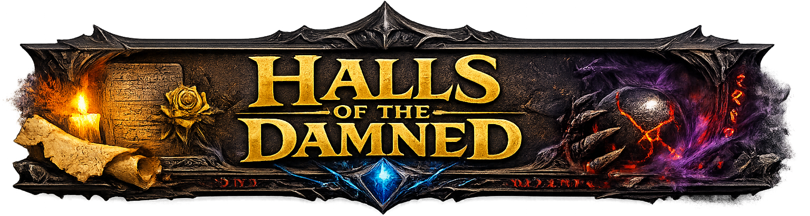

# KnoxRPG — Halls of the Damned Campaign Website



A dedicated campaign companion website for the **Halls of the Damned** D&D 5th Edition campaign run by the KnoxRPG group. Provides an immersive campaign portal with a Faerûnian calendar, session journals, character tracking, NPC directories, maps, artifacts, and DM tools — all backed by PostgreSQL and integrated with Ollama for AI features.


## Features

- **Campaign Calendar** — Interactive Calendar of Harptos with event tracking, weather, and current in-game date display.
- **Session Journal** — Chronological session logs with world date tracking and markdown-rendered recaps.
- **Characters** — Player character profiles with stats, backstories, and campaign notes.
- **NPCs** — Campaign NPC directory with descriptions, locations, and relationship tracking.
- **Maps** — Campaign maps and location artwork served from NAS storage.
- **Artifacts & Handouts** — In-game artifacts, letters, and DM handouts.
- **History** — Campaign lore and world history timeline.
- **House Rules** — Campaign-specific rule modifications and homebrew content.
- **Art & Images** — Campaign art gallery served from NAS-hosted content.
- **Admin Panel** — DM tools for managing calendar dates, sessions, and campaign content.
- **Authentication** — Session-based auth with bcrypt password hashing.
- **Search** — Full-text search across campaign content via PostgreSQL.

## Project Structure

```
knoxrpg-hotd-website/
├── .github/
│   └── workflows/  # CI/CD pipeline (self-hosted Cortana runner)
├── docker/             # Dockerfile for container image build
├── helm/               # Helm chart for Kubernetes deployment
│   └── hotd-website/
│       └── templates/  # K8s resource templates
├── src/                # Node.js application source
│   ├── server.js       # HTTP server entry point
│   ├── config.js       # Configuration, Harptos calendar data, nav items
│   ├── routes/         # Route handlers: API, auth, pages, admin
│   ├── lib/            # Azure stub, auth, search, markdown, utilities
│   ├── db/             # PostgreSQL pool & schema
│   ├── pages/          # Server-rendered HTML page generators
│   ├── components/     # Shared HTML components (nav, CSS, shell, overlays)
│   └── hotd-campaign/  # Static campaign content (HTML, images)
├── .dockerignore
└── .gitignore
```

## Tech Stack

- **Runtime**: Node.js 22 (raw `http` module — no framework)
- **Database**: PostgreSQL with pgvector (shared with KnoxRPG website)
- **AI**: Ollama (via RAG service) for campaign-aware AI features
- **Container**: Docker / Buildah (node:22-slim base)
- **Orchestration**: Kubernetes via Helm chart
- **Content**: NAS-hosted campaign assets mounted as hostPath volume

## Environment Variables

| Variable | Required | Description |
|---|---|---|
| `PGHOST` | Yes | PostgreSQL host |
| `PGPORT` | No | PostgreSQL port (default: 5432) |
| `PGUSER` | Yes | PostgreSQL user |
| `PGPASSWORD` | Yes | PostgreSQL password |
| `PGDATABASE` | Yes | PostgreSQL database name |
| `HOTD_CONTENT_DIR` | No | Path to HotD campaign content (default: /data/hotd-content) |
| `OLLAMA_HOST` | No | Ollama API URL |
| `RAG_SERVICE_URL` | No | D&D RAG service URL |
