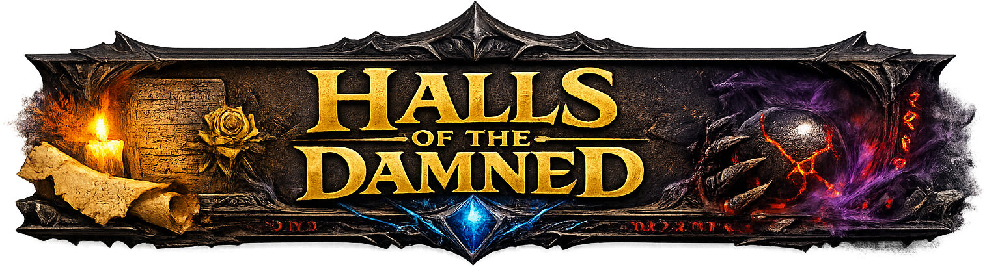
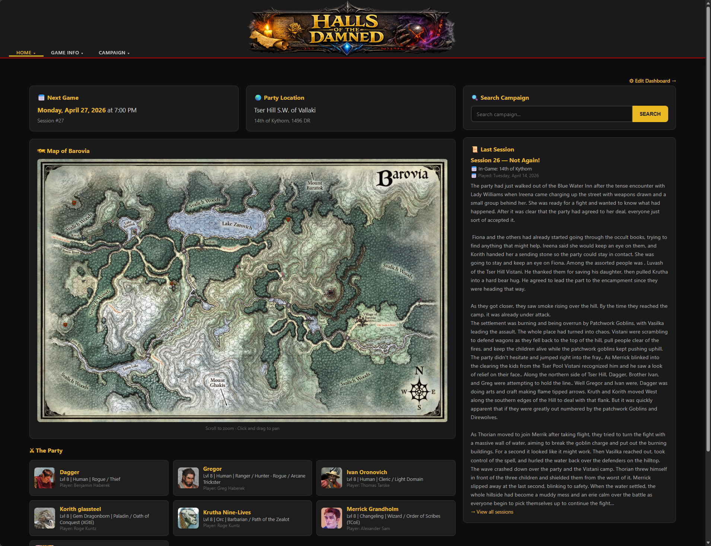

# KnoxRPG — Halls of the Damned Campaign Website

A dedicated campaign companion website for the **Halls of the Damned** D&D 5th Edition campaign run by the KnoxRPG group. Built from scratch with pure Node.js and PostgreSQL, self-hosted on a home lab MicroK8s cluster, and deployed via Helm. The site provides an immersive campaign portal with session journals, interactive maps, NPC directories, AI-powered DM tools, a full Forgotten Realms encyclopedia, and more.

---

## The Campaign

**Halls of the Damned** is a custom 5e campaign set in the Forgotten Realms that leans heavily into gothic horror. The story is original, though it weaves through familiar settings and draws on deep Realms lore.

### The Story

At the dawn of time, the god **Tharizdun** was driven mad by forces beyond reality and turned against the divine host. He created the Abyss and forged the first demons before the combined might of the gods imprisoned him in cosmic chains. His avatar, **Shorthagot the Harbinger of Ruin**, survived and continued working toward his master's liberation.

During the height of the **Netheril Empire**, Shorthagot infiltrated its highest circles disguised as the archmage Arthindol the Terraseer. Over two centuries he directed a network of hidden research sites, the **Thul laboratories**, culminating in the construction of the **Great Machine** at **Thul Avenar** beneath the mountains of Damara. The Machine's true purpose was to free Tharizdun. When Karsus's Folly collapsed the Weave in -339 DR, the Machine nearly tore open a gateway, but surviving arcanists shattered it into four sealed components known as the **Keys of Shorthagot** and imprisoned the avatar within the Machine itself.

The **Order of the Yellow Rose** was founded in 75 DR to guard the Keys and watch over the buried ruins of Thul Avenar. For over a thousand years the prison held. Then in 1496 DR, **Lyzara'Nualith**, a succubus in service to Tharizdun disguised as the noblewoman Lady Elysra Nivariel Williams, orchestrated the **Fall of Valls**. Her cultists breached the planar gateway beneath the city, flooding it with horrors from the Shadowfell and shattering the Order's stronghold. The Keys were scattered, and the prison that holds Shorthagot grows weaker by the day.

The players began in the northern kingdom of **Damara**, hired as caravan guards on the Pelavir River. They survived the Fall of Valls, crossed into the demiplane of **Barovia** through the Devil's Mist, and now fight to recover the Key, understand the ancient Netherese machinery, and stop Lyzara'Nualith's forces before Shorthagot is freed and completes his long-interrupted work: the liberation of the Chained God.

---

## Features

- **Session Journal** — Chronological session logs with world date tracking and markdown recaps
- **Characters** — Player character profiles synced from D&D Beyond
- **NPCs** — Campaign NPC directory with custom portraits, associations, DM notes, and visibility controls
- **Interactive Map** — Pan/zoom map of Barovia with draggable faction markers
- **Forgotten Realms Encyclopedia** — 42 realm pages with geography, politics, locations, and factions
- **Notable Groups** — Organization pages for campaign factions (Vistani, Bonegrinder Coven, etc.)
- **Artifacts & Handouts** — In-game artifacts, letters, and DM handouts
- **Campaign History** — Full world history timeline from the Dawn Ages through present day
- **Art Gallery** — Campaign art served from NAS storage with click-to-enlarge overlay
- **DM Command Center** — Sidebar dashboard with AI chat, campaign notebook (with RAG-grounded AI Assist), NPC/session CRUD, and Image Studio
- **DM AI Chat** — RAG-grounded AI assistant with function-calling tools for campaign Q&A
- **Notebook AI Assist** — RAG-grounded freeform content generation that drafts new campaign notebook pages
- **Image Studio** — GPT Image 1 generation with gallery management and publish-to-art-gallery workflow
- **Campaign Notebook** — Trilium-inspired markdown notebook with wiki-links, backlinks, and link map
- **RAG Pipeline** — Embedding pipeline with pgvector for semantic search across all campaign content
- **Search** — Full-text and semantic search across NPCs, sessions, spells, items, and lore
- **Authentication** — Session-based auth with bcrypt password hashing and role-based access

## Hosting

The website runs on a self-hosted home lab:

- **Server**: MicroK8s single-node Kubernetes cluster on an Ubuntu server (codename "Cortana")
- **Deployment**: Helm chart with rolling updates, deployed via GitHub Actions CI/CD on a self-hosted runner
- **Database**: PostgreSQL with pgvector extension, running as a cluster service
- **Storage**: Campaign images and generated art served from a local NAS mounted as a hostPath volume
- **Container Registry**: Images built and pushed via GitHub Actions, pulled by the cluster on deploy

## Website Layout

## Tech Stack

| Layer | Technology |
|---|---|
| **Runtime** | Node.js 22 — raw `http.createServer`, no frameworks |
| **Language** | JavaScript (CommonJS in `src/`, ES modules in `foundry/`) |
| **Database** | PostgreSQL 15 with pgvector for semantic search |
| **AI / LLM** | OpenAI GPT-4o (chat, function calling), GPT Image 1 (art generation), text-embedding-3-small (RAG) |
| **Embeddings** | Custom 5-stage pipeline: Extract, Chunk, Sanitize, Embed, Store |
| **Container** | Docker / Buildah — `node:22-slim` base image |
| **Orchestration** | MicroK8s (single-node Kubernetes) via Helm chart |
| **CI/CD** | GitHub Actions on self-hosted runner |
| **Secrets** | Azure Key Vault in prod, environment variables in dev |
| **Storage** | NAS-hosted campaign assets mounted as hostPath volume |
| **VTT** | FoundryVTT v13 module (optional companion) |

