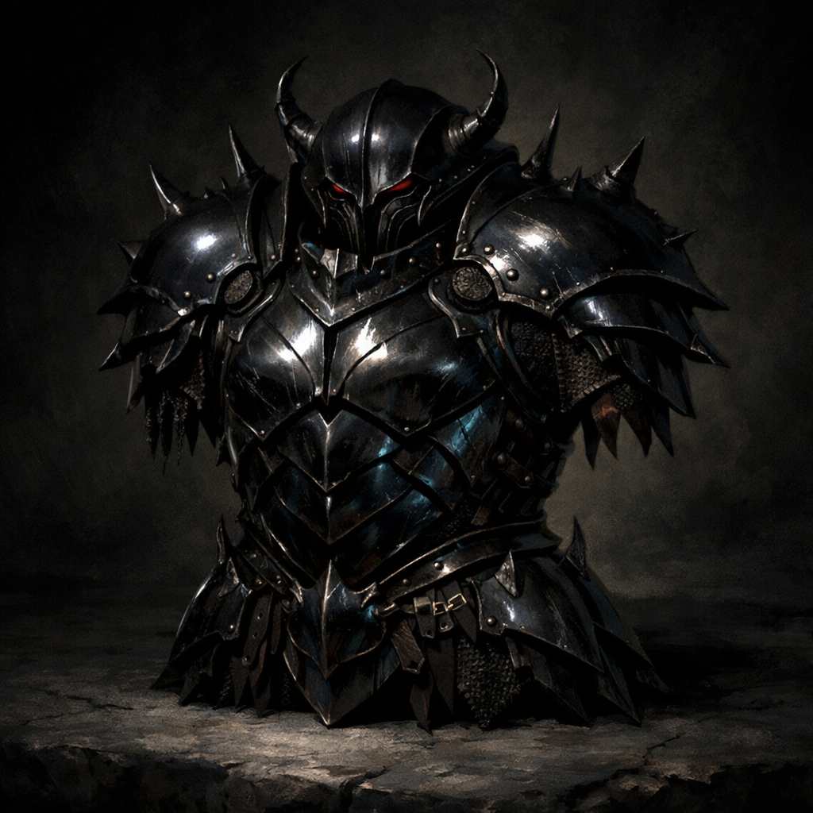

# Ebony Beetle Armor (Scale Mail)

Armor (scale mail), rare 
 
 
This glossy black scale mail armor is made from enchanted carrion beetle chitin by the darakhul. If the armor normally imposes disadvantage on Dexterity (Stealth) checks or has a Strength requirement, the ebony beetle version of the armor doesn’t. While wearing the armor, you are immune to slashing damage. It is half the weight of comparable metal armor.

This armor consists of a coat and leggings (and perhaps a separate skirt) of leather covered with overlapping pieces of metal, much like the scales of a fish. The suit includes gauntlets.

Book of Ebon Tides, pg. 197
