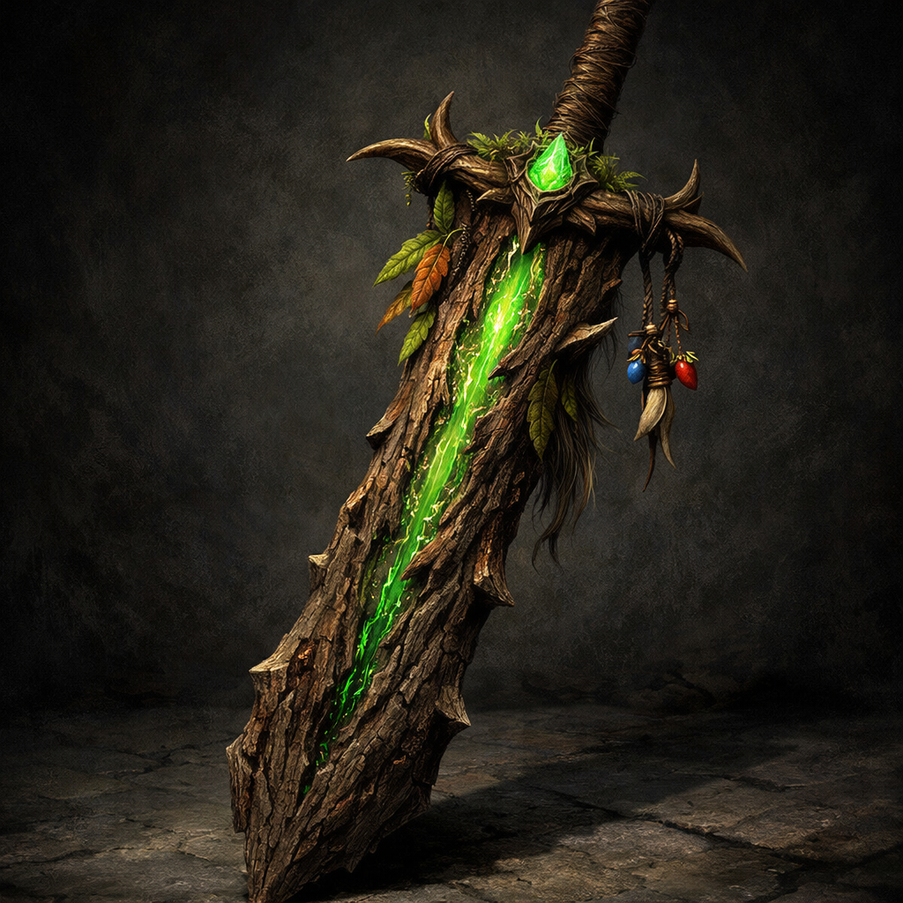

# Monster Hunter’s Greatsword, +2

Weapon (greatsword), very rare (requires attunement by a Ranger)
 
 
This greatsword is carved from bark, with a core of magical sap, and decorated with leaves from magical plants. Its hilt and shaft are bound in hair from a fey creature. This magic weapon channels the natural magic found in the elements of nature.
 

While holding this magic greatsword, you gain a +2 bonus to attack and damage rolls made with it, and you gain a +2 bonus to spell attack rolls and the saving throw DCs of your Ranger spells. In addition, you can use the weapon as a Spellcasting Focus for your Ranger spells.
 

When you hit with an attack using this greatsword, you can expend a Ranger spell slot to cast Hunter’s Mark on the target as part of the same action used to make the attack. When you cast Hunter’s Mark in this way it does not require Concentration. Additionally, the spell lasts for one minute or until the target dies or you cast Hunter’s Mark again using either the weapon or otherwise.
 

Crafting. Creating a Monster Hunter’s Greatsword, +2 requires a Very Rare Workshop and the following Very Rare Components:
 
 

[Animus] Any Animus
 

[Fluid] Sap
 

[Hair] Hair from a Fey
 

[Hair] Leaves
 

[Hide] Bark
 

Proficiency with a Greatsword allows you to add your proficiency bonus to the attack roll for any attack you make with it.
 

 

This weapon has the following mastery property. To use this property, you must have a feature that lets you use it.
 

Graze. If your attack roll with this weapon misses a creature, you can deal damage to that creature equal to the ability modifier you used to make the attack roll. This damage is the same type dealt by the weapon, and the damage can be increased only by increasing the ability modifier.
 

Monsters of Drakkenheim, pg. 390
