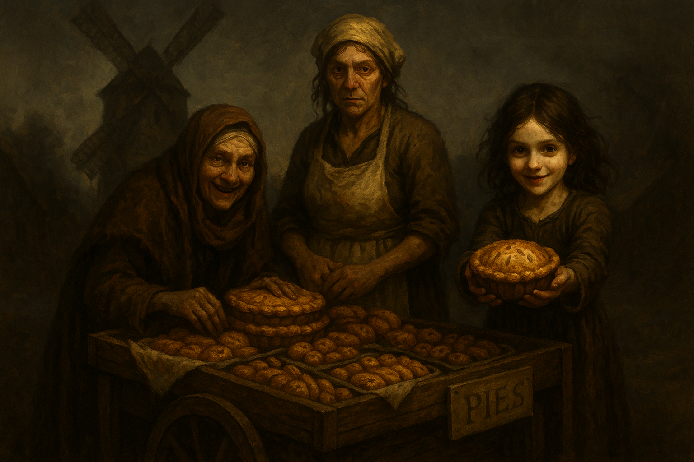

# The Bonegrinder Coven

- **Type:** Hag Coven
- **Base of Operations:** Old Bonegrinder
- **Status:** Diminished — one member killed
- **Alignment:** Enemy

---

## The Family Trade

To the people of Barovia, they were just bakers. An old grandmother, her daughter, and her granddaughter, selling sweet-smelling pastries from a wooden cart on the roads near the Village of Barovia. The treats were cheap, warm, and brought vivid, happy dreams to anyone who ate them. In a land where the sun never truly shines and misery is the only constant, those dreams were worth more than gold. People lined up. People came back. People brought their last coins and begged for just one more.

The Wormwiggle family operated out of Old Bonegrinder, a weathered stone windmill on the Old Svalich Road between the Village of Barovia and Vallaki. From a distance it looked abandoned. Up close, the smell of baking and woodsmoke made it feel almost welcoming. The three women kept to themselves, sold their pies, and smiled at anyone who passed.

Nobody asked what went into the pastries.

## Origins

The Wormwiggle coven was not native to Barovia. Morgantha, Bella, and Offalia were once part of a larger hag coven in Damara. When their kin were slaughtered, the three survivors fled. They forced a Vistani band to smuggle them through the Mists into Barovia, where they found the abandoned windmill and claimed it as their own.

They settled into a quiet routine. Morgantha handled sales and public appearances, traveling the roads with her cart and her gap-toothed smile. Bella tended to the baking inside the mill. Offalia accompanied Morgantha on the road, playing the part of an innocent child to charm customers and, when the opportunity arose, to lure children away from their families.

Old Bonegrinder became their home, their workshop, and their trap.

## The Battle of Old Bonegrinder

The coven's operation came to light when Luvash Vanduva, leader of the Tser Hill Vistani, arrived at the Blood of the Vine Inn desperate and searching for his kidnapped daughter Arabelle. She had been taken from the Village of Barovia and was being held at the windmill.

The party traveled to Old Bonegrinder and was greeted at the door by Bella, who was nervous about letting armed strangers inside. She tried to slip Dreamlatch Root into a pot of stew to drug the party. Greggor and Krutha spotted it and called her out. She drank the soup herself, mumbled something, and retreated upstairs.

The party searched the mill and found old children's clothing, including a dress Riya recognized as belonging to Arabelle. Dagger heard a child crying from the third floor, followed by the sound of a slap. When the party moved upstairs, a choking poison cloud and explosion were triggered. Downstairs, Ireena was knocked unconscious and the children Toma and Riya went missing.

Dagger reached the top floor and found Toma and Riya tied to the windmill gears. He freed them while the rest of the party rescued Arabelle into a dimensional pocket. Bella cast Sleep on Dagger and the children, slammed the trapdoor shut, and the session ended with everyone trapped between floors.

When the fighting resumed, Merrick locked Bella with Hold Person and Thorian followed with a devastating Lightning Bolt that killed her. With the middle hag dead, the runes that Bella had etched throughout the mill over decades unraveled. The windmill appeared to collapse inward and vanish entirely, leaving nothing but bare ground. The party fled, believing the mill was destroyed.

The party has since learned that Old Bonegrinder still stands. The collapse was an illusion.

The party escorted Ireena and the rescued children, including Arabelle, Riya, and Toma, onward to Vallaki. Luvash's reunion with Arabelle in Vallaki changed how the entire Tser Hill camp viewed the party.

## Members

### Morgantha Wormwiggle — Matriarch

The eldest of the three. In her human disguise she appears as a frail old grandmother wrapped in a heavy brown shawl and headscarf, with wispy white hair and a wide, gap-toothed smile. She travels the roads near the Village of Barovia with her cart, selling dream pastries to the desperate. Her manner is warm and grandmotherly, the kind of woman who presses treats into children's hands and calls everyone "dear."

Morgantha is the coven's leader and its public face. She is cunning, patient, and completely without conscience. She views the kidnapping and grinding of children as the family trade, nothing more. She is still at large.

### Bella Wormwiggle — Daughter (Deceased)

The middle generation. In her human disguise she appears as a hunched, middle-aged woman with stringy hair, a flour-dusted apron, and a gap-toothed smile. Quieter than Morgantha. She tended to the baking inside the mill and watched visitors with an unsettling intensity that her disguise could not quite hide.

Bella was killed during the Battle of Old Bonegrinder when Merrick held her with Hold Person and Thorian struck her down with a Lightning Bolt. Her death caused the rune network she had built throughout the mill to unravel, triggering what appeared to be the windmill's collapse.

### Offalia Wormwiggle — Granddaughter

The youngest of the three. In her human disguise she appears as a pale girl of about ten or twelve with wild dark hair and a nervous giggle. She accompanies Morgantha on the road, charming locals with her smile and slipping treats to children to help lure them away from their families. She kept the kidnapped children caged on the upper floor of the windmill and tormented them.

Offalia escaped Old Bonegrinder alongside Morgantha. She is still at large.

## DM Notes

Morgantha and Offalia are still alive and will want revenge. The death of Bella cost them a family member and broke the coven's ability to cast shared spells, as hag coven spellcasting requires all three to be within thirty feet of each other. Without Bella, they lose access to their coven magic.

Old Bonegrinder was not destroyed. The collapse the party witnessed was an illusion, likely triggered by the unraveling of Bella's rune network. The mill still stands and Morgantha and Offalia have returned to it. The players just learned this.

The dream pastries are made from the life force of kidnapped children. This is the horrific secret at the heart of the coven's operation. The pastries grant vivid, happy dreams and temporary hit points but are powerfully addictive. After consuming three or more in a week, a person has disadvantage on Wisdom saves without another fix. The people of Barovia do not know what goes into them and would be horrified if they did.

Bella's status in npcs.json should be updated to Dead to reflect her death in Session 18. The rune network she built throughout the mill was the source of her Rune-Step ability, allowing her to teleport between floors as a bonus action during combat. Players could disrupt the runes with Arcana or Athletics checks (DC 15).

The coven was once part of a larger hag group in Damara. They forced a Vistani band to smuggle them through the Mists into Barovia. This Vistani connection could surface again if Morgantha tries to use or threaten the Vistani for help.

Morgantha and Offalia are back at Old Bonegrinder. They may attempt to recruit or create a third hag to restore the coven, or pursue the party directly for revenge.
