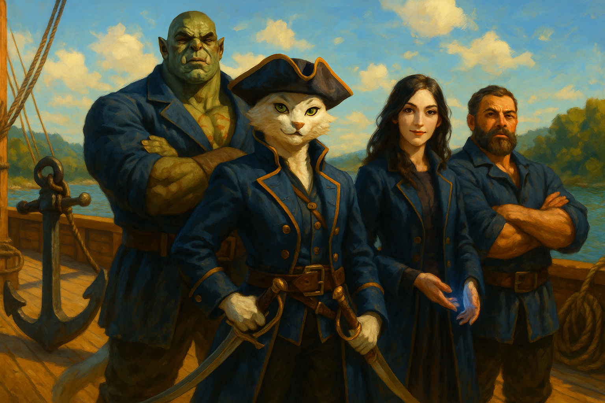

# Crew of the Sea Spray

- **Type:** Ship's Crew / Adventuring Company
- **Base of Operations:** The Sea Spray (river vessel), originally berthed in Frosthaven, Vaasa
- **Status:** Active — currently at White Bridge, Damara
- **Alignment:** Ally

---

## The Story

The crew of the Sea Spray is a tight-knit group of sailors led by the infamous Captain Reaven "Emerald Eyes." The Sea Spray operated as a cargo vessel running the Pelavir River between Vaasa and Damara during a time of increasing conflict, as King Frostmantle's wars with Narfell had made the route dangerous.

Captain Reaven, flanked by First Mate Gorak and Selene Brightwater, entered the Frozen Anchor inn in Frosthaven and put out an open call for able hands. The players signed on as hired protection for the voyage south along the Pelavir River.

For the first few days, nothing of note occurred as the crew settled into life aboard the ship. On the third day, as the Sea Spray passed through Bloodstone Pass, strange figures were spotted in the fog along the banks. Captain Reaven warned the crew about Damaran laws regarding unsanctioned magic. That night, two Night Screamers — large shadowy creatures — crashed through the mist and attacked the ship, sending it careening toward the rocky shore. Below deck, ice-cold river water flooded in as the crew scrambled topside. On deck, Captain Reaven fought with deadly precision while Gorak swung a massive anchor with brutal force. The players joined the fight and the creatures were eventually dealt with, but the Sea Spray was left in ruins — broken wood, scattered supplies, and blood covering the deck.

In the eerie silence that followed, two figures emerged from the mist-shrouded woods. Lord Geoffrey Frostmantle, battered and exhausted, dragged the gravely wounded Prince Ian Frostmantle forward, pleading for aid in the name of the King. The Prince had been ambushed by undead led by a knight in dark armor, and Lord Geoffrey had carried him through the dark woods all night.

Lord Geoffrey tasked the players with traveling to Valls to find Mistress Clarissa Allyson, pressing his signet ring into a sealed letter as proof of his authority. Captain Reaven gave the players healing potions before they parted ways — "Use them wisely. I can't promise we'll meet again, but if you make it out of this, I'll be waiting for you back at the capital, for as long as we can." The crew took the Prince and Lord Geoffrey to White Bridge for safety, and the players set out into the wilderness toward Valls.

---

## Members

### Captain Reaven "Emerald Eyes"
Captain Reaven is a silver-furred Tabaxi — her coat so pale it is almost white — with striking emerald-green eyes that scan every room with the sharpness of a blade. A Swashbuckler by trade and captain by reputation, she is confident, daring, and known across the northern rivers as "Emerald Eyes" for taking on voyages no sane sailor would accept. Her movements are smooth, precise, controlled — a predator entering a den full of prey. She fights with dual scimitars, darting between enemies with deadly precision. Reaven has a mysterious past tied to the Damaran rebels, though she speaks of it to no one. What defines her most is how she leads — not through fear, but through trust. She gave Gorak a chance when every other captain turned him away, took in Selene when the girl had nowhere else to go, and earned Garrick's lifelong loyalty through genuine camaraderie. The crew of the Sea Spray is the family she built, and she would die before she let anything happen to them.

### First Mate Gorak "Broken Tusk"
Gorak is a towering, scarred mountain of muscle — a full-blooded Orc Barbarian who walks the Path of the Juggernaut. He wears a blue seaman's coat that will never button across his enormous frame, and his piercing yellow eyes scan every room with barely restrained impatience. A prominent broken tusk gives him his name. Before the Sea Spray, Gorak was turned away from every crew and company he approached — no one would give an orc a chance. Captain Reaven was the first and only captain to judge him by his strength and character rather than his race, and Gorak repays that trust with absolute, unwavering devotion. He serves as both First Mate and helmsman, and in a fight he wields a massive ship's anchor with devastating force. The crew became the only family he has ever known, and he would tear a ship apart plank by plank to protect them.

### Selene Brightwater
Selene is the youngest member of the crew — a young Half-Elf Sorceress with wild magic running through her veins. She has long dark hair falling loose around her shoulders, pale skin, and striking violet eyes that betray a quiet intensity. Selene ran away from a cruel family that kept her as little more than a servant. She discovered her wild magic as a child, and the uncontrollable surges only made her captors treat her worse. When she fled, she stowed away aboard the Sea Spray. Captain Reaven was furious when she found the girl hiding below deck — but the more she listened to Selene's story, the softer she became. The crew adopted Selene as their own, and they have been fiercely protected by her ever since. Her magic is emotionally volatile — powerful but unpredictable — and she is quiet and reserved around strangers, often tucking her hands into her sleeves when nervous. Despite her youth and difficult past, Selene is braver than she knows.

### Garrick Ironbrow
Garrick is a broad-shouldered Dwarf Fighter and the ship's resident shipwright — a former blacksmith with the calloused hands and stoic demeanor to prove it. He is immensely strong and utterly dependable, the kind of man who says little but is always the first to act when something needs doing. Garrick carries a tragic past involving pirates and revenge that drove him from his forge and former life. He originally boarded the Sea Spray as a hired guard for a single voyage, but found himself unexpectedly drawn to the strange company of a Tabaxi captain and her Orc first mate — their camaraderie was unlike anything he had ever known. He signed on permanently not long after Gorak and never looked back. The unlikely crew of the Sea Spray became the closest thing to family he'd had in years. He keeps the ship seaworthy and swings his hammer with equal skill whether he's driving nails or cracking skulls.

---

## DM Notes

The crew of the Sea Spray serves as the players' connection to the world outside Barovia. They are the reason the players are in Damara at all, and Captain Reaven's promise to wait at the capital provides a potential thread for the campaign's conclusion or for reinforcements if the story calls for it.

The crew is believed to be at White Bridge with Prince Ian Frostmantle and Lord Geoffrey. The Sea Spray is wrecked on the shore of the Pelavir River. The players have not had contact with the crew since entering Barovia.

The wreck of the Sea Spray is marked on the campaign map as a location point of interest.
