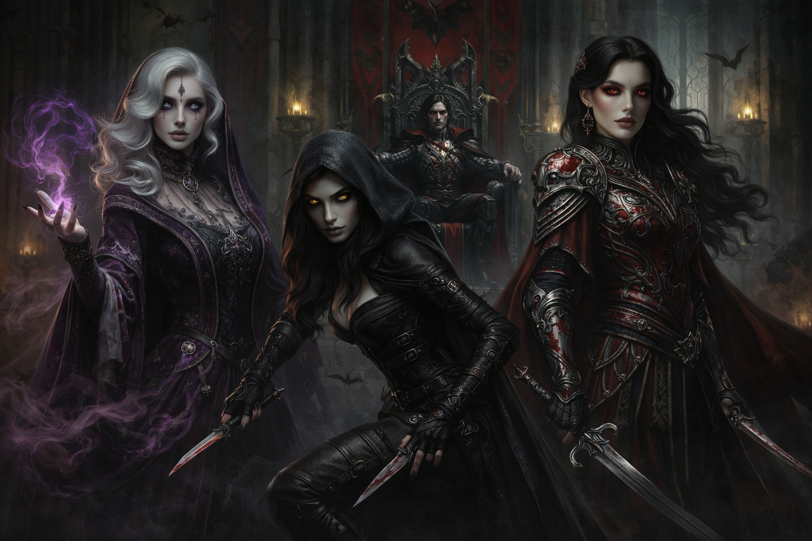

# The Stormraven Sisters

- **Type:** Noble House / Dark Servants of Strahd
- **Base of Operations:** Castle Ravenloft, Barovia
- **Status:** Defeated — all three sisters have been destroyed
- **Alignment:** Enemy

---

## Family History

The Stormraven family was one of the most feared and respected noble houses in the region, renowned for their martial skill, arcane heritage, and loyalty to the Von Zarovich bloodline. The Stormravens had served the Von Zarovich dynasty since the early days of their rule, when the Von Zarovich warlords carved Barovia out of the chaos that followed the Fall of the Netheril Empire. Generation after generation, they stood as the sword and shield of the Von Zarovich line: their soldiers, their captains, and their most trusted enforcers. No one in the court doubted their loyalty, and no one dared put it to the test.

Among the last generation of the house were three sisters, known collectively as **The Ravens of War**: Elandra, Seraphine, and Kaelin. They stood above the rest of their house in skill and devotion. Elandra was the soldier. Seraphine knew dark studies and battlefield magic. Kaelin moved like a shadow and had the patience to wait where other killers twitched and gave themselves away.

## The Story

### The Conquest of Barovia

The Stormraven Sisters rode with Strahd Von Zarovich long before he became a monster. When the aging warlord prince embarked on his campaign to conquer the misty valley his father, King Barov, had claimed for the Von Zarovich dynasty, the sisters followed without question. They had been raised in the service of the Von Zarovich name, and Strahd's war was their war. Elandra commanded his vanguard and drove out the native peoples who resisted. Seraphine walked the battlefields afterward, cataloguing the dead and the arcane remnants of the old civilizations they displaced. Kaelin moved ahead of the army like a ghost, scouting enemy positions and silencing sentries before the main force arrived.

When the valley was won, Strahd built Castle Ravenloft on a large rise in the center of the valley, in the shadows of Mount Baratok and Mount Ghakis, named in honor of his mother, Queen Ravenovia. The Stormravens stood by his side as he cemented his family's hold over Barovia. Elandra kept to military matters, inspecting the castle's defenses, walking its walls, and asking questions better than many of Strahd's own captains. Kaelin secured the passes. Seraphine grew close to Strahd himself.

### The Amber Temple

Seraphine had always enjoyed secrets. She had a sharp mind and no fear of places other people avoided. The master builder Marko Vaduva wrote that he saw her more than once in the lower libraries, in the old record rooms, in the vaults where broken relics and half-deciphered scraps were kept. Sometimes Strahd was with her. Sometimes not. But as the months went on, she had his ear more often.

Then the two of them disappeared for several days. No proclamation. No explanation. Just gone. Some said they had gone south to bargain with hermits or grave-priests. Some said they hunted old magic. Others whispered of ancient ruins and a secret romance between them. What is known is this: Strahd left with Seraphine, and when he came back he was different. Detached. Colder. Not merely angry or heartsick, but something else entirely. His attention was elsewhere, as though part of him had gone somewhere the rest of them could not follow. He took less pleasure in anything. If he looked at Tatyana now, it was with something else in his eyes, like a man looking at someone who had betrayed him.

They had traveled to the Amber Temple, a place where ancient forbidden entities known as the Dark Powers offered gifts no mortal should accept. There, Strahd made a pact, trading his soul and mortality for eternal youth and dominion over death. Seraphine stood with him. Marko Vaduva later wrote: *"I have heard Strahd and Seraphine talk of the Chained God and of Shorthagot, his servant, and of bargains made with the desperate and the damned. I cannot tell you what name spoke to Strahd in those days. I can only say that after that journey south, something had him by the heart."*

### The Murder of Sergei

When Strahd's younger brother Sergei arrived in Barovia, everything changed. Sergei was younger, easier in manner, and loved without effort. Servants smiled when he passed. People spoke more freely near him. Strahd commanded a room; Sergei put it at ease. Then Tatyana, a rare beauty from the valley, gave her heart to Sergei. Strahd, already aged and consumed by jealousy, was devastated. From his own journal: *"With words she called me brother, but when I looked into her eyes they reflected another name: death. It was the death of the aged that she saw in me."*

On the day of Sergei's wedding, Strahd murdered his brother. His pact was sealed with Sergei's blood. He found Tatyana weeping in the garden east of the chapel and pursued her through the upper halls. She fled toward the heights of the castle. She screamed that she would rather die than let him touch her, and she meant it. Tatyana threw herself from the walls of Ravenloft. Her body was never recovered.

### The Long Night

What followed was chaos. The castle guards turned on Strahd, calling him *kinslayer*. Arrows flew. Steel came out. Men shouted that the count had murdered his own brother. Others shouted for order. There was no order left to keep.

Elandra and the rest of Strahd's personal guard began striking down anyone who raised a hand against their liege, but it was a losing battle. Strahd had been shot by more than a dozen crossbow bolts. Wounded. Surrounded. It should have been done. Instead he endured, and then he fell on those around him with a fury that defied what any mortal could do. He feasted upon the blood of his own soldiers. The pact had taken hold. Strahd Von Zarovich was no longer a man.

Then the sky went black. Not clouds rolling in, but the day itself seemed to fail. The mists rose up around Ravenloft and the whole valley. They came thick and wrong and fast. Men at the outer wall vanished waist-deep in them. Horses in the lower court screamed and could not be calmed. Torches guttered. By dawn, no living soul remained in Ravenloft save Strahd and those loyal to him. Barovia was swallowed by the Mists of Ravenloft and became the first Domain of Dread, a prison crafted by the Dark Powers, with Strahd as both warden and inmate.

The Stormraven Sisters witnessed all of it.

**Elandra** had fought at Strahd's side throughout the carnage, cutting down his own guards without hesitation. She was a soldier, and her oath to the Von Zarovich name was everything she had. Even when she saw Strahd descend upon his own men and drink their blood, even when she realized her master was no longer a man but something monstrous, she did not waver. There may have been a moment of hesitation. Even the most loyal hound can smell blood and know the master has changed. But Elandra had given everything for Strahd's cause. She would not turn away now. When Strahd gave the sisters his ultimatum, *"Swear yourselves to me once more, body and soul, and I will grant you the gift of eternity. Or resist, and die as all the others did,"* Elandra was the first to kneel. She drank willingly of his blood, and the dark gift took her. She rose as the first person Strahd ever turned, his greatest warrior remade in his own image.

**Seraphine** had been at Strahd's side since the Amber Temple. She had seen the darkness coming before anyone else and had not looked away. Where Elandra knelt out of duty, Seraphine knelt out of fascination. She saw an opportunity for power beyond anything she had known, the secrets of undeath laid bare before her, an eternity to study them. She embraced the darkness willingly, eager to explore the limits of her newfound immortality. Of the three, Seraphine was the one who truly wanted what Strahd offered.

**Kaelin** was not so quick to yield. The youngest sister had always been the most independent, the one who questioned, the one who could vanish into the night without a trace. She watched her eldest sister kneel and her middle sister embrace the darkness, and something inside her broke. She tried to flee. She ran through the blood-soaked halls of Ravenloft, past the bodies of men she had served beside, into the depths of the castle where she knew every shadow and every hidden passage. It was not enough. Strahd hunted her down himself, cornering her in the lower depths. When he found her, he did not strike her down. Instead, he whispered: *"You of all should know, little bird, there is no escaping the shadows."* He turned her there in the dark. Not with fangs, but with a blood ritual and a force of will she could not resist. Whatever Kaelin had been before that moment was gone.

That night, the Stormraven Sisters were reborn, not as warriors of honor, but as Strahd's personal executioners, bound to his will through blood and the unholy pact he had offered. The Ravens of War became the Ravens of the Damned.

### The Battle of Argynvostholt

After the Long Night, when the Mists sealed Barovia away from the world, Strahd moved to crush any opposition that remained in the valley. Most bent the knee or fled. One force did not.

In the hills west of a fortified manor called Argynvostholt, the Order of the Silver Dragon had gathered under the leadership of an ancient silver dragon named Argynvost. For centuries Argynvost had lived among the people of the valley in human guise, protecting the Balinok Mountains and the lands around them. When Strahd turned and the valley fell to darkness, Argynvost rallied his knights to resist. It was the first organized opposition Strahd faced after his transformation, and the only force in Barovia with the power to challenge him directly.

The Order met Strahd's forces in open battle in the hills west of the keep. Argynvost threw off his human guise and revealed his true form. His claws tore through Strahd's armor and his radiant breath burned the land black. For a moment, the vampire lord faltered and fell to his knees, nearly undone. It was the closest anyone had come to destroying Strahd since his rebirth.

But the Stormraven Sisters turned the battle. Kaelin and Elandra struck from the flanks, and together they brought the dragon down. Strahd survived, gravely wounded, and was spirited away by Elandra. She took the head of Argynvost as a trophy for Strahd.

The Order's knights fought on, but without their dragon they were overwhelmed. Argynvost's final letter, found later in the ruins, read: *"My knights have fallen, and this land is lost. The armies of my enemy will not be stopped by sword or spell, steel or fang. Today I will die, not avenging those who have fallen, but defending that which I love, this valley, this home, and the ideals of the Order of the Silver Dragon."*

After the battle, Seraphine walked the field and laid a curse upon the fallen. Those who died rose again as revenants, bound to the grounds of Argynvostholt by hatred alone. Sir Godfrey and the few who lingered between life and death suffered worse, twisted into crawling necro-spiders in the depths below the keep, sealed away in darkness with nothing but their madness and the memory of their lost humanity. Vladimir Horngaard, the Order's commander, was consumed by hatred so deep that it kept him and his knights trapped as revenants for centuries, unable to find peace.

### The Massacre at the Druid Clearing

The Vistani are the only people who can walk freely through the Mists that seal Barovia from the outside world. For centuries, Strahd tolerated them because of an ancient debt: the Vistani had once rescued him after a great battle, and he granted them freedom of movement and his protection in return. But that freedom came with an unspoken condition. The Vistani served Strahd, acted as his eyes and ears beyond the Mists, and kept his secrets. Some Vistani accepted this arrangement. Others did not.

The Tser Pass Vistani, a caravan led by the d'Avenir family, were among those who remembered what the Vistani had been before Strahd shackled their blood to his will. Dmitru d'Avenir led the caravan. His wife Sorina was its heart, strong and willful and devoted to the old Vistani ways. Their daughter Ezmerelda, always listening and always watching, grew up in the wagons alongside her aunt Velinka.

What the d'Avenir family did to draw Strahd's wrath is not entirely clear, but the punishment was total. The Stormraven Sisters descended on the Tser Pass Vistani at the Druid Clearing in Damara, wearing death-black armor. They attacked without warning and without mercy. The caravan was destroyed. Wagons burned. The bodies were never buried.

The players passed through the Druid Clearing during their journey south. They found a dozen ancient wagons, their vibrant paint dulled by sixteen years of weather. Cracked wheels, faded pennants, empty chests, and scattered bones littered the site. The scene told the story of a desperate stand that ended badly.

Only two members of the caravan survived. Velinka d'Avenir was pulled from the wreckage by druids of the Verdant Heart and nursed back to life in a hidden forest. While recovering, she saw prophetic visions of Barovia burning beneath an unblinking red eye. She later guided the party through the Devil's Mists to the Gates of Barovia during Session 09. Young Ezmerelda also survived, though how she escaped is not fully known. She eventually found the legendary monster hunter Rudolph Van Richten, who took her on as his student. She lost her right leg below the knee to a werewolf and now hunts the undead across Barovia as one of its most capable fighters.

Neither Velinka nor Ezmerelda knows the other is alive. Van Richten has vowed to destroy the Stormraven Sisters to avenge the d'Avenir family. The Stormravens also purged other groups during this period. Gilda Bearmantle, a dwarf druid, lost many of her spirit-bound companions to the Sisters during their initial purge before retreating into the deep forest to join the Verdant Heart.

### The Assassination of Zuleika Toranescu

Zuleika Toranescu was the Den Leader of the Barovian werewolf packs, a just and measured leader who sought peace with the humans of the valley. His parents, Kiara and Duesius Toranescu, had raised their family with a belief that the packs had lost too much of their humanity. Zuleika carried that conviction into his leadership. His mate Emil, a respected warrior and shaman, shared his view. Under Zuleika, the werewolves held to an uneasy truce with the surrounding settlements.

Kiril Stoyanovich did not share that vision. When Kiril was young, human hunters from Vallaki wiped out his original pack. The Toranescu family took him in and raised him alongside their own, but the hatred never left. Where Zuleika saw a path to coexistence, Kiril saw weakness and betrayal of their kind. He wanted the packs to make war on the humans. But Kiril knew he could not defeat Zuleika in a direct challenge for leadership, so he turned to Strahd.

Elandra Stormraven brokered the arrangement. She, along with Strahd's personal guard, ambushed Zuleika and his eldest son Ekrol while they were out hunting. They dressed as human hunters from Vallaki, killed them both, and left the scene staged to look like a human attack. The deception worked. Grief and rage swept through the Den, and Kiril seized control in the chaos that followed.

With the Den under his command, Kiril ordered relentless attacks on human settlements, throwing werewolves against towns and farms without mercy. The casualties were devastating on both sides. Families were destroyed, and whatever trust had existed between the packs and the people of Barovia was shattered. Eventually the losses grew too great. The Den rose up against Kiril's savage leadership and expelled him, putting Emil Toranescu in his place as the new Den Leader.

Kiril left with roughly thirty warriors who shared his hatred, mostly those who had lost loved ones to human hunters. They called themselves the Blood Hunters and roamed Barovia as a rogue pack in direct service to Strahd. Elandra continued to use Strahd's authority to command the Den through fear, ordering Emil to carry out missions she would never have chosen on her own. Emil obeyed because she knew that resisting Strahd meant death for her people and her young son Jiro.

The assassination of Zuleika was one of the Stormravens' most effective acts of manipulation. A single killing, carefully disguised, fractured the werewolf packs, turned them into weapons against the people of Barovia, and gave Strahd a loyal warlord in Kiril Stoyanovich. The damage it caused rippled outward for years.

### The Failed Assault on Castle Ravenloft

About a year before the players arrived in Barovia, Rudolph Van Richten called on his oldest friend, the legendary archmage Mordenkainen, to help destroy Strahd and the Stormraven Sisters. Van Richten wanted to avenge the death of Ezmerelda's family. Mordenkainen, who was fond of Ezmerelda and treated her like a niece, did not need much convincing. He arrived in Barovia roughly six months ahead of Van Richten and began building alliances.

While Mordenkainen was preparing, Klara Vorovich, a spy at the Blood of the Vine Inn, reported his activities through Vistani loyalist channels to Strahd. With his plans exposed, Mordenkainen had no choice but to act before he was ready. He rallied what allies he had: Doru, the son of Father Donavich; the siblings Ismark and Ireena Kolyanovich; and about fifty villagers. The assault was desperate, fought in the pale light of morning. Villagers fell like wheat before the scythe.

On the ramparts of Castle Ravenloft, Strahd descended in person. When he saw Ireena, he faltered, as if struck by something he had not expected. That single heartbeat of hesitation gave Mordenkainen his chance. The wizard struck Strahd with a devastating spell, gravely wounding him. But Strahd recovered and struck Mordenkainen down, pushing him over the edge of the castle walls. He fell into the valley below. Strahd believed him dead.

Mordenkainen survived the fall but lost his spellbook and magical focus. The attack and the fall shattered his mind. He could not remember who he was or why he was so badly injured. For the last ten months, he wandered the northern woods around Mount Baratok, feral and dangerous, attacking anything and anyone that came close.

During the battle, Seraphine Stormraven moved through the carnage. She found Doru and bit him, turning him into a vampire spawn. Strahd let the boy escape, a cruel punishment sent home to torment his father. Only three villagers survived the assault: Ismark, Ireena, and Doru, who was dragged from the carnage by his friends, already turning. They brought him to Father Donavich at the Church of Barovia, who locked his son in the undercroft in hopes of finding a cure. The vampiric curse could only be broken by destroying the vampire that began the chain, which meant Seraphine had to die.

---

## Members

### Elandra Stormraven — The Eldest
Elandra was the eldest and most savage of the Stormraven sisters, a Bladesinger vampire and the martial apex predator of the trio. She was the first person Strahd ever turned and served as the leader of his Personal Guard. A Half-Elf of terrifying speed and precision, Elandra dual-wielded two powerful magical longswords, combining vampiric ferocity with bladesong magic. She was a commander who knew war intimately. She walked Castle Ravenloft's walls and asked questions better than many captains, studying where mortar might crack in winter, where cisterns could be poisoned, where a climbing line might be thrown from the dark without being seen. Cold, disciplined, and unbreakable, Elandra was one of the most dangerous foes the party ever faced. She allied with the werewolf packs through Kiril Stoyanovich and ordered Emil Toranescu to retrieve artifacts from the Wizard's Tower and kill the people there. Elandra was defeated at the Werewolf Den, the last of the three sisters to fall.

### Seraphine Stormraven — The Middle Sister
Seraphine was a powerful Sorceress and Dark Priestess, the intellectual heart of the trio. Quietly cruel and fascinated by the mysteries of undeath, Seraphine wielded devastating magical abilities and commanded undead with practiced ease. She was the sister who cursed the fallen knights of Argynvostholt so their spirits would never know peace, and it was her bite that turned Doru, Father Donavich's son, into a vampire spawn, sending the boy home to torment his father. The party encountered Seraphine at Tser Pool, where the Battle of Tser Pool during Sessions 15–16 became one of the campaign's most intense conflicts. She nearly overwhelmed the party before being defeated. Seraphine's death broke the vampiric curse on Doru, fully healing him and restoring Father Donavich's faith.

### Kaelin Stormraven — The Youngest
Kaelin was a Warlock and Dark Knight, the youngest and most emotionally haunted of the sisters. A master of shadow magic and shapeshifting, she could vanish into the night without a trace and had the patience to wait where other killers twitched and gave themselves away. Despite being turned against her will, Kaelin served Strahd faithfully. She was on a mission for Strahd to learn more about Lady Elysra Williams when the party encountered her during Sessions 3–4 along the Pelavir River. Kaelin initially appeared as a lost girl the party had rescued from Hell Hounds, but once inside the Old Church where survivors from Valls had sheltered, her form twisted and in one smooth motion she slit Father Alric Vendril's throat before attacking the party. The players killed Kaelin, their first major victory and their first encounter with the Stormraven name.

---

## DM Notes

The Stormraven Sisters served as the campaign's recurring antagonists through the first arc. Each sister represented a different aspect of Strahd's power: Elandra his martial dominance, Seraphine his cruelty and dark magic, and Kaelin his shadowy reach. Their defeats were milestone moments: Kaelin's death (Sessions 3–4) was the party's first real victory, Seraphine's fall at Tser Pool (Sessions 15–16) freed Doru and turned the tide in the Village of Barovia, and Elandra's destruction at the Werewolf Den eliminated the last active Stormraven threat and freed the packs from Strahd's direct control.

All three sisters are now dead. The Stormraven bloodline, which served the Von Zarovich dynasty for centuries, has been extinguished by the party.

Van Richten has vowed to avenge Ezmerelda's family by destroying Strahd and the Stormraven Sisters. With the sisters now dead, only Strahd remains.
