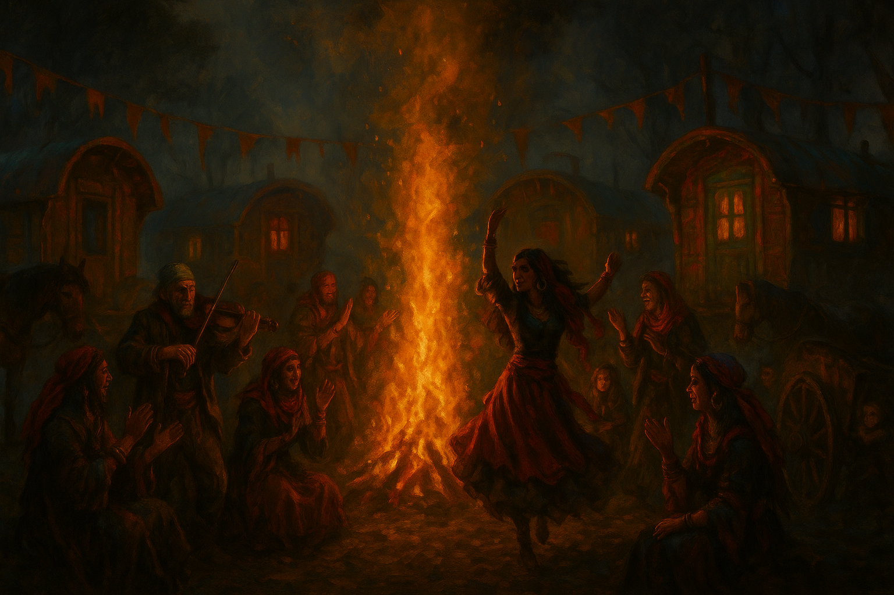

# The Vistani

- **Type:** Wandering Folk
- **Base of Operations:** Various encampments across Barovia (Tser Pool, Tser Hill, Tser Raven, Tser Luna)
- **Status:** Endangered — multiple camps destroyed, Tser Hill under active assault
- **Alignment:** Mixed — loyalties are deeply divided between those who serve Strahd and those who resist him

---

## Origins

The Vistani are survivors of the Fall. When the Netheril Empire collapsed, the world burned. Kingdoms fractured, armies scattered, and entire civilizations were swallowed by war, famine, and the unchecked release of wild magic. Whole regions became uninhabitable overnight. The people who would become the Vistani were among the countless displaced, driven from their homes with nothing but what they could carry.

They traveled. Not by choice at first, but because staying still meant death. They moved from ruin to ruin, scavenging food and resources as nations tore each other apart in the chaos that followed the Fall. They learned to read the land, to find safe passage where others saw only danger, and to keep moving when the ground beneath them turned hostile. Over time, the traveling itself became something more than survival. It became who they were. They called it "the Travel," and it shaped everything about how they lived, how they raised their children, and how they understood the world.

Eventually the Vistani made their way to the Valley of Barovia. It was quiet there, tucked between the Balinok Mountains, untouched by the worst of the fighting. While the rest of the world bled, Barovia offered peace. The Vistani claimed it as home. They set up encampments along the rivers and passes, established trade routes, and built a life for themselves in the valley. But they never stopped traveling. The Travel was too deeply woven into their identity to abandon. Barovia was their anchor, their place of safety in a world of chaos, but it was never a cage. They came and went as they pleased, and that freedom defined them as a people.

## The Ancient Pact

Centuries later, Strahd Von Zarovich moved his forces into the Barovia Valley to claim it for the Von Zarovich dynasty. During the campaign, Vistani travelers found Strahd gravely wounded after a battle. They took him in, nursed him back to health, and protected him until he recovered. Strahd did not forget the debt.

When Strahd signed his pact with the Dark Powers and the Mists rose to seal Barovia from the outside world, the Vistani were trapped along with everyone else. But Strahd honored what they had done for him. He granted the Vistani freedom to travel through his domain and beyond the Mists, and safe passage wherever his authority held. They became the only people who could walk freely in and out of Barovia, a privilege no other living soul possessed.

Over the centuries, Strahd's gratitude hardened into expectation. The Vistani served as his eyes and ears beyond the Mists, carried messages, kept his secrets, and reported on those who moved against him. Some Vistani accepted this arrangement and served willingly. Others remembered what their people had been before Strahd claimed them, and carried that resentment quietly. Most simply survived, caught between loyalty and fear, doing what they had to do to keep their families safe. The arrangement also brought the Vistani wealth. They were the only ones who could move goods into Barovia from the outside world, and resources that were common elsewhere sold at high prices in a land cut off from everything.

## Culture and Abilities

The Vistani call their nomadic way of life "the Travel." Caravans move in brightly painted wagons, setting camp wherever the road takes them. Bonfires, storytelling, music, and spiced wine are the heart of any Vistani gathering. Their culture values family above all else, and abandoning the Travel is seen as a betrayal of everything it means to be Vistani.

Their most well-known gift is the ability to navigate the Mists. Where others vanish or go mad, the Vistani walk through unharmed. This ability appears to be tied to their blood, not just their knowledge. Velinka d'Avenir opened the Gates of Barovia using her own Vistani blood, a ritual no outsider could replicate.

The Vistani are also known for their seers and fortune-tellers. The most powerful among them read the Tarokka Deck, a set of cards that reveal glimpses of the past, present, and future. These readings are always cryptic, but they always prove true. Some Vistani also possess what they call "second sight," a minor gift of divination that lets them sense things others cannot.

Their music carries old power. Vistani songs were once said to call down stars, though now the old songs go unsung and the people scatter. Some melodies still echo ancient holy chants, twisted by time but not entirely forgotten.

The Vistani are also capable of laying powerful curses. Rudolph Van Richten carries the weight of a Vistani curse placed on him after a tragic incident involving his son, Erasmus, a reminder that crossing the Vistani carries consequences that last a lifetime.

## The Vistani and Strahd

The relationship between the Vistani and Strahd is not simple. Strahd tolerates them, protects them, and uses them. In return, many Vistani serve him faithfully as spies, messengers, and informants. Others serve only out of fear, knowing that open defiance means death. A few have broken away entirely, choosing exile or worse rather than remain shackled to the Devil's will.

Whether Strahd truly blesses the Vistani or merely tolerates them has always been a matter of debate among the Vistani themselves. Recent events have settled that question. Strahd turned against the Vistani with the same cold efficiency he turns against everything that displeases him, ordering their camps destroyed and their people scattered. The ancient pact, it turns out, was only ever as strong as Strahd's patience.

## The Encampments

The Vistani have never lived in one place. Even after settling in the Valley of Barovia, they spread themselves across the land in a network of encampments, each one tied to a river, a crossroads, or a trade route. These camps are not permanent in the way a town is permanent. Wagons can be hitched and moved in hours. But over the centuries, the camps took on identities of their own, with families who returned to the same ground generation after generation, leaders who rose from those families, and traditions that belonged to one camp and not another.

Each encampment operates independently. There is no single Vistani king or council. Leadership within a camp falls to whoever the families trust most, usually the loudest voice, the steadiest hand, or the one whose family has been there the longest. Madam Eva held spiritual authority over all the Barovian Vistani through the weight of her wisdom and the power of her sight, but she gave orders to no one. The camps cooperated when they needed to and kept their own counsel when they did not.

### Tser Pool Encampment — Destroyed

The Tser Pool encampment sat in a wide clearing along the banks of the Ivlis River, on the Old Svalich Road. It was the spiritual heart of the Barovian Vistani, the place where Madam Eva held court and read the Tarokka for those who sought her counsel. The camp was smaller than Tser Hill but carried more weight among the Vistani because of Eva's presence. Travelers, traders, and fortune-seekers all made their way to Tser Pool at one time or another.

The party arrived at the camp after killing a pack of werewolves on the Tser Road. The Vistani watched them emerge from the mist with blood and dirt still on their armor. Stanimir greeted them with open arms and a cup of wine. The camp that night was full of firelight, music, dice games, and stories. Madam Eva summoned them to her tent and performed the Tarokka reading that set the party on their path.

The camp was destroyed during the Battle of Tser Pool. Seraphine Stormraven led a massive undead assault. Death Knights attacked from east and west, Goliath Skeletons emerged from the water, and Seraphine arrived in a carriage drawn by Nightmares to demand Ireena Kolyana for Strahd. The camp burned. Every adult Vistani was killed, including Madam Eva and Luvash's sister Nadara. Only two children and Ireena survived, hidden beneath the wagons.

#### Members

- **Madam Eva** — Ancient Vistani seer and leader of the encampment. The most powerful fortune-teller in all the realms, she used the Tarokka Deck to divine the future and guide those who sought her counsel. Her readings were always cryptic but always proved true. She was far older than she appeared and harbored deep secrets. Despite the Vistani's traditional service to Strahd, Eva appeared to work toward his downfall for reasons of her own. Her Tarokka reading guided the party to the locations of powerful artifacts needed in the fight against Strahd. Killed when Seraphine Stormraven destroyed the camp.
- **Stanimir** — The camp's storyteller. A heavy-set man in silks and scarves with gold hoops in his ears. Booming, jovial, the kind of man who fills a room and chases silence away with laughter. He was the first to welcome the party, greeting them by the bonfire with a cup of wine and tales of Barovia's dark lord. Proud of his heritage and deeply afraid of Strahd, though he would never admit it. Killed in the massacre.
- **Danyela** — A young woman with black hair streaked in red who ran a dice game by the fire. Teasing, smoky, dangerous. She cheated openly and winked when caught. Beneath the charm she carried a quiet mourning she never explained. Killed in the massacre.
- **Old Piotr** — The camp's fiddler. Skeletal-thin, white-bearded, one eye clouded with age. His bow never stopped moving. He played a melancholy tune he said kept the spirits from whispering too close. Those with the knowledge to recognize it heard echoes of a chant once used by the Order of the Yellow Rose, a holy refrain twisted by time but not entirely forgotten. Killed in the massacre.
- **Nicolai** — The camp's horse master. A gruff, practical man who tended the animals at the camp's edge and warned travelers not to wander the mists at night. He spoke of Strahd with the resigned dread of a man who had seen too much. Killed in the massacre.
- **Nadara** — Luvash's sister, married to one of the Tser Pool Vistani. Her death in the massacre is a major source of Luvash's fury at Strahd and his determination to see the Vistani survive. She has no surviving children.
- **Arabelle** — A girl of about fourteen with dark braided hair and bright, curious eyes. Fascinated with the heroes and their gear. She asked if they had seen the real sun. One of only two children who survived the massacre, hidden beneath the wagons by Ireena.

### Tser Hill Encampment — Under Siege

The Tser Hill encampment is the largest Vistani settlement in Barovia, located near Vallaki. The dusk elves, led by Kasimir Velikov, live alongside the Vistani here in a shared community that has existed for generations. The camp serves as the commercial center of Vistani trade in the valley. Much of the magical merchandise that passes through Vallaki comes from goods the Tser Hill Vistani bring in from beyond the Mists.

The camp is currently under assault. Vasilka and her Patchwork Goblins overwhelmed the Tser Raven Vistani first, then moved on to Tser Hill. Vasilka has demonstrated terrifying power, including redirecting a defender's spell back against them, and commands what appears to be an unlimited supply of Mongrelfolk. The players are currently defending the camp.

#### Members

- **Luvash Vanduva** — Head of the Vanduva family and leader of the Tser Hill Vistani. A large, boisterous man who leads with his heart and his voice. He was first met at the Blood of the Vine Inn, desperate and searching for his kidnapped daughter Arabelle. After the party rescued her from the Bonegrinder hags, Luvash publicly thanked them in Vallaki. His sister Nadara died in the Massacre of Tser Pool, and the grief has hardened into something between fury and determination. He is the public face of the camp, not subtle, not strategic, but deeply trusted by his people.
- **Arrigal Vanduva** — Luvash's brother and Arabelle's uncle. Charming, clever, deadly with a blade. Quiet where Luvash is loud. He watches before he speaks and is hard to surprise. He handles planning and security for the camp and is the one most likely to turn a feeling into a plan. Luvash trusts him completely.
- **Arabelle Vanduva** — Luvash's sixteen-year-old daughter. She was kidnapped by the hags of Old Bonegrinder and rescued by the party. Quiet, watchful, she notices details that adults miss. She has feelings for Brom Martikov, who saved her during the Festival of Light.
- **Kasimir Velikov** — Leader of the dusk elves who live alongside the Vistani at Tser Hill. A ranger who bears terrible scars. His ears were cut off by Rahadin on Strahd's orders as punishment for an act of defiance. He leads the Night Rangers, a group of dusk elf rangers who patrol the area and protect both the Vistani and his own people. Kasimir is haunted by visions from his dead sister Patrina and carries a deep, quiet grief for everything his people have lost.

### Tser Raven Encampment — Destroyed

A smaller Vistani settlement near Krezk. The Tser Raven Vistani were the first target when Strahd ordered the camps destroyed. The Abbot's forces hit them in the middle of the night without warning. Wagons were burned and anyone who could not flee was killed. The survivors scattered into the woods or sought shelter behind Krezk's walls. Little is known about this camp's specific leadership or how many survived.

### Tser Luna Encampment

A quiet Vistani group along the Luna River to the south. The Tser Luna Vistani keep to themselves and are rarely mentioned by the other camps. They maintain a trade relationship with the Radescu werewolf pack, who live as humans in a nearby village and only turn on the full moon. The Radescu deal exclusively with the Tser Luna Vistani when they need supplies, and the arrangement appears to be built on mutual trust and discretion. The current status of this camp is unknown.

### The E'Tressa Family — Blood of the Vine Inn

Not a camp, but a settled Vistani family in the Village of Barovia who abandoned the Travel and now run the Blood of the Vine Inn. The Tser Hill Vistani viewed their departure as a betrayal, and there has been no contact between the families since.

The inn also sheltered a young Vistani couple, Dmitru and Sorina Vaduva, whose daughter Liliana went missing in the Village of Barovia.

#### Members

- **Sarkov E'Tressa** — Co-owner of the Blood of the Vine Inn. A broad-shouldered, silent man in his late forties. His tongue was cut out by Strahd for speaking against him. He communicates through gestures and a steady, watchful presence. Originally from the Tser Hill Vistani, he gave up the Travel after Strahd's punishment left him unable to speak. He protects Luna and the inn with quiet strength and harbors a deep hatred for Strahd that he can never voice.
- **Luna E'Tressa** — Co-owner and the voice of the inn. A striking woman in her early forties with kind but weary eyes. Born in the Village of Barovia, she married Sarkov and left the Tser Hill community. She was once a singer among the Vistani, and her voice still carries old caravan songs when the mood takes her. She speaks for both herself and Sarkov.
- **Magda E'Tressa** — Sarkov's widowed aunt and the inn's cook. A stout woman in her late sixties with a hooked nose and a cane she does not truly need. Gruff, practical, and fiercely protective. She left the Tser Hill Vistani without hesitation when Sarkov was mutilated. Family loyalty runs deeper than caravan bonds.
- **Ilyana Kostova** — Luna's godmother and a fixture at the inn. A tall, wiry woman in her early seventies with bright scarves and sharp eyes that miss little. She was once a singer and dancer among the Vistani, though her voice has gone raspy. She claims to have "second sight," and her warnings have an unsettling habit of proving accurate. She knows old Vistani stories and traditions better than anyone at the inn.
- **Klara Vorovich** — Luna's distant cousin and the inn's bookkeeper. A thin, severe woman in her late sixties with long gray hair always tied back. Quiet, efficient, always listening.

### The d'Avenir Family — Destroyed

The d'Avenir family led a caravan known as the Tser Pass Vistani. They were among those who remembered what the Vistani had been before Strahd claimed them, and they refused to serve him. Dmitru d'Avenir led the caravan. His wife Sorina was its heart, strong and willful and devoted to the old Vistani ways. Their daughter Ezmerelda grew up in the wagons alongside her aunt Velinka, always listening, always watching.

Whatever the d'Avenir family did to draw Strahd's wrath, the punishment was absolute. The Stormraven Sisters descended on the caravan at the Druid Clearing in Damara, wearing death-black armor. They attacked without warning. Wagons burned. The bodies were never buried.

The players passed through the Druid Clearing during their journey south and found a dozen ancient wagons, their paint dulled by sixteen years of weather. Cracked wheels, faded pennants, empty chests, and scattered bones told the story of a desperate stand that ended badly.

#### Survivors

- **Velinka d'Avenir** — Sorina's sister and Ezmerelda's aunt. A druid of the Verdant Heart. She was pulled from the wreckage by druids and nursed back to life in a hidden forest. She saw prophetic visions of Barovia burning beneath an unblinking red eye. She guided the party through the Devil's Mists to the Gates of Barovia, opening them with her own Vistani blood, but refused to enter herself. She believes her entire family is dead.
- **Ezmerelda d'Avenir** — Dmitru and Sorina's daughter. She escaped the massacre, though how she survived is unknown. She eventually found the monster hunter Rudolph Van Richten, who took her on as his student. She lost her right leg below the knee to a werewolf and now hunts the undead across Barovia as one of its most capable fighters. She does not know her aunt Velinka is alive.

#### Deceased

- **Dmitru d'Avenir** — Father and caravan leader. Killed in the Stormraven massacre.
- **Sorina d'Avenir** — Mother and heart of the caravan. Strong, willful, devoted to the old Vistani ways. Killed in the massacre.

## DM Notes

The Vistani are in crisis. Their spiritual leader is dead. Three of their camps have been destroyed or overrun. Their largest remaining settlement is under active assault. The ancient pact with Strahd, the one thing that kept them safe for centuries, has been broken by Strahd himself after Lady Williams manipulated him into believing the Vistani had betrayed him.

Strahd maintains his hold on the Vistani through a network of loyalists and spies embedded in every camp and settlement. Arrigal Vanduva, Luvash's brother, is Strahd's most trusted spy among the Vistani. He delivered the false Burgomaster letter that lured the party to Barovia. Luvash trusts him completely, unaware of his betrayal. Klara Vorovich, a distant cousin of Luna E'Tressa at the Blood of the Vine Inn, feeds intelligence to Strahd's network in the same way.

Lady Williams manipulated Strahd into believing the Vistani had betrayed him, which triggered the destruction of the camps. The Vistani's divided loyalties create natural tension in every interaction. Players can never be entirely sure whether a Vistani they meet serves Strahd, resists him, or is simply trying to survive.

Van Richten has vowed to destroy the Stormraven Sisters to avenge the d'Avenir family. The fact that Velinka and Ezmerelda are both alive and neither knows about the other is a thread that could be pulled at any time.

The destruction of the Vistani camps also removes one of the party's most reliable sources of information and safe harbor. Without the Vistani's ability to move through the Mists, the players have lost a potential escape route from Barovia and a network that once stretched beyond the domain's borders. What remains of the Vistani is scattered, grieving, and fighting to survive.
