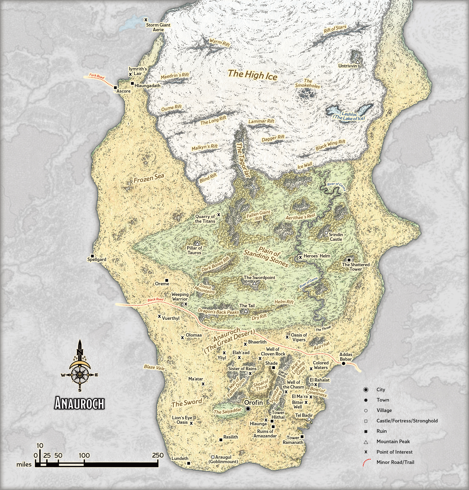
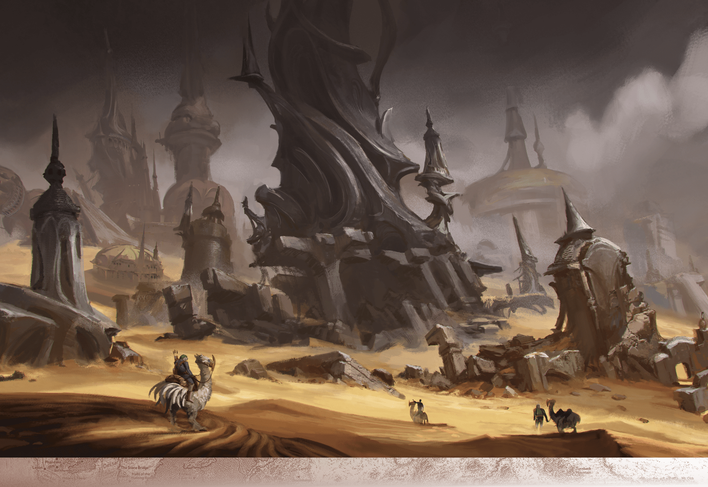

# Anauroch

> **At a Glance:** A wasteland, once the thriving heart of the Netherese empire, inexorably spreads into surrounding lands.
> **Region:** Anauroch
> **Languages:** Midani (Bedine), Netherese (Shade)

Anauroch is a vast desert that was once the center of the powerful Netherese Empire. The desert is divided into three distinct regions: the High Ice, the Plain of Standing Stones, and the Sword. The harsh climate and treacherous terrain make survival difficult, yet several groups manage to thrive. The Bedine, a nomadic people, have adapted to the desert's challenges, living in harmony with the land. The remnants of the Netherese, known as the Shadovar, returned from the Shadowfell with ambitions to reclaim their lost glory. Additionally, the Zhentarim, a mercantile and military organization, maintain a strong interest in Anauroch's trade routes and hidden treasures.

The history of Anauroch is marked by the rise and fall of the Netherese Empire, which reached its zenith around -339 DR before collapsing due to the catastrophic event known as Karsus's Folly. This event led to the desertification of the region. The return of the Shadovar in 1372 DR and their subsequent fall in 1487 DR have left a lasting impact on the region, with many seeking to exploit the power and artifacts left behind.

## Notable Locations

### Azirrhat
Azirrhat is a mysterious ruin located in the northern part of Anauroch. It is believed to be a remnant of the Netherese Empire, containing ancient magic and artifacts. The site is guarded by lamias and other desert creatures, making exploration dangerous. Adventurers are drawn to Azirrhat in search of lost knowledge and treasure.

### Saiyaddar
Saiyaddar is a series of oases that serve as vital waypoints for travelers crossing the desert. The Bedine tribes often gather here to trade and replenish their supplies. The oases are lush compared to the surrounding desert, providing a stark contrast to the barren landscape.

### Scimitar Spires
The Scimitar Spires are a range of jagged mountains that form the western boundary of Anauroch. These peaks are home to various creatures and are rumored to hide entrances to ancient Netherese vaults. The Zhentarim have shown interest in the spires, seeking to uncover the secrets buried within.

### Shadow Sea
The Shadow Sea is a vast expanse of shimmering sand that resembles a body of water from a distance. It is a treacherous area known for its mirages and shifting sands. The Shadow Sea is said to conceal the ruins of a Netherese city, drawing treasure hunters and scholars alike.

### The Sword
The Sword is a narrow strip of fertile land at the southern edge of Anauroch. It is a critical trade route that connects the desert to the lands beyond. The Zhentarim frequently patrol this area to ensure the safety of their caravans and to maintain control over the flow of goods.

### Thul Avenar
Thul Avenar is a hidden research complex located beneath the mountains at the edge of the desert. It was once a center of Netherese magical experimentation, and its Great Machine played a role in the events of Karsus's Folly. The site remains a point of interest for those seeking to understand the ancient magic of Netheril.

### Bedine Encampments
Scattered throughout Anauroch, these encampments are home to the nomadic Bedine tribes. Each encampment is a small community that moves according to the seasons and the availability of resources. The Bedine are known for their hospitality and their deep knowledge of the desert.

### Zhentarim Outposts
The Zhentarim maintain several outposts along the trade routes in Anauroch. These fortified positions serve as bases for their operations in the region, providing shelter and resources for their agents. The outposts are strategically placed to monitor and control the flow of goods and information.

---

## DM Notes

Anauroch is the former heartland of the Netherese Empire, founded around -3,859 DR. The campaign's Netheril dates differ from some published sources. The hidden research complex of Thul Avenar lies beneath the mountains at the desert's edge, where Netherese arcanists attempted to harness forces older than the Weave. The Great Machine within Thul Avenar partially activated during Karsus's Folly, contributing to planar instability that persists to this day.

The return and fall of Shade Enclave (1372-1487 DR) is directly connected to current events. Shadovar agents sought artifacts related to the Great Machine before their city fell. Some of these agents may still operate in the region.

The Zhentarim maintain active interest in Anauroch's trade routes and buried Netherese sites. Several artifacts recovered from the desert have appeared in markets across the Sword Coast and the Forgotten Lands.
