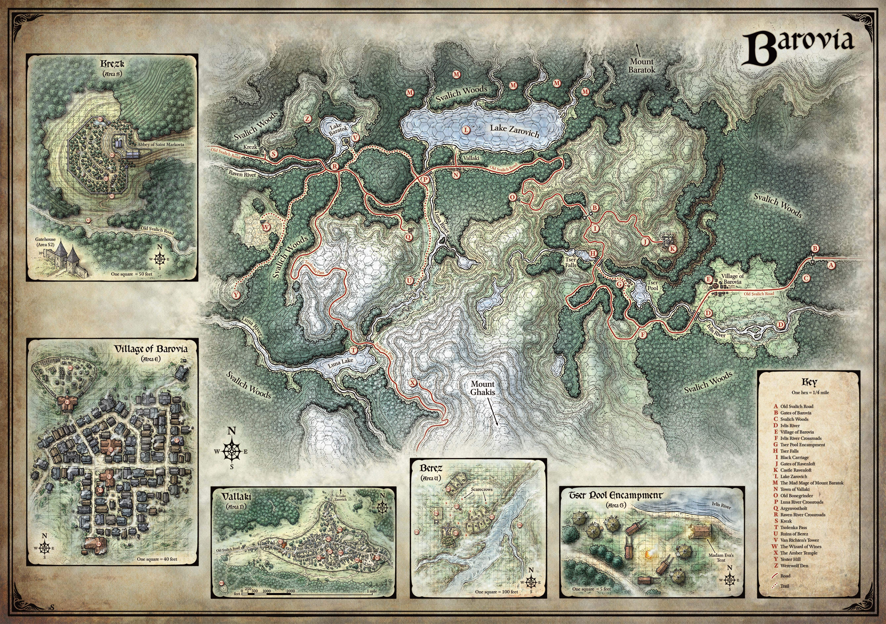

# Barovia

Barovia is a small, isolated valley nestled deep within the Giantspire Mountains of northeastern Faerun. Once a remote but fertile stretch of land, it was conquered in the late 11th century DR by the Damaran General-Prince Strahd Von Zarovich, who named it in honor of his father, King Barov II. Following Strahd's transformation into a vampire lord and the curse that followed, the valley was sealed away from the rest of the world by supernatural mists, becoming a demiplane of dread ruled by darkness and despair.

## Geography

Barovia occupies a narrow mountain valley surrounded on all sides by towering peaks and dense forests. The land is perpetually overcast, shrouded in thick fog that rolls in from the surrounding mountains. Sunlight rarely breaks through, and the landscape carries a constant sense of unease.

The valley is divided into several key areas. The Village of Barovia sits at the eastern edge, a collection of crumbling cottages and fearful residents who rarely venture outside after dark. The town of Vallaki lies deeper in the valley, larger and more fortified but no less troubled. To the west stands the village of Krezk, perched near the slopes of Mount Baratok and protected by high stone walls.

The Svalich Woods dominate the landscape between settlements, thick with ancient trees and home to wolves, dire creatures, and things far worse. The Old Svalich Road winds through the forest, connecting the major settlements and serving as the only reliable route of travel through the valley.

Lake Zarovich sits northwest of Vallaki, a cold and still body of water surrounded by mist. Few fish in its waters willingly. The Ivlis River flows from the mountains through the valley, feeding into the lowlands before disappearing into marshes near the eastern edge of the domain.

## History

### Before the Curse

Before it became a prison, Barovia was simply a remote valley in the Giantspire Mountains. Ancient Netherese ruins lay buried beneath the mountains nearby, remnants of the research complex known as Thul Avenar, where Netherese arcanists had once attempted to harness forces older than the Weave itself.

In the years following the fall of Netheril, the Von Zarovich dynasty rose to power in the lands of Damara. Through military conquest and political consolidation, the family built a kingdom stretching across much of the eastern frontier. Strahd Von Zarovich, born in 1090 DR, proved to be the most brilliant military commander the dynasty had produced.

During one of his campaigns to expand Damaran territory, Strahd discovered this fertile valley in the mountains. He conquered it and named it Barovia after his father, King Barov II Von Zarovich. He then ordered the construction of a great fortress overlooking the valley. This castle, later known as Castle Ravenloft, was named in tribute to his mother, Queen Ravenovia Van Roeyen.

### The Curse of Strahd

During the wedding celebration of Strahd's younger brother Sergei Von Zarovich and the noblewoman Tatyana, Strahd was consumed by jealousy. He had already made a dark pact with a malevolent entity in exchange for eternal life and power. In a moment of betrayal, he murdered Sergei.

The pact transformed Strahd into a vampire lord bound by dark magic and eternal hunger. The land recoiled from the act. Strange mists descended upon the valley, sealing Barovia away from the rest of the world. The domain became a supernatural demiplane of dread, forever isolated within the Mists of Ravenloft.

With Strahd trapped in his cursed domain, the power of the Von Zarovich dynasty was shattered. Damara fell into political collapse, and the rival noble houses competed for control of the kingdom during the period known as The Fractured Realms.

### The Domain of Dread

Since the curse, Barovia has existed outside normal time and space. The Mists that surround the valley are not natural fog. They are a planar boundary, a wall between the demiplane and the Material Plane. Those who enter the Mists rarely find their way out. Some are drawn in deliberately by Strahd or by the dark powers that maintain the domain.

The people of Barovia live under Strahd's rule, though most try to ignore his existence. Generations have passed within the valley, and the original inhabitants' descendants know nothing of the world beyond the Mists. Fear permeates daily life. Doors are barred at night. Strangers are met with suspicion.

## Notable Locations

- **Castle Ravenloft** - The ancient fortress overlooking the valley, home to Strahd Von Zarovich. A sprawling structure of towers, crypts, and grand halls, all falling slowly into decay.
- **Village of Barovia** - The easternmost settlement, where the road from the Mists first enters the valley. Small, poor, and deeply afraid.
- **Vallaki** - The largest town in the valley, governed by local leaders who attempt to maintain order through festivals and forced optimism.
- **Krezk** - A walled village near the western mountains, sheltered and isolated even by Barovian standards.
- **The Amber Temple** - A ancient temple high in the mountains, built long before Strahd's arrival. It contains dark vestiges, entities of immense power sealed within amber sarcophagi.
- **Old Bonegrinder** - A windmill on a hill along the Old Svalich Road, known for its sinister occupants.
- **Yester Hill** - A forested hilltop south of Vallaki, sacred to druids who serve Strahd.
- **Argynvostholt** - The ruined manor of an order of knights who once opposed Strahd, now haunted by the spirits of its fallen defenders.

## Government and Politics

Barovia is ruled absolutely by Strahd Von Zarovich, the vampire lord of Castle Ravenloft. His authority is total, though he rarely exercises it directly in the day-to-day affairs of the valley's settlements. Local leaders govern their towns under the implicit understanding that Strahd's will is law, and that defiance is fatal.

The Vistani hold a unique position in Barovia. Unlike other inhabitants, they can pass freely through the Mists. They serve as Strahd's eyes and ears throughout the valley, and in return they enjoy freedoms denied to everyone else.

## Culture and Society

Life in Barovia is defined by fear and resignation. The people are hardy, accustomed to hardship, and deeply superstitious. They distrust outsiders, avoid the forest after dark, and speak of Strahd only in whispers.

Religion offers little comfort. The Morning Lord (Lathander) was once worshipped openly in the valley, but faith has dimmed over the centuries. The church in the Village of Barovia still stands, though its congregation has dwindled. Some Barovians have turned to darker beliefs, while others simply endure without hope.

The Vistani maintain their own traditions, traveling between settlements and sometimes beyond the Mists themselves. Their culture emphasizes freedom, storytelling, and loyalty to their own people above all else.

---

## DM Notes

Barovia is the central setting of the Halls of the Damned campaign Chapter One. The players entered the domain through the Mists after the Fall of Valls in 1496 DR.

The valley's proximity to the ancient Netherese complex of Thul Avenar is not coincidental. The planar instability caused by the Great Machine's partial activation during Karsus's Folly weakened the boundaries between planes in this region. When Strahd's curse manifested, those weakened boundaries allowed the Mists to anchor more completely.

The Amber Temple contains vestiges that may be connected to the same primordial forces the Netherese attempted to harness. Several of these entities predate the gods themselves and may have knowledge of Shorthagot and the Keys.

The Order of the Yellow Rose established a presence near the valley long before Strahd's conquest, guarding the planar gateway beneath what would become the Citadel in Valls. The fall of Valls and the breach of the Shadowfell gateway are directly connected to events unfolding within Barovia.
