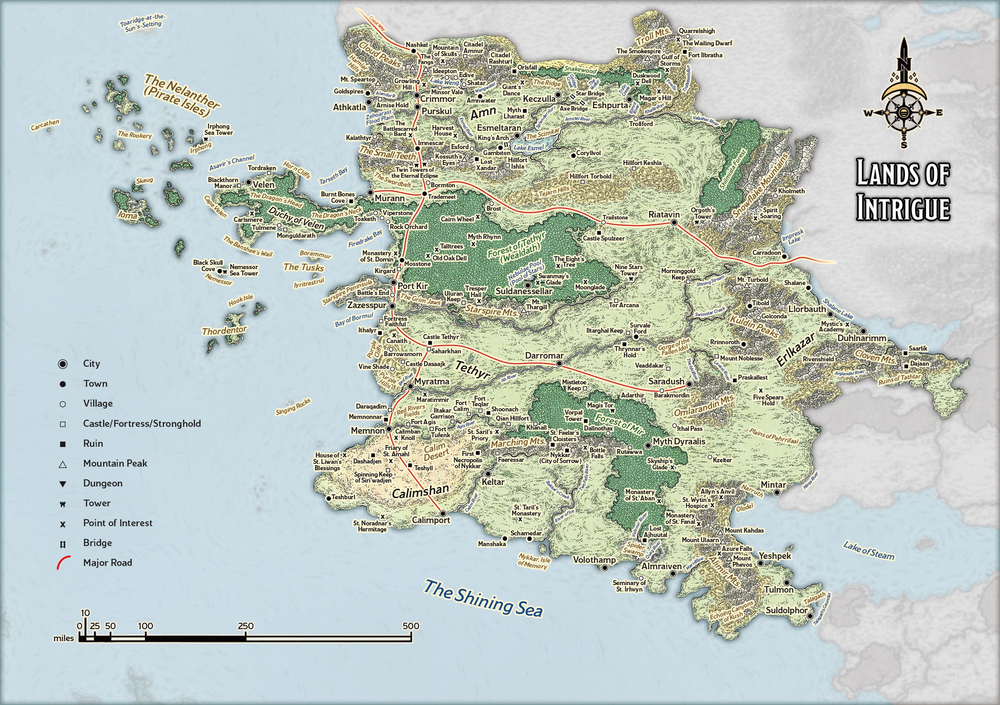

# Calimshan

> **At a Glance:** These wealthy mercantile realms each keep a close eye on each other while carefully tending to their own political turmoil.
> **Region:** Lands of Intrigue
> **Languages:** Alzhedo, Chondathan

Calimshan is a land where tradition and innovation coexist under the reign of Sultana Songal. Situated in the southwest of Faerun, it is a realm steeped in history, with a legacy spanning over ten thousand years. The region is known for its scorching deserts, bustling trade cities, and the complex interplay between its human inhabitants and the powerful genie factions. The four genie factions have both subjugated and allied with the people of Calimshan throughout history, resulting in a dynamic relationship that continues to shape the realm. While the desert-dwelling Calishites rely on genie magic for survival, the inhabitants of the capital city, Calimport, have embraced technological advancements from Lantan, leading to a proliferation of Mechanical Wonders that have transformed urban life.

Calimshan is home to the largest population of genasi in Faerun, with many living among the human populace, while others reside within the genie strongholds. The region's culture is a tapestry of diverse influences, with a strong emphasis on commerce, tradition, and the arcane. The political landscape is complex, with various factions vying for power and influence, both within the human society and among the genies.

## Notable Locations

### Alimir Mountains

The Alimir Mountains are a formidable range that once served as the battleground for the Eye Tyrant Wars, where Calimshan faced off against beholder tyrants. Today, these mountains are home to a massive beholder hive, where nearly fifty beholders bide their time, rebuilding their numbers and plotting their next move. The mountains are also rich in mineral resources, attracting miners and adventurers alike, despite the lurking danger.

### Calim Desert

The Calim Desert is a vast, inhospitable expanse created by the magical backlash from the imprisonment of the genies Calim and Memnon in the Calimemnon Crystal. This desert is notorious for its unpredictable wild magic and frequent sandstorms, which can be both a bane and a boon to those who traverse its dunes. Hidden within the desert are ancient ruins and lost cities, remnants of a bygone era when genies ruled the land.

### Calimport

Calimport, the capital of Calimshan, is one of the oldest and most influential cities in Faerun. This bustling trade hub is a melting pot of cultures, where magical and mechanical marvels coexist. The city is governed by Sultana Songal, who enforces the Sultana’s Oath, a magically binding pact that genies must swear to enter the city. Beneath the surface lies the Muzad, an undercity teeming with cults, criminals, and illicit markets, offering both opportunity and danger to those who dare to venture there.

### Forest of Mir

The Forest of Mir is a mystical woodland that conceals the Phantom City of Myth Dyraalis, a place with strong ties to the Feywild and the plane of Arborea. Only those with fey ancestry can perceive this hidden city, thanks to a powerful mythal. Nearby, the settlement of Dallnothax serves as a haven for followers of Vhaeraun, the drow god of thievery, who operate from the shadows.

### Genie Strongholds

Scattered across Calimshan are the strongholds of the four genie factions. The dao fortress of Olympus Dag is nestled in the Marching Mountains, while the marid city of Maran Saya lies deep beneath the Shining Sea. The djinni city of Burin Bir floats above the Forest of Mir, trailing a series of opulent palaces. In the Calim Desert, the efreeti fortress of Gozva Ka is hidden by shimmering illusions. These strongholds are centers of power for the genies, who rule over their domains with the aid of servitors and allies.

### Marching Mountains

The Marching Mountains are home to the First Necropolis of Nykkar, an ancient burial site where early Calishites laid their revered dead to rest. This area is steeped in history and mystery, attracting scholars and adventurers who seek to uncover its secrets. The mountains are also a natural barrier, separating Calimshan from its northern neighbors.

### Nykkar, Isle of Memory

The Isle of Memory, known as Nykkar, is a modern necropolis where Calishites have established numerous mausoleums and cemeteries. Maintained by priests of Kelemvor, the island is serviced by the Death Fleet, a group of ships dedicated to transporting the deceased. A lighthouse on the island's northern tip guides these vessels, ensuring safe passage through the treacherous waters.

### Spider Swamp

The Spider Swamp is a fetid, dangerous region on Calimshan's southern coast. Although Zanassu the Spider Demon was vanquished long ago, the swamp remains infested with quasits and other demonic creatures. The reclusive araneas, spider-people who use magic to conceal their identities, also inhabit this area. They occasionally venture into nearby towns to trade, maintaining a delicate balance between secrecy and interaction with the outside world.
