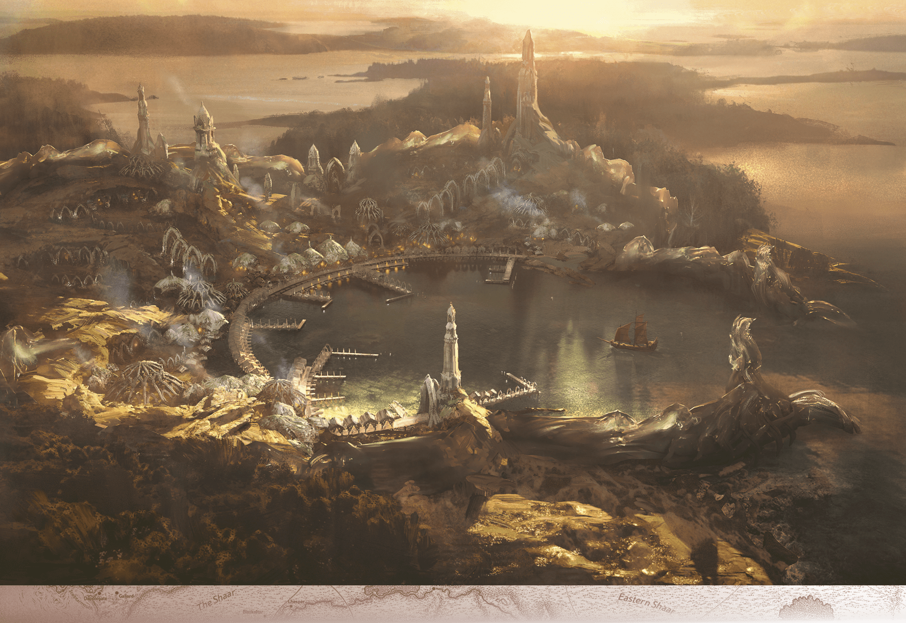

# Chult

> **At a Glance:** Distant lands and island realms that lie at the edges of Faerunian knowledge and exploration.
> **Region:** Beyond the Map
> **Languages:** Various

Chult is a land of tropical wilderness: dense jungles and snaky rivers ringed by mountains, volcanoes, and sheer escarpments. Walls of mountains to the west, south, and east shield the interior from the sea and from the view of sailors. The rivers are so sluggish that it can be difficult determining which direction is upstream and which is down. The rivers pick up speed only where they thunder down through steep-sided gorges.

Chult has long been inhabited by bullywugs, dwarves, humans, goblins, and lizardfolk, as well as dinosaurs, hydras, wyverns, and other monsters. The people of Chult revere a deity named Ubtao, whose divine rival, Dendar the Night Serpent, is said to be imprisoned beneath volcanoes called the Peaks of Flame.

Chult’s coast from the Bay of Chult to Refuge Bay offers beaches from which explorers embark into the jungle, but the Bay of Chult is the only spot that welcomes travelers from afar. The rest of the peninsula is a breeding ground for bloodsucking, disease-bearing insects; monstrous reptiles; carnivorous birds and beasts of every variety; and murderous undead.

Chult's history is rich and complex, with its people having survived numerous cataclysms, including the Spellplague and the more recent Death Curse. The region is known for its dangerous wildlife and treacherous terrain, which have kept it largely unexplored by outsiders. The government of Chult is decentralized, with power largely in the hands of local leaders and influential merchant princes, particularly in Port Nyanzaru.

## Notable Locations

### Mezro

The city of Mezro is widely thought to have been destroyed in the Spellplague. In fact, its inhabitants saved it through powerful magic, whisking it away into a demiplane and leaving only ruins behind. Some hints suggest the city will return when it is no longer in danger. The Flaming Fist, a mercenary company out of Baldur’s Gate, has searched the ruins of Mezro extensively and still sends patrols there. Mezro was once a center of worship for Ubtao, and its eventual return could restore its status as a spiritual heart of Chult.

### Port Nyanzaru

Port Nyanzaru hugs the coastline at the south end of the Bay of Chult. It’s a colorful, musical, aroma-filled, vibrant city, the only city in Chult that isn’t in ruins or overrun by monstrous creatures. The city is run by seven influential merchant princes. Other than trade, the biggest attractions are the weekly dinosaur races through the streets. Locals and visitors alike wager princely sums on the races’ outcomes. The city also boasts grand bazaars, glorious mansions and temples, circuses, and gladiatorial contests. Port Nyanzaru serves as the primary gateway for explorers and adventurers seeking to venture into the dangerous jungles of Chult.

### Peaks of Flame

The Peaks of Flame are a range of active volcanoes located in the heart of Chult. They are believed to be the prison of Dendar the Night Serpent, a primordial entity of destruction. The area is fraught with danger, from lava flows to fire elementals. The Peaks are also rumored to be rich in rare minerals and gemstones, attracting daring miners and treasure seekers despite the risks.

### Valley of Lost Honor

This valley is a desolate and foreboding place, scarred by ancient battles. It is said to be haunted by the spirits of warriors who died in a great conflict long ago. The valley is also home to a number of undead creatures, making it a perilous place for those who venture too far from the main trails. Despite its dangers, the valley contains ruins that hold ancient secrets and treasures.

### Aldani Basin

The Aldani Basin is a vast, swampy region in Chult, named after the Aldani, or lobsterfolk, who once inhabited the area. The basin is teeming with life, including dangerous predators and exotic plants. It is a place of mystery, with many hidden caves and lost ruins waiting to be discovered by brave adventurers.

### Kir Sabal

Kir Sabal is a secluded monastery inhabited by the aarakocra, a bird-like humanoid race. The monastery is perched high on a cliff, offering breathtaking views of the surrounding jungle. It serves as a sanctuary and a place of learning, where the aarakocra practice their spiritual traditions and offer guidance to those who seek it. Kir Sabal is also a place of refuge for those who oppose the undead menace in Chult.

### Nangalore

Nangalore is an ancient, overgrown garden palace located in the jungles of Chult. It was once the home of a powerful queen, and its ruins are now inhabited by strange creatures and deadly traps. The palace is known for its exotic flora, some of which possess magical properties. Adventurers are drawn to Nangalore by the promise of hidden treasures and the allure of its mysterious past.
