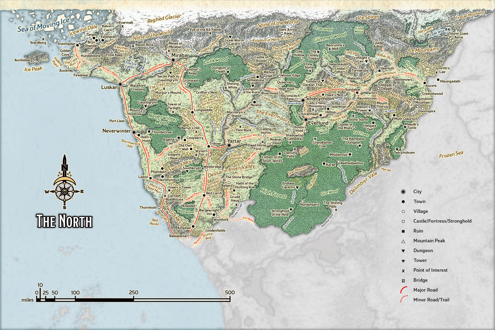
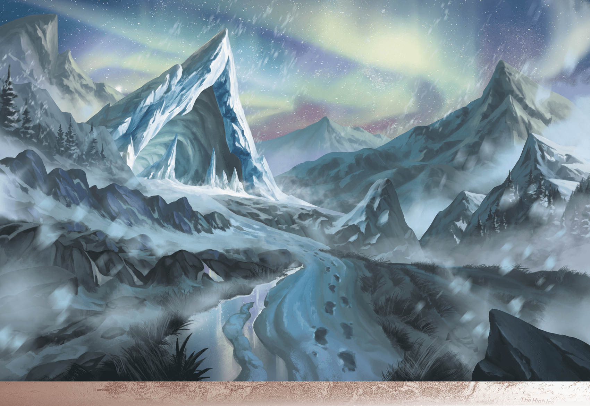

# Icewind Dale

> **At a Glance:** In this harsh and beautiful wilderness, nothing lasts and survival is a day-to-day concern.
> **Region:** The North
> **Languages:** Bothii, Chondathan, Illuskan, Reghedjic

At the far northern end of the Sword Coast, beyond the Spine of the World, lies Icewind Dale. This isolated and rugged region is bounded by the Reghed Glacier to the east and the gnashing maw of the Sea of Moving Ice to the north and west. The landscape is dominated by the solitary peak of Kelvin’s Cairn and the Ten-Towns, a collection of small settlements that band together for mutual survival. The people of Icewind Dale endure a harsh climate, with long, brutal winters and brief, cool summers. Despite the challenges, the area is rich in resources such as gems, timber, and the valuable bones of knucklehead trout, which are sought after for crafting scrimshaw. The region is steeped in history and mystery, attracting adventurers and scholars eager to uncover frost giant artifacts, Underdark wonders, and Netherese secrets. However, the dangers are many, including fierce monsters, hostile locals, and the ever-present threat of Auril's priests. The presence of chardalyn, a blighted material known to corrupt those who seek power, adds another layer of peril to this unforgiving land.

## Notable Locations

### Bryn Shander

Foremost among the Ten-Towns, Bryn Shander is the local center of trade and government. As the largest and most fortified of the settlements, it serves as a walled refuge for those fleeing nearby towns in times of crisis. The town is governed by Speaker Duvessa Shane, who leads with a fair but firm hand. Bryn Shander's markets are bustling with traders selling goods from across the region, making it a vital hub for commerce and communication.

### Easthaven

Easthaven is one of the more adventurous of the Ten-Towns, known for its bustling docks and lively atmosphere. The town has a reputation for being a place where anything can be bought or sold, often attracting those with less-than-noble intentions. It is governed by Speaker Danneth Waylen, who works tirelessly to maintain order amidst the chaos. Easthaven is also known for its historical significance, being one of the first settlements in the region.

### Caer-Dineval

Perched on the cliffs overlooking Lac Dinneshere, Caer-Dineval is a town with a rich history and a strong sense of tradition. The town is dominated by a crumbling castle, which serves as the seat of power for Speaker Crannoc Siever. Caer-Dineval is known for its fishing industry and the quality of its smoked knucklehead trout. The town's inhabitants are fiercely independent and wary of outsiders.

### Kelvin's Cairn

Kelvin's Cairn is the solitary mountain that rises above the tundra of Icewind Dale. It is a landmark for travelers and a source of many local legends. The mountain is home to various creatures, including yetis and white dragons, and is rumored to hide entrances to the Underdark. Adventurers often explore its slopes in search of treasure or to test their mettle against the elements.

### Reghed Glacier

The Reghed Glacier is a massive ice sheet that defines the eastern boundary of Icewind Dale. It is a harsh and unforgiving environment, home to the nomadic Reghed tribes who follow the herds of reindeer across the ice. The glacier is also a place of mystery, rumored to contain ancient ruins and secrets from a bygone era.

### Sea of Moving Ice

To the north and west of Icewind Dale lies the Sea of Moving Ice. This frigid expanse is a perilous place, with shifting ice floes and hidden dangers beneath the surface. The sea is home to icebergs, polar bears, and the occasional white dragon. It is also a place where ships are lost and legends are born, as sailors tell tales of ghostly vessels and sunken treasures.

### Termalaine

Termalaine is a picturesque town located on the shores of Maer Dualdon. Known for its vibrant fishing industry, the town relies heavily on the lake's bounty. Termalaine is governed by Speaker Oarus Masthew, who is respected for his wisdom and dedication to the community. The town is also a popular destination for travelers seeking the beauty of the northern lights.

### Lonelywood

Nestled in a dense forest on the northwestern shore of Maer Dualdon, Lonelywood is a secluded and quiet town. It is known for its timber industry and the production of fine wooden crafts. The town's isolation has fostered a close-knit community, but it also attracts those who prefer solitude or have something to hide. Speaker Nimsy Huddle leads the town with a gentle touch, ensuring the peace is kept in this tranquil setting.
