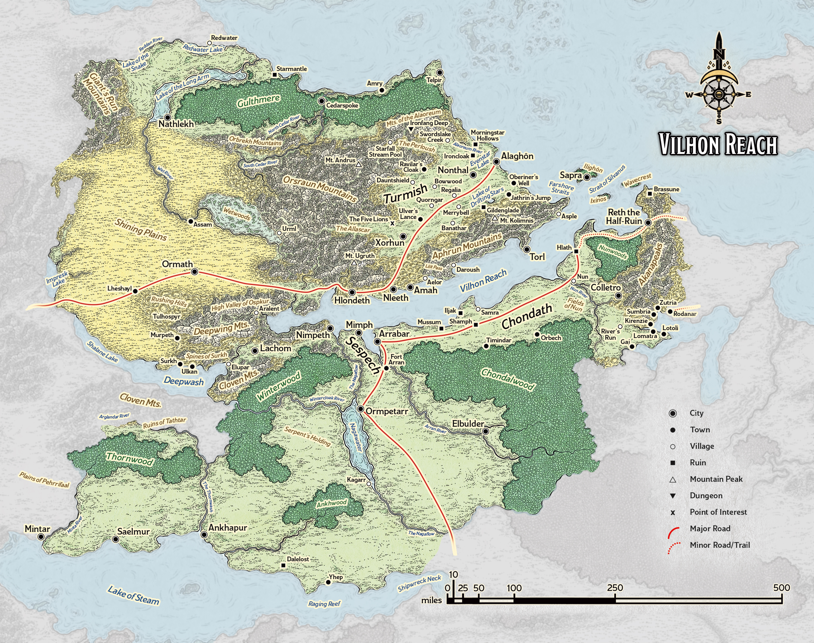
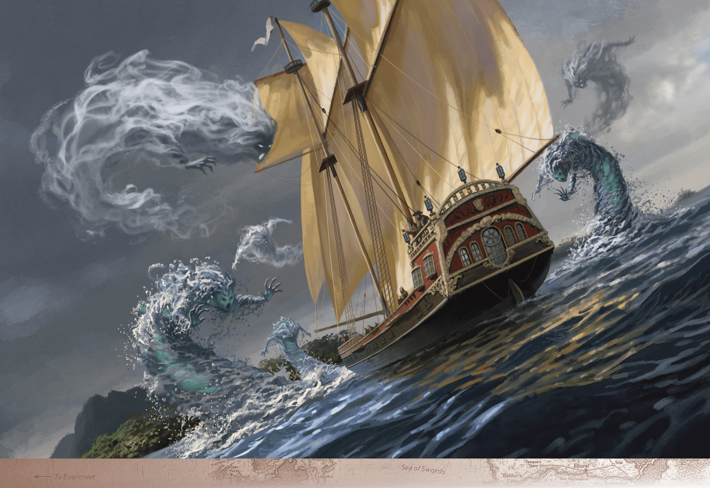

# Independent City-States

> **At a Glance:** The Emerald Enclave helps to maintain balance between people and nature in this region.
> **Region:** Vilhon Reach
> **Languages:** Chondathan, Shaaran, Turmic

The Vilhon Reach is a region characterized by its numerous independent city-states, each with its own distinct culture and governance. Historically, these city-states were wary of being reabsorbed into the Chondathan empire, but such fears have diminished over time. The area is known for its diverse population and rich history, with influences from various cultures and races. The geography of the Vilhon Reach includes lush forests, fertile plains, and a coastline that supports thriving trade. The region's economy is bolstered by trade routes that connect it to other parts of Faerun, and its political landscape is shaped by alliances and rivalries among the city-states.

## Notable Locations

### Hlondeth

Hlondeth, known as the City of Serpents, is a key player in the politics of the Vilhon Reach. Ruled by the yuan-ti House Extaminos, the city is renowned for its exotic architecture, featuring snakelike designs and structures made from green marble. The city's strategic location along the trade road out of Turmish makes it an essential hub for commerce. Despite its sinister reputation due to the yuan-ti influence, Hlondeth maintains a cordial relationship with its neighbors, particularly Turmish, ensuring the smooth flow of trade.

### Ilighôn

Ilighôn is the heart of the Emerald Enclave, a powerful faction dedicated to maintaining the balance between civilization and nature. The island is a sanctuary where arcane magic is suppressed, allowing only primal and divine magic to flourish. This unique characteristic makes Ilighôn's port city, Sapra, a refuge for those fleeing arcane persecution. The island's defenses include the formidable Seven Sentinels of Silvanus, elemental guardians that protect its shores. The island's lush landscapes and the presence of the Emerald Enclave make it a place of significant natural and spiritual importance.

### Ixinos

Ixinos is shrouded in mystery, with its inhabitants fiercely guarding their privacy. The island's only known settlement, Tazixor, is where the enigmatic queen of Ixinos holds court. The She-Wolves, a mercenary company, serve as the island's protectors and are one of the few sources of information about Ixinos. The island's isolation and the queen's reluctance to engage in diplomacy contribute to its enigmatic reputation. Despite its secrecy, Ixinos plays a subtle role in the region's power dynamics through the activities of the She-Wolves.

### Reth the Half-Ruin

Reth, once a thriving city, was partially destroyed during the Spellplague, leaving half of it submerged beneath the sea. The remnants of the city are a testament to the catastrophic events that reshaped the region. Adventurers are drawn to Reth's underwater ruins, where they battle kuo-toa and other sea creatures in search of lost treasures. The city's surviving half remains inhabited, serving as a reminder of resilience in the face of disaster and a hub for those seeking to explore its sunken secrets.

### Turmish

Turmish is a prosperous city-state known for its fertile lands and vibrant trade. It is a center of commerce in the Vilhon Reach, with its markets bustling with goods from across Faerun. The city is governed by a council of merchants and landowners, reflecting its economic focus. Turmish's relationship with Hlondeth is particularly important, as the trade road connecting them is vital for the region's economy. The city is also known for its skilled craftsmen and the production of high-quality goods, making it a key player in regional trade.

### Wavecrest

Wavecrest is one of the two islands known as the Eyes of Silvanus, alongside Ilighôn. Unlike its sister island, Wavecrest is uninhabited and covered in dense jungle. The island is home to a variety of dangerous creatures, making it a perilous place for adventurers. Despite its dangers, Wavecrest is occasionally visited by those seeking rare herbs and resources found only in its wilds. The island's untamed nature is a stark contrast to the cultivated lands of Ilighôn, highlighting the diverse environments within the Vilhon Reach.
