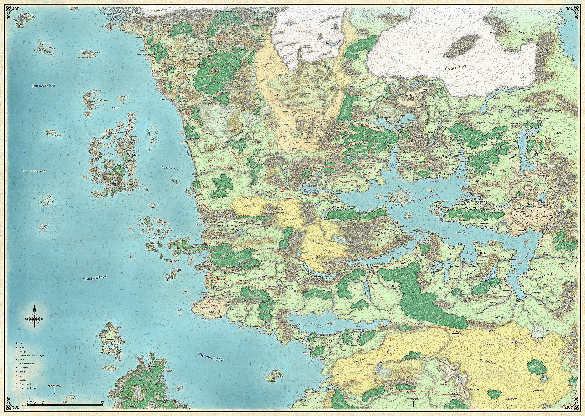

# Lake of Steam

> **At a Glance:** Distant lands and island realms that lie at the edges of Faerunian knowledge and exploration.
> **Region:** Beyond the Map
> **Languages:** Various

The Lake of Steam is a vast inland sea located in the southern region of Faerun, bordered by the independent city-states on the north shore and the chaotic Border Kingdoms to the south. This region is characterized by its diverse cultures, political intrigue, and economic prosperity. The cities along the northern shore were historically part of the Calimshan Empire and still reflect its cultural influences, including a strong emphasis on wealth, luxury, and political autonomy. The area is often referred to as the "Moonsea of the South" due to its complex political landscape and frequent power struggles.

The southern shore, known as the Border Kingdoms, is a land of opportunity and danger, where adventurers and would-be rulers vie for control over small territories. This region is dotted with a variety of structures, including wizard towers, monasteries, fortresses, and temples, each representing the ambitions of their respective rulers. The political landscape here is fluid, with territories frequently changing hands as new leaders emerge.

## Notable Locations

### Ankhapur

The city of Ankhapur is renowned for its pearl industry, with pearls harvested from the Lake of Steam's murky waters. These pearls, known for their size and quality, are highly sought after in the markets of Calimshan and Amn. Ankhapur is a bustling trade hub, with a diverse population engaged in various mercantile activities. The city is governed by a council of wealthy merchants who prioritize economic growth and stability.

### Saelmur

Saelmur is a fortified city located on the northern shore of the Lake of Steam. Known for its strategic location, Saelmur serves as a key trading post between the Lake of Steam and the inland regions. The city is protected by high walls and a well-trained militia, ensuring the safety of its inhabitants and merchants. Saelmur is also famous for its annual trade fair, which attracts traders and adventurers from across Faerun.

### Innarlith

Innarlith is one of the largest and most influential city-states on the northern shore of the Lake of Steam. The city is ruled by a powerful oligarchy of merchant lords who control its vast trade networks. Innarlith is known for its opulent architecture and vibrant cultural scene, with numerous theaters, galleries, and festivals celebrating the arts. The city's wealth and influence make it a key player in the region's politics.

### The Border Kingdoms

The Border Kingdoms, located on the southern shore of the Lake of Steam, are a collection of small, independent territories. Each territory is ruled by an adventurer or mercenary who has claimed the land through force or cunning. The region is known for its instability, with frequent conflicts and shifting alliances. Despite the chaos, the Border Kingdoms attract adventurers seeking fortune and power.

### The Deepwash

The Deepwash is a large freshwater lake located to the east of the Lake of Steam. It is surrounded by dense forests and is home to a variety of wildlife, making it a popular destination for hunters and trappers. The lake's clear waters are also a source of freshwater fish, which are traded in the nearby settlements. The Deepwash is considered a natural boundary between the Lake of Steam and the more settled lands to the east.

### Mintar

Mintar is a city-state located on the northwestern shore of the Lake of Steam. It is known for its strong military presence and strategic importance as a gateway to the western lands. The city is governed by a military council that enforces strict laws and maintains order through a well-disciplined army. Mintar's economy is heavily reliant on trade, with goods flowing through its bustling ports.

### Kzelter

Kzelter is a small but prosperous city situated on the southern shore of the Lake of Steam. It is known for its skilled artisans and craftsmen who produce high-quality goods, including textiles, pottery, and metalwork. The city is governed by a council of guild leaders who ensure the prosperity and security of its citizens. Kzelter's markets are a popular destination for traders seeking unique and finely crafted items.
