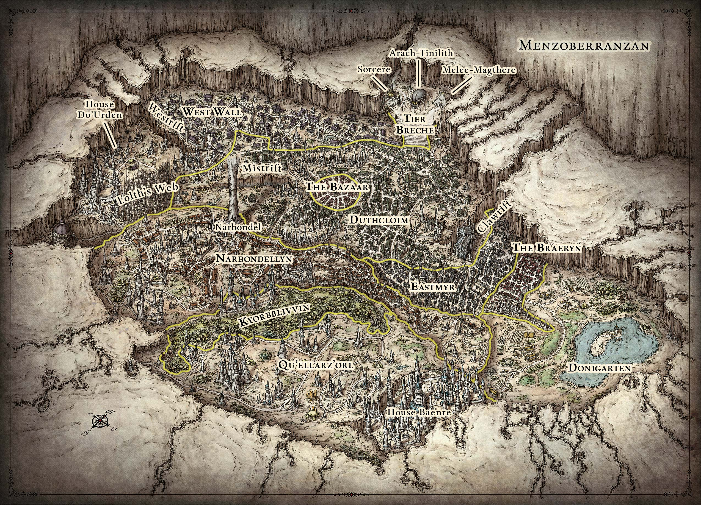
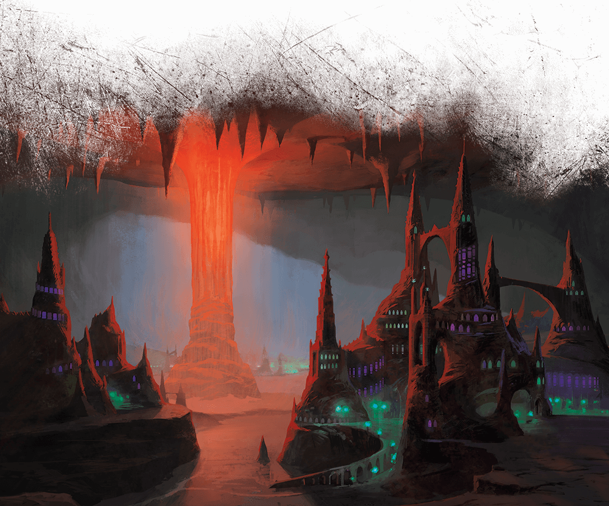
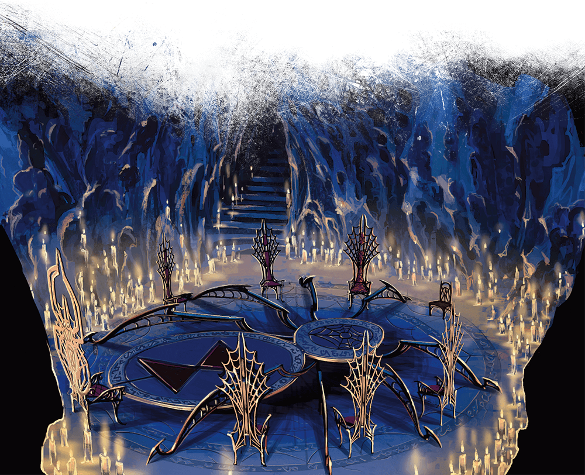
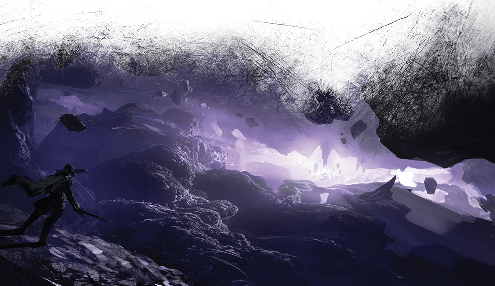
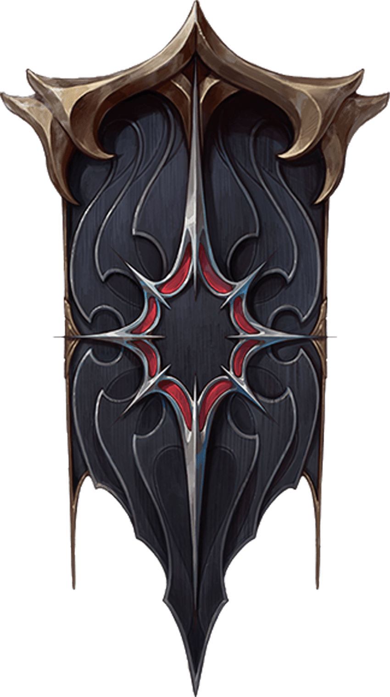

# Menzoberranzan

> **At a Glance:** The City of Spiders is the center of Lolth's worship in Faerun and a place of deception, manipulation, and endless intrigue.
> **Region:** The North (Underdark)
> **Population:** 20,000 drow plus thousands of slaves
> **Government:** Matriarchal theocracy worshiping Lolth, the Demon Queen of Spiders
> **Languages:** Elvish, Undercommon

Menzoberranzan is a drow city carved from the pillars of a great cavern in the Underdark between Silverymoon and Mithral Hall. It is the center of Lolth's worship in Faerun. Also known as the City of Spiders, it's known for its culture of deception, manipulation, and the capture and trade of enslaved surface dwellers. Although officially governed by a council of matrons from the eight greatest houses, the city is under the heel of House Baenre and the Matron Mother, who rules in Lolth's name. On a high plateau stands the Academy, Tier Breche, where priestesses, mages, and noble warriors are trained. Over a hundred tunnels link the city to other parts of the Underdark, and drow traders sell poisons, strange mushrooms, beasts of burden, scrolls, wine, and secrets with merchants of the deep.

The City of Spiders is carved out of and built within a great cavern the drow call Araurilcaurak, its vault soaring a thousand feet above the stone floor. Drow dwellings and strongholds are carved from massive stalagmites and stalactites, connected with delicate-looking bridges of hardened spider silk and lit with coldly glowing eldritch fires. Most streets and buildings are illuminated by green, blue, and violet continual flame spells. Ancient enchantments woven by the wizards of Sorcere protect the city from cave-ins and prevent teleportation into or out of the city.

## The Ruling Council

The Ruling Council is comprised of the matron mothers of the eight most powerful drow noble houses in the city. House Baenre has dominated the council for centuries. The current Matron Mother Quenthel Baenre rules in Lolth's name and commands the loyalty (or at least the fear) of the other houses. Political maneuvering, assassination, and open warfare between houses is a constant feature of Menzoberranzan's politics. A house that falls from the top eight is destroyed, its members killed or scattered.

The eight ruling houses jockey for position endlessly. A lower-ranked house can rise by destroying a higher-ranked one, but only if no evidence of the attack survives. This is the Way of Lolth: the strong devour the weak, and cunning is valued above all else.

## Notable Locations

### Tier Breche (The Academy)

On a high plateau stands Tier Breche, the Academy of Menzoberranzan. It consists of three institutions: Arach-Tinilith, the school of Lolth where priestesses are trained; Melee-Magthere, where warriors learn the art of combat; and Sorcere, the tower of wizardry where male drow study arcane magic. Every noble house sends its children to the Academy, and the rivalries forged there shape the city's politics for generations.

### Sorcere

Sorcere is the arcane academy of Menzoberranzan, where male drow mages are trained. The tower is a center of magical research and political intrigue. The Council of Spiders, a secret alliance of drow mages who wish to overthrow Lolth's priestesses, has infiltrated Sorcere. The former Archmage of Menzoberranzan, Gromph Baenre, conducted his most dangerous experiments here, including the ill-fated demon summoning ritual that brought the demon lords to the Underdark.

### Arach-Tinilith

The school of Lolth is shaped like a giant spider. Here, the priestesses of Lolth are trained in the ways of the Spider Queen. Arach-Tinilith is the most prestigious of the three academies, and its graduates hold the highest positions of power in the city. The high priestess of Arach-Tinilith answers directly to the Matron Mother.

### The Bazaar

A 750-foot-wide circle of bare bedrock, the Bazaar is a crowded labyrinth of stalls where drow merchants sell their wares. Poisons, potions, oils, elixirs, jewelry, perfume, silk, exotic fungi, and slaves are all traded here. Drow patrols enforce order with brutal efficiency, and theft is punished severely.

### The Braeryn (The Stenchstreets)

The Braeryn is a shantytown of ramshackle structures overlooking garbage-choked alleyways, inhabited by the dregs of drow society. Fallen priestesses, bankrupt merchants, escaped slaves, and the homeless or maimed are common here. Visitors to the city who wish to go unnoticed often find their way to the Stenchstreets.

### Narbondellyn

The wealthiest district outside of the noble compounds, Narbondellyn is home to the city's merchant class. Its buildings are finer than those in other common districts, and its streets are better patrolled. The district takes its name from Narbondel, the great natural stone pillar at the center of the cavern that serves as the city's clock. Each day, a wizard casts a fire spell at the pillar's base, and the heat slowly rises to the top over the course of the day.

### The Dark Dominion

The rock surrounding the city is honeycombed with tunnels and passageways forming the Dark Dominion, a territory claimed by the drow but not part of the city proper. Home to all manner of Underdark denizens, this maze forms part of Menzoberranzan's defenses as well as its underworld, a dangerous place for dark dealings and clandestine meetings.

### Kyorbblivvin

The fungus farms of Kyorbblivvin produce most of the city's food supply. Vast caverns are cultivated with edible fungi, mosses, and molds tended by slaves under drow supervision. The farms also produce the raw materials for many of the city's poisons and alchemical products.

### Eastmyr and Westrift

Two great rifts split the cavern floor on the east and west sides of the city. These chasms descend into deeper tunnels of the Underdark and serve as both defensive features and access points to the lower depths. Patrols guard the approaches, but determined infiltrators have used the rifts to enter the city undetected.

## Key Organizations

### Bregan D'aerthe

A company of drow spies, mercenaries, and assassins led by the legendary Jarlaxle Baenre. Bregan D'aerthe operates both within Menzoberranzan and across the surface world, taking contracts from any faction willing to pay. The organization serves as a refuge for houseless males and other drow outcasts. Jarlaxle maintains an extensive network of contacts and safe houses throughout Faerun.

### The Church of Lolth

Based in Arach-Tinilith, the Church of Lolth is the dominant religious and political institution in Menzoberranzan. The priestesses of Lolth hold authority over nearly every aspect of drow life. Lolth's doctrine demands constant competition, treachery, and sacrifice. The Spider Queen rewards cruelty and cunning, and her priestesses enforce her will through fear and divine magic.

### The Council of Spiders

A secret alliance of male drow mages who resent the dominance of Lolth's priestesses. The council has infiltrated Sorcere and other institutions, working covertly to shift the balance of power. Their activities are extremely dangerous, as discovery would mean immediate death at the hands of the priestesses.
