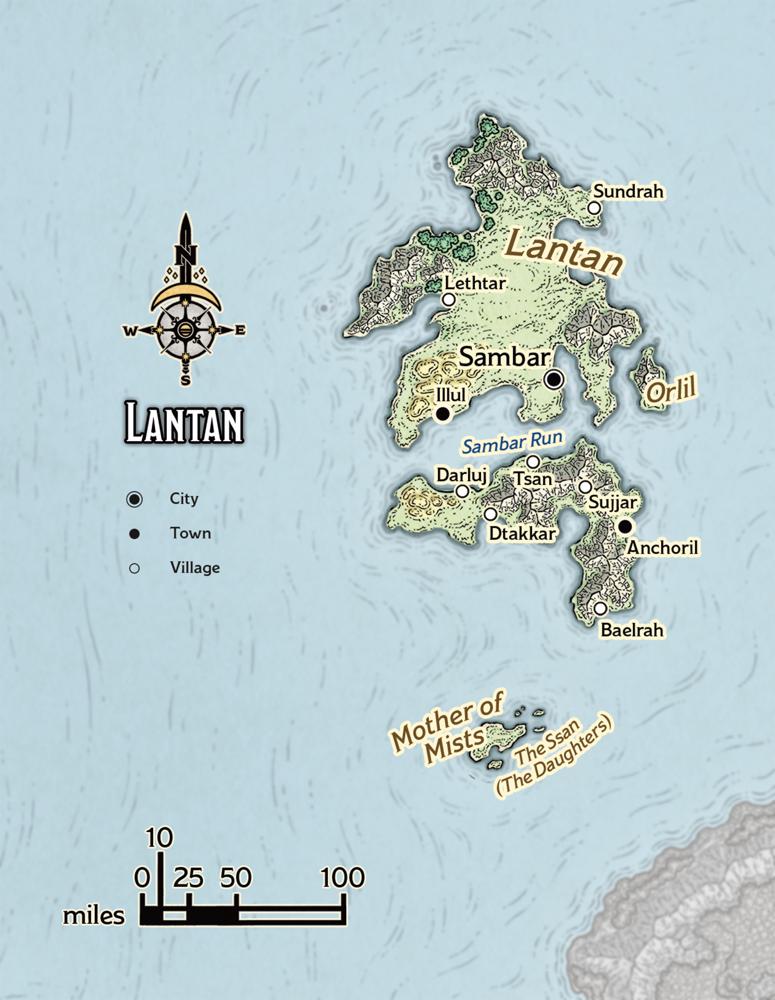

# Mintarn

> **At a Glance:** Each island realm is its own small, self-contained pocket of culture, from the ancient traditions of the Moonshaes to innovative Lantan.
> **Region:** Trackless Sea
> **Languages:** Lantanese, Illuskan, Chondathan

The island of Mintarn, located between the Moonsea Isles and Waterdeep, is renowned for its mercenary services and serves as a neutral ground for negotiations and diplomacy. The island's strategic position in the Trackless Sea makes it a hub for adventurers and mercenaries seeking fame and fortune. The local culture is a blend of influences from its seafaring neighbors, and Mintarn is known for its vibrant taverns, which are frequented by quest-givers and adventurers from across Faerun. Mintarn is governed by a ruler known as a tyrant, a title that belies the generally light-handed governance style. However, the island's current ruler, Her Tyrancy Bloeth Embuirhan, faces challenges from the ancient red dragon Hoondarrh, who demands annual tributes and exerts considerable influence over the island's affairs.

Mintarn's history is marked by its role as a mercenary haven. In past decades, the island prospered by providing military services to cities like Neverwinter and Waterdeep. However, the dragon Hoondarrh's growing demands have strained these relationships, isolating Mintarn economically and politically. The island's future hangs in the balance as its people seek new leadership and strategies to deal with the dragon's threat.

## Notable Locations

### Hoondarrh's Lair

Hoondarrh, the ancient red dragon, resides on an isolated volcanic island northwest of Mintarn. His lair is a place of fear and legend, filled with the treasures of those who have tried and failed to appease or defeat him. The dragon's presence looms large over Mintarn, influencing its politics and economy. Adventurers occasionally attempt to confront Hoondarrh, but few return.

### Mintarn Harbor

Mintarn Harbor is the island's main port and a bustling center of commerce and trade. Despite the island's current economic challenges, the harbor remains active with ships from various parts of Faerun. The harbor is also a gathering place for mercenaries and adventurers seeking employment or passage to distant lands.

### The Tyrant's Keep

The seat of power on Mintarn, the Tyrant's Keep, is a fortified structure overlooking the harbor. It serves as the residence of Her Tyrancy Bloeth Embuirhan and the center of government. The keep is a symbol of Mintarn's independence and resilience, though its walls cannot keep out the shadow of Hoondarrh's influence.

### The Mercenary Guildhall

The Mercenary Guildhall is a prominent institution in Mintarn, where mercenaries gather to find work and share information. The guildhall is a lively place, filled with tales of adventure and danger. It plays a crucial role in the island's economy, acting as a mediator between clients and mercenaries.

### The Dragon's Tribute Grounds

Located on the outskirts of the main settlement, the Dragon's Tribute Grounds is where offerings to Hoondarrh are collected and prepared for delivery. The grounds are a somber reminder of the dragon's hold over the island, and the rituals performed here are steeped in tradition and fear.

### The Adventurers' Quarter

This district within Mintarn's main settlement is known for its inns, taverns, and shops catering to adventurers. The Adventurers' Quarter is a melting pot of cultures and a place where stories of heroism and folly are exchanged. It is here that many adventurers begin their journeys, seeking to make a name for themselves.

### The Shrine of the Sea Lords

A small but revered shrine dedicated to the gods of the sea, the Shrine of the Sea Lords is a place where sailors and fishermen offer prayers for safe passage and bountiful catches. The shrine is maintained by a group of dedicated clerics who provide spiritual guidance to Mintarn's seafaring community.

Mintarn's unique position as a neutral ground and mercenary hub makes it a pivotal location in the Trackless Sea. Its future remains uncertain as it grapples with the challenges posed by Hoondarrh and the shifting political landscape of Faerun.
