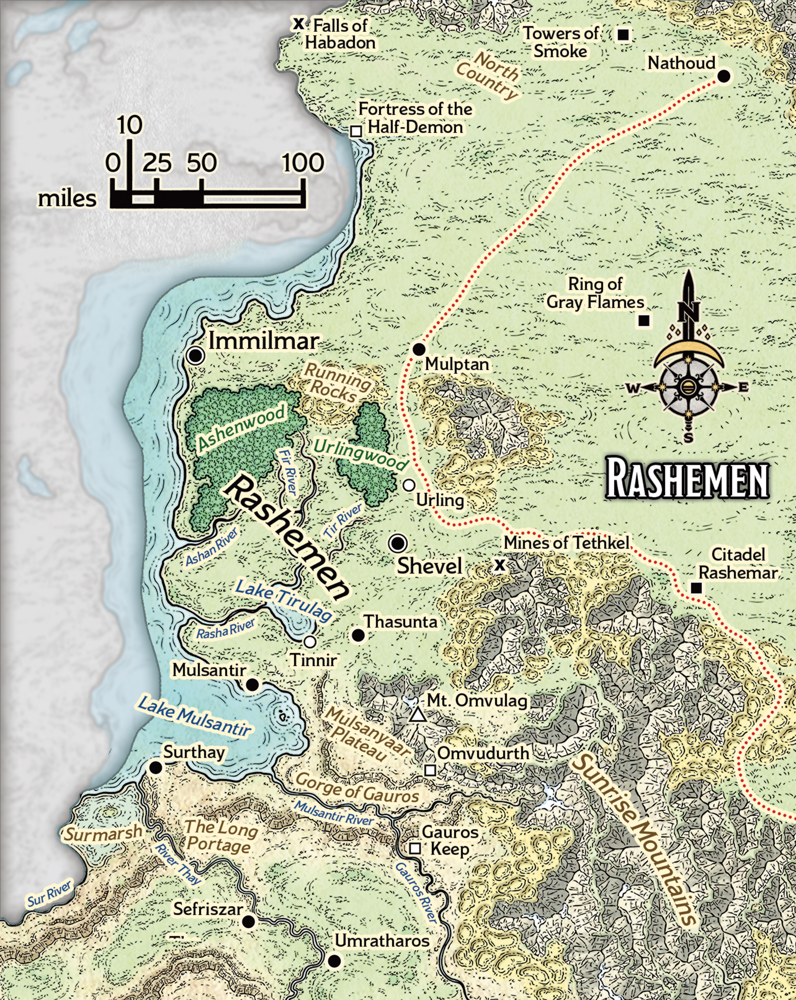

# Rashemen

> **At a Glance:** Arcane magic profoundly influences these cultures: sorcery in Aglarond, wizardry in Thay, and warlock pacts in Rashemen.
> **Region:** Arcane Empires
> **Languages:** Aglarondan, Rashemi, Thayan

Rashemen is a rugged and mysterious land, characterized by its deep forests, towering mountains, and expansive heaths. Known for its insularity, the realm is steeped in magical traditions that outsiders find both enigmatic and formidable. The society of Rashemen is heavily influenced by its warrior culture, with its famed berserkers who enter frenzied states during battle. Leadership in Rashemen is unique, as the Iron Lord, currently Mangan Uruk, is selected from the ranks of these fierce warriors by the hathrans, a council of powerful female spellcasters. These hathrans, or "wise sisters," are pivotal to Rashemen's governance, drawing strength from pacts with the spirits of the land.

The spiritual life of Rashemen centers around the veneration of the Three, a triad of deities: Bhalla, Khelliara, and the Hidden One. The land is also inhabited by telthors, spirits that are both revered and feared. The wychlaran, or "wise ones," are the spellcasters who form pacts with these spirits, donning masks that symbolize their mystical connections. While traditionally, the hathrans are women and the vremyonni, or "old ones," are men who focus on crafting magical items, these roles have become more flexible over time, especially as Rashemen has gradually opened to external influences.

## Notable Locations

### Ashenwood

The Ashenwood is a vast, ancient forest forbidden to permanent settlement by decree of the hathrans. It is a place of deep magic, inhabited by powerful spirits, intelligent animals, and formidable monsters. Rashemi who venture into Ashenwood do so to seek guidance from the spirits or to prove their mettle in hunts, offering gifts to appease the forest's mystical inhabitants.

### Citadel Rashemar

Once a formidable fortress, Citadel Rashemar now lies in ruins, a testament to a violent past. Over a century ago, it was destroyed by eastern invaders, leaving behind a haunted shell now occupied by a coven of hags. These hags command an assortment of creatures, including goblins and ogres, maintaining a sinister presence in the area.

### High Country

The High Country is a treacherous region at the northern end of the Sunrise Mountains, known for its unpredictable magic and ancient ruins. The monoliths here, remnants of the Raumathari Empire, contain imprisoned demons once controlled by Narfell. The hathrans vigilantly maintain the wards that keep these demons contained. The region is also the domain of the elusive white dragon, Kissethkashan.

### Immilmar

Immilmar serves as the capital of Rashemen and is often the first stop for visitors to the realm. The Iron Lord governs from a castle fortified by ancient magic. The city is known for its A-frame timber lodges and its reserved populace, who prefer the company of their own and encourage outsiders to keep their visits brief.

### Mines of Tethkel

The Mines of Tethkel are notorious for the unruly nature of their workers and the dangers that lurk nearby. Goblin bandits and worgs are common threats, while kobolds have established a lair within the mines. Recently, a deep dragon wyrmling has emerged from an egg within the kobolds' hoard, adding to the mine's perilous reputation.

### North Country

Stretching between the Falls of Erech and the Towers of Smoke, the North Country is a sparsely populated expanse dotted with ruins from Narfell and Raumathar. Rashemi warriors frequently explore these ruins, seeking to demonstrate their bravery and uncover relics of the past.

### Ring of Gray Flames

The Ring of Gray Flames consists of five ancient towers constructed by the Raumathari. Though mostly in ruins, two towers remain intact, emitting mechanical sounds from within. Gray flames perpetually burn atop each tower, and divine magic is ineffective in their vicinity. The area is guarded by animated arcane spells, making it a place of intrigue and danger.

### Shevel

Located along the Golden Road, Shevel has grown from a simple trading post into a bustling city. Its walls offer protection against frequent raids from the east, a legacy of the region's turbulent history. The city is a melting pot of cultures and a hub for mercenaries seeking work.

### Sunrise Mountains

The Sunrise Mountains mark the eastern boundary of Faerun, their peaks soaring to fifteen thousand feet. The range is littered with ruins from Raumathar and enigmatic wells from even older civilizations. The few passes through the mountains are fraught with danger, as numerous deadly creatures inhabit the caves and tunnels.

### Urlingwood

Urlingwood is the spiritual center of Rashemen, a dense forest teeming with telthors and mystical beasts. The hathrans alone are permitted to enter this sacred wood, and any violation of this law is met with severe consequences. The forest is a place of profound magic and spiritual significance to the Rashemi people.
