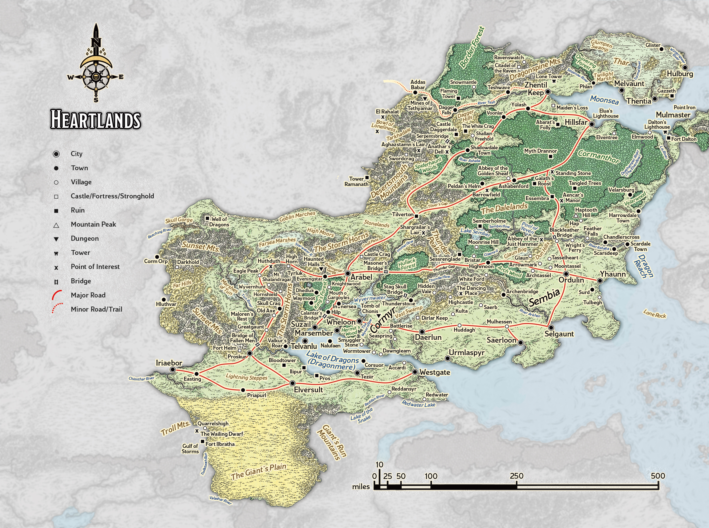
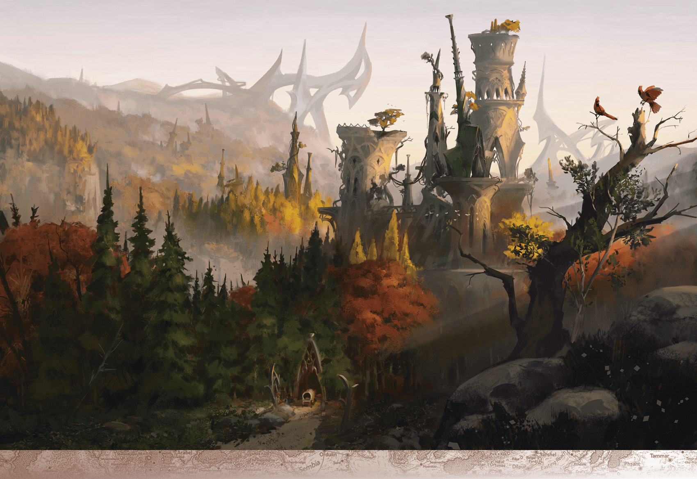

# Sembia

> **At a Glance:** These are lands of chivalrous knights, dastardly despots, rich and scheming merchants, and backwoods farmers just trying to make a living.
> **Region:** Heartlands
> **Languages:** Chondathan, Damaran

Sembia is a relatively young realm that has rapidly become a powerhouse of trade and commerce in the Heartlands. Its cities are governed by influential merchant councils, which reflect the nation's focus on wealth and negotiation. The realm's history is marked by its aggressive pursuit of trade and territorial expansion, often at the expense of its neighbors. The culture in Sembia is one where wealth equates to power, and social status is often determined by one's financial success. The Sembians are known for their shrewdness in business, and their cities are bustling hubs of commerce and negotiation.

Geographically, Sembia is characterized by its fertile lands, which are ideal for agriculture. The countryside is dotted with orchards, vineyards, and farms, providing a rich bounty that supports both the local population and trade exports. Historically, Sembia has maintained a complex relationship with its neighbors, including the Dalelands and Cormyr, often using its economic power to influence regional politics.

## Notable Locations

### Ordulin

Half a century ago, a dale called Moondale enjoyed a prosperous trade relationship with neighboring Sembian cities before being peacefully annexed into Sembia. It was renamed Ordulin and now serves as Sembia’s capital. Every seven years, the merchant councils of Sembia’s other cities convene and appoint an Overmaster from their ranks to govern Sembia from Ordulin. They have gone to great lengths to foster Sembian pride in the city and erase its cultural roots as a former dale. Ordulin is a center of political power and commerce, with its bustling markets and grand merchant houses.

### Saerloon

Saerloon is one of Sembia's most prominent cities, known for its gothic architecture and vibrant cultural scene. The city is famous for its art and music, attracting bards and performers from across Faerun. Saerloon is also a center for religious activity, with numerous temples dedicated to various deities, including Shar and Mask. The city's strategic location on the coast makes it a vital port for trade, and its docks are always busy with ships from distant lands.

### Selgaunt

Selgaunt is the wealthiest city in Sembia, renowned for its opulent lifestyle and lavish parties. It is a city where the rich and powerful gather, and its streets are lined with luxurious shops and grand estates. The city is a hub for trade and finance, with many banking houses and trading companies headquartered here. Selgaunt's influence extends beyond Sembia's borders, as its merchants conduct business throughout Faerun.

### Yhaunn

Yhaunn is a major port city located on Sembia's southern coast. It serves as a gateway for trade with the southern lands and is known for its bustling markets and diverse population. The city has a reputation for being a bit rough around the edges, with a thriving underworld of smugglers and pirates. Despite this, Yhaunn remains an essential part of Sembia's economy, and its docks are always busy with activity.

### Daerlun

Daerlun lies on the western edge of Sembia, near the border with Cormyr. It is a city of contrasts, where the old world meets the new. The city has a rich history, with ancient ruins and historic buildings interspersed with modern developments. Daerlun is a center for education and learning, with several renowned academies and libraries. The city's strategic location makes it an important military and trade hub, serving as a buffer between Sembia and its western neighbors.

### The Thunder Peaks

The Thunder Peaks form a natural border between Sembia and Cormyr. These rugged mountains are home to various creatures and are known for their unpredictable weather. The peaks are a popular destination for adventurers seeking treasure and glory, as they are rumored to contain hidden caves and ancient ruins. The mountains also serve as a natural defense for Sembia, protecting it from potential invasions from the west.

### The Vast Swamp

Located to the southeast of Sembia, the Vast Swamp is a treacherous and mysterious region. It is home to numerous dangerous creatures and is often avoided by travelers. The swamp is rumored to contain ancient secrets and lost treasures, attracting adventurers and treasure hunters. Despite its dangers, the swamp plays a role in Sembia's economy, as it provides valuable resources such as rare herbs and exotic wildlife.
