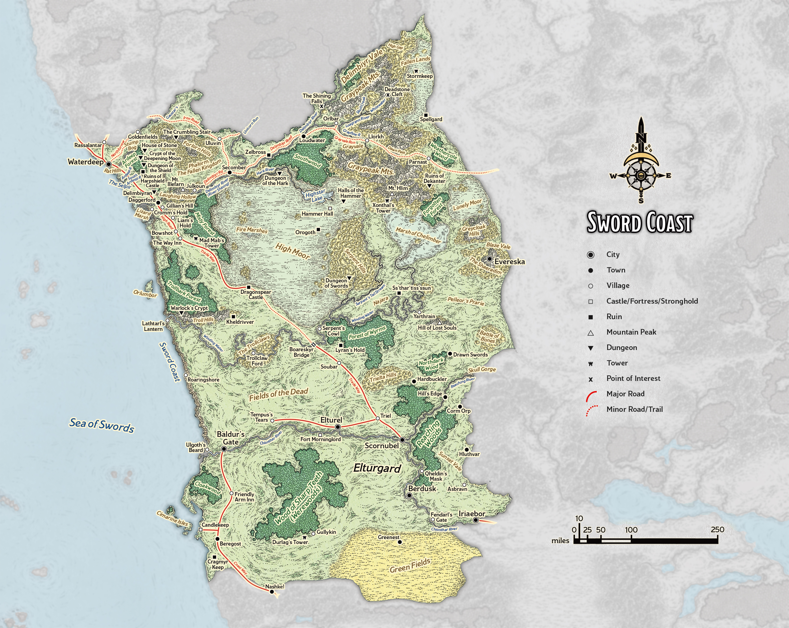
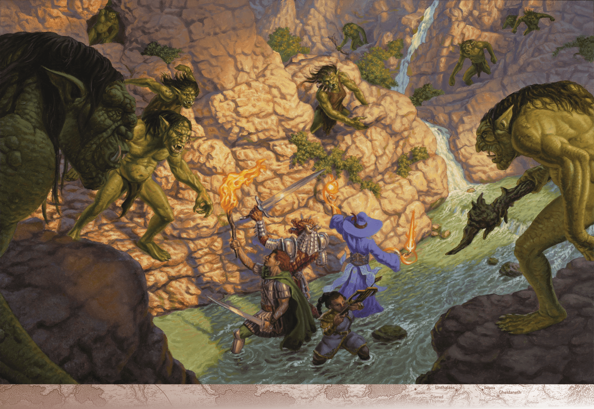

# Sword Coast

> **At a Glance:** This cosmopolitan region is famous for its large cities and the Realms-shattering menaces that threaten them.
> **Region:** Sword Coast
> **Languages:** Chondathan

The Sword Coast is a vibrant and diverse region along the western edge of Faerun, known for its bustling cities, treacherous wilderness, and rich history. It stretches from the city of Waterdeep in the north to Baldur's Gate in the south, bordered by the Sea of Swords to the west and the vast expanses of the Western Heartlands to the east. The region is characterized by its varied geography, which includes rugged coastlines, dense forests, and rolling hills. The Sword Coast is a melting pot of cultures and races, with humans, elves, dwarves, halflings, and more coexisting in its cities and towns.

The governance of the Sword Coast is primarily decentralized, with each city-state maintaining its own government and laws. However, the Lords’ Alliance serves as a unifying force, a coalition of cities including Waterdeep, Baldur’s Gate, Daggerford, and Amphail, among others. The Alliance was formed to promote mutual trade, ensure regional stability, and provide a collective defense against common threats. Despite their cooperation, each member city prioritizes its own interests, leading to a complex web of alliances and rivalries.

## Notable Locations

### Baldur's Gate

The grim, crowded city of Baldur’s Gate sits alongside the River Chionthar. Its nobles, called patriars, reside in the Upper City while most of the rest of the populace lives in the Lower City. Refugees and the destitute make what homes they can in the Outer City. A short way to the east sits the walled district of Little Calimshan, a thriving neighborhood of immigrants from that southern realm. The Council of Four governs Baldur’s Gate, led by Grand Duke Ulder Ravengard. See chapter 6 of Forgotten Realms: Adventures in Faerun for more on Baldur’s Gate.

### Criminal Underworld

Baldur’s Gate has a shady underworld organization known as the Guild. It operates throughout the city under the discreet leadership of a crime boss named Nine-Fingers Keene. She has agents throughout Baldur’s Gate, including in the city’s banking network.

### The Dead Three

The gods Bane, Bhaal, and Myrkul share a common history linked to the city of Baldur’s Gate, where they are known as the Dead Three. All three gods began as mortals, claimed a share of the power of the death god Jergal, and died during the Time of Troubles. All three have returned, and their worshipers have made a resurgence in Baldur’s Gate and the surrounding area, hiding away in the shadows of society. Cultists of the Dead Three plot endlessly to secure the ascendancy of their deities at the expense of innocent folk. (The three gods are described in more detail in chapter 5.)

### Waterdeep

Also known as the City of Splendors, the bustling city of Waterdeep is ruled by a lordly council. The current Open Lord, Laeral Silverhand, keeps her identity known to the public. The Masked Lords rule alongside her anonymously, thus preventing any of them from being bribed or threatened. Waterdeep boasts a prodigious magical academy at Blackstaff Tower, which is run by a wizard holding the office of the Blackstaff, currently Vajra Safahr.

### City Wards

Waterdeep is divided into several wards. Wards aren’t separated by walls or gates, and crossing between wards is easy. City wards include the Sea Ward, marked by the palatial fortress-estates of the city’s rich and powerful; the peacefully elegant North Ward; and the busy marketplaces of the Trade Ward. The Southern Ward is home to many immigrants, while the city’s poorest live and work in the Dock Ward. Waterdeep’s dead are entombed in the City of the Dead, a massive park and open air mausoleum within the city. Outside Waterdeep, a large collection of shelters that were once temporary housing for refugees has become a neighborhood of its own: the Field Ward. The Field Ward isn’t patrolled by the city guards and has no sanitation or other city services; it is home to Waterdeep’s most desperate citizens.

### Defenses

While Waterdeep has a militia and city guard, its most famous defenders are magical walking statues and the griffon cavalry. The walking statues are eight enormous statues that sit dormant among the city’s buildings. The Blackstaff can activate them to defend the city in times of dire need, animating each statue into an unstoppable stone colossus. The griffon cavalry is made up of well-trained riders and their griffon mounts. Each rider wears a Ring of Feather Falling, allowing them to safely leap from their mounts in daring assaults on any enemy.

### Undermountain

The twenty-three-floor megadungeon of Undermountain stretches deep beneath the city of Waterdeep. Adventurers descend into it from a well in the Yawning Portal tavern to search for treasure. At the dungeon’s bottommost level lairs Halaster Blackcloak. Halaster’s motives are unknown and perhaps unknowable. He built this behemoth of a dungeon complex long before Waterdeep was founded, and he’s been stocking it with perils ever since. Many creatures have also found their way into Undermountain of their own accord, creating civilizations in its halls, including the bustling, crime-ridden city of Skullport.

### Xanathar Guild

The Xanathar Guild is a criminal organization operating out of Skullport, a subterranean city beneath Waterdeep. Its gang activity frequently spills up into Waterdeep proper. Very few people know who or what Xanathar actually is: a paranoid, megalomaniacal beholder who fawns over his pet goldfish, Sylgar. Xanathar has eyes all over the bustling city of Waterdeep and despises his rival, the Zhentarim. For more on the Xanathar Guild, see chapter 6.

### Neverwinter

Known as the Jewel of the North, Neverwinter is a city that has endured much hardship but continues to thrive. It is ruled by Lord Dagult Neverember, who has invested heavily in rebuilding the city after its near destruction. Neverwinter is famous for its skilled craftsmen and its warm climate, a result of the Neverwinter River being heated by fire elementals beneath Mount Hotenow. The city is a member of the Lords’ Alliance and plays a crucial role in the politics of the North.

### Daggerford

A smaller but strategically important town, Daggerford lies along the Trade Way between Waterdeep and Baldur's Gate. Governed by the Duke of Daggerford, the town serves as a waypoint for travelers and merchants. Its proximity to the Misty Forest and the Lizard Marsh makes it a frequent target for marauding creatures, but its well-trained militia and stout walls provide a strong defense.

### Candlekeep

Perched on a cliff overlooking the Sea of Swords, Candlekeep is a fortress library that houses one of the greatest collections of knowledge in Faerun. It is a place of scholarly pursuit, where monks known as the Avowed maintain and protect the vast archives. Access to Candlekeep is highly restricted; visitors must donate a work of writing not already in the library’s collection to gain entry.

---

## DM Notes

The Sword Coast's major cities, particularly Waterdeep and Baldur's Gate, serve as the primary connection points between the campaign's northeastern frontier and the wider world of Faerun. News and rumors from Damara, Vaasa, and the Forgotten Lands filter through Sword Coast merchant networks. The Lords' Alliance's interest in regional stability could draw attention to the crisis in the east.
