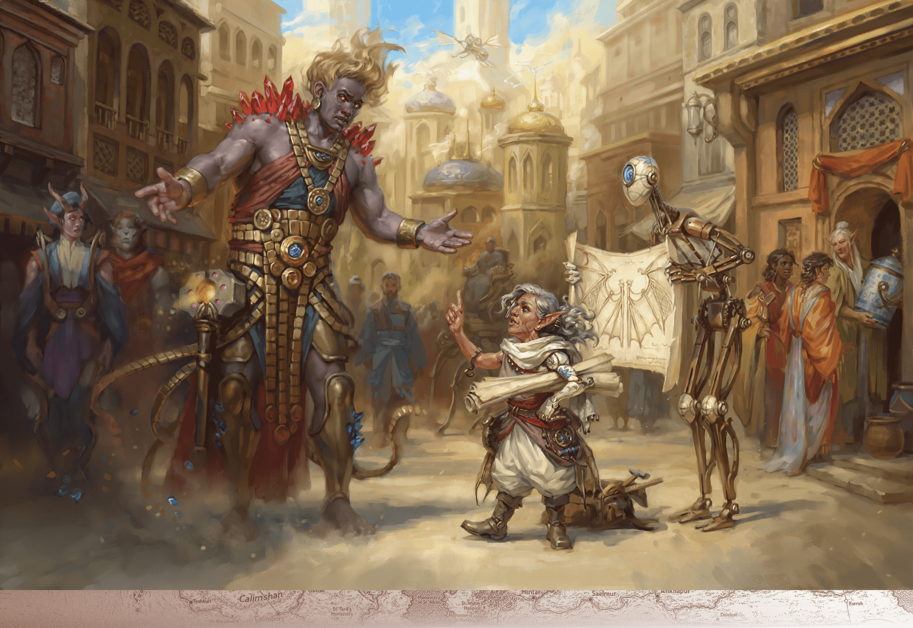

# Tethyr

> **At a Glance:** These wealthy mercantile realms each keep a close eye on each other while carefully tending to their own political turmoil.
> **Region:** Lands of Intrigue
> **Languages:** Alzhedo, Chondathan

Tethyr is a kingdom steeped in history and tradition, located in the Lands of Intrigue on the western coast of Faerun. It is bordered by Amn to the north and Calimshan to the south. The realm is known for its fertile lands and diverse population, which includes humans, elves, dwarves, and halflings. Tethyr's government is a feudal monarchy, with a complex hierarchy of lords and vassals. The current monarch, Queen Ysabel Linden, ascended to the throne after the death of her predecessor, Queen Anais Rhindaun. Despite her efforts to rule effectively, her legitimacy is questioned by some due to her lack of Siamorphe's divine blessing. The kingdom's culture is heavily influenced by its ties with the elven communities of the Wealdath, fostering a unique blend of human and elven traditions.

## Notable Locations

### Castle Tethyr

Castle Tethyr, once the grand seat of the kingdom's royalty, now lies in ruins after a devastating fire 150 years ago. The dungeons beneath the castle have become the lair of Xithallowthlan, an elder beholder blessed by the Great Mother. The beholder's presence is a dark secret, with its hundreds of eyes watching over the forgotten corridors, plotting unknown schemes.

### Darromar

The capital city of Tethyr, Darromar, is the political heart of the kingdom. Queen Ysabel Linden governs from the majestic Faerntarn Palace, a symbol of the realm's enduring strength. The city is a hub of commerce and diplomacy, attracting traders and dignitaries from across Faerun. Recently, the arrival of Saerwyn the Bright, who claims divine heritage, has stirred political intrigue as he challenges the queen's right to rule.

### Forest of Tethyr

Known as Wealdath to the elves, the Forest of Tethyr is a vast expanse of ancient trees and magical creatures. It is home to the Suldusk and Elmanesse wood elf tribes, who live in harmony with the forest. The Suldusk reside in the treetop city of Suldanessellar, while the Elmanesse work to restore the mythal of Myth Rhynn. The forest is also the domain of Garlokantha, a wise and peaceful gold dragon.

### Omlarandin Mountains

The Omlarandin Mountains are famed for their rare omlar gems, which are highly sought after for their magical properties. These turquoise stones are crucial in crafting powerful magic items, making the mountains a target for miners and adventurers. However, the demand from Calimshan's genie lords has depleted many of the accessible mines, pushing explorers to venture deeper into the treacherous terrain.

### Purple Hills

The Purple Hills are renowned for their exquisite wines, produced by the local halfling communities. This region is also home to Canaith, a legendary bard academy that has recently reopened its doors. Bards from all over Faerun come to study and perfect their craft, drawn by the academy's rich history and the halflings' renowned hospitality.

### Starspire Mountains

The Starspire Mountains are a rugged range that harbors the secondary lair of Balagos, a fearsome red dragon. Known as Mount Thargill, this lair is guarded by Ixolothingeir, a young bronze dragon who was maimed and enslaved by Balagos. The mountains are a dangerous place, with the presence of the dragons deterring all but the most daring adventurers.

### Velen

Velen, a city known for its spectral inhabitants, is an autonomous duchy that gained independence from Tethyr in 1424 DR. The ghosts of Velen coexist peacefully with the living, adding an eerie charm to the city. Velen's naval fleet is a formidable force, protecting the coast from the threat of Nelanther pirates and maintaining strong ties with Tethyr.

### Mosstone

Mosstone is a small but significant town located along the Trade Way, serving as a gateway to the Wealdath. It is a bustling stop for traders and travelers, offering a glimpse into the harmonious relationship between humans and elves. The town is known for its vibrant markets and the annual festival celebrating the bond between the two cultures.

### Ithmong

Ithmong, a fortified city on the eastern border of Tethyr, serves as a crucial defense against potential threats from Amn. The city is a military stronghold, with a large garrison of soldiers ready to defend the realm. Ithmong's strategic location and formidable defenses make it a key player in Tethyr's security and regional politics.
