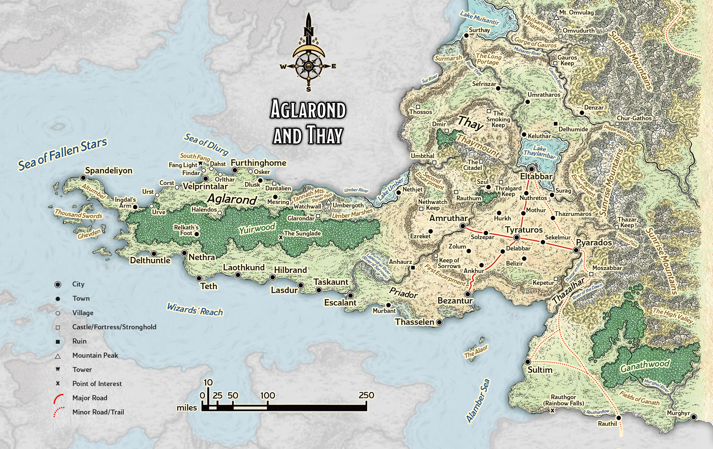
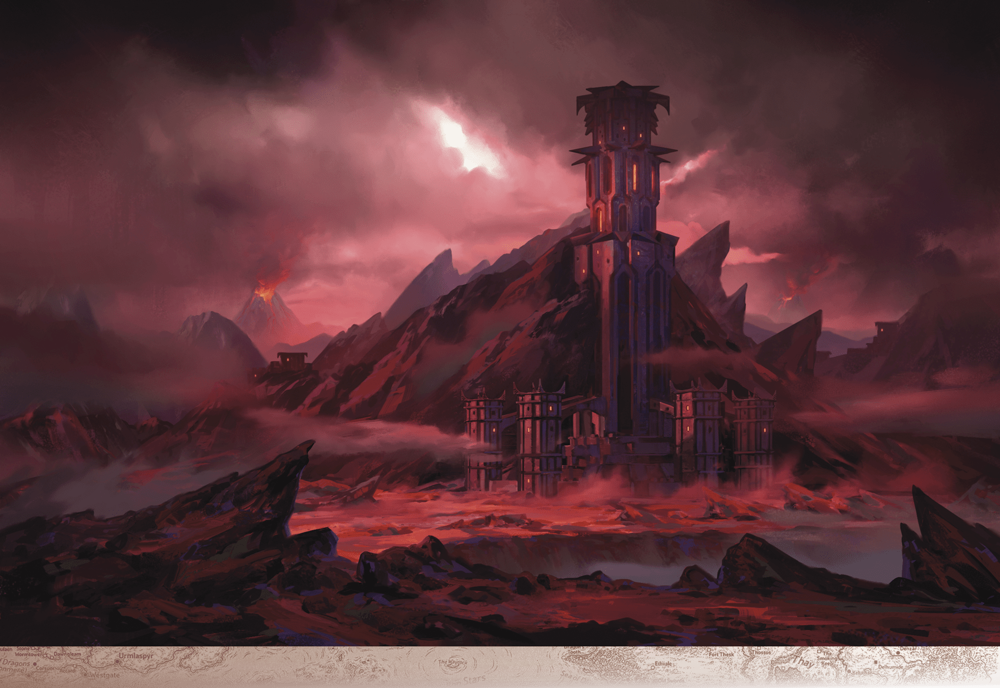

# Thay

> **At a Glance:** Arcane magic profoundly influences these cultures: sorcery in Aglarond, wizardry in Thay, and warlock pacts in Rashemen.
> **Region:** Arcane Empires
> **Languages:** Aglarondan, Rashemi, Thayan

Thay has a reputation as a barren wasteland ruled by tyrannical wizards and populated by their undead minions. The truth is more complex.

While much of Thay remains barren, ancient weather-controlling spells bring enough rain for rivers and forests. The word of a Red Wizard is law, but most Red Wizards are more interested in self-advancement than conquest. And while undead walk openly in Thay, necromancy is just one of eight schools of magic, and Thay is home to many ordinary citizens just trying to live out their lives. All this combines to make Thay more than the caricature known throughout Faerun, even if this exaggerated reputation is built on a foundation of truth.

Thay’s infamous undead ruler, Szass Tam, rules Thay, assisted by seven other zulkirs, each a master of a different school of magic. Few dare to oppose Szass Tam, but the zulkirs and the rulers of Thay’s various tharchs have considerable leeway to do as they please, so long as they don’t attract Szass Tam’s attention.

Aglarond and Rashemen pride themselves as realms that keep Thay in check, thwarting the Red Wizards’ territorial and magical ambitions. Thayan rulers, called tharchions, try to invade Aglarond or Rashemen every decade or so, and border raids are constant. The political landscape in Thay is one of intrigue and power struggles, both among the Red Wizards and between the various tharchs.

## Notable Locations

### The Citadel

A vast and ancient fortress that predates the Red Wizards of Thay, the Citadel was carved out of one of the highest mountains of Thaymount by a lizard-like people who left their images in statues and murals. The Citadel towers among lava, ash, and razor-sharp rocks and has extensive subterranean levels. For centuries, the Citadel has been Thay’s greatest stronghold, and Szass Tam has claimed it for his own. In the Citadel, Szass Tam is unassailable. In the time since he moved into the Citadel, many magical atrocities have occurred there.

### Delhumide

Thay began as a colony of the distant Mulhorandi empire, and Delhumide was Thay’s capital. Now the old city is a dangerous ruin inhabited by fiends, evil fey, and desperate folk. These threats keep the region around the ruins sparsely populated, but adventurers brave the ruins in search of lost Thayan treasures. The ruins of Delhumide are a testament to Thay's tumultuous history and its break from Mulhorandi control.

### Plateau of Thay and Thaymount

Central Thay stands on a vast, desolate plateau. Magic formalized by Red Wizards long ago brings rain here, which in turn allows towns, cities, and forests to survive. A second higher plateau rises from the first, culminating in the volcanic peaks of Thaymount. Only Red Wizards and their guests are allowed there. The plateau is a strategic location, providing a natural defense and a vantage point over the surrounding lands.

### Tax Stations

Small fortresses called tax stations dot Thay’s border, roads, and internal boundaries. Soldiers at each station check identification papers and collect small but frequent tolls. A typical tax station has a garrison of thirty to fifty warriors, often including a pack of gnolls. These stations serve as both revenue collectors and military outposts, ensuring control over movement within Thay.

### Tharchs

Thay is divided into districts called tharchs, many named after a prominent city in that region; every tharch is governed by a tharchion who answers to one of the eight zulkirs. The eleven tharchs are the Alaor (two islands that house Thay’s fleet and shipyards), Delhumide, Eltabbar, Gauros (everything between the Gauros River and the Sunrise Mountains), High Thay (bounded by the Second Escarpment), Lapendrar (bordering Thesk and Aglarond), Priador, Pyarados, Surthay, Thazalhar, and Tyraturos. Each tharch has its own unique characteristics and resources, contributing to Thay's overall power.

### Eltabbar

Eltabbar is the current capital of Thay and the heart of its magical and political power. It is a city dominated by the Red Wizards, with grand towers and magical constructs visible throughout. The city is a hub of trade and arcane research, attracting scholars and merchants from across Faerun, despite its fearsome reputation.

### The Alaor

The Alaor consists of two islands that serve as Thay’s primary naval base. It houses the majority of Thay’s fleet and shipyards, making it a critical location for maintaining Thay’s maritime power. The islands are heavily fortified, and access is strictly controlled by the Red Wizards.

### Pyarados

Pyarados is a major city located near the border with Aglarond. It serves as a military stronghold and a staging ground for Thay’s frequent incursions into neighboring territories. The city is also known for its gladiatorial arenas, where slaves and captured enemies are forced to fight for the entertainment of Thayan citizens.

### Thazalhar

Thazalhar is a tharch known for its harsh desert climate and the ruins of ancient civilizations. It is sparsely populated, with most inhabitants living in fortified settlements. The region is rich in mineral resources, and mining is a major industry, with slaves often used for labor.

### Surthay

Surthay is located in the northern part of Thay and is characterized by its cold climate and rugged terrain. It is a region of strategic importance due to its proximity to the borders with Rashemen and the Sunrise Mountains. The tharch is known for its skilled warriors and formidable defenses.
