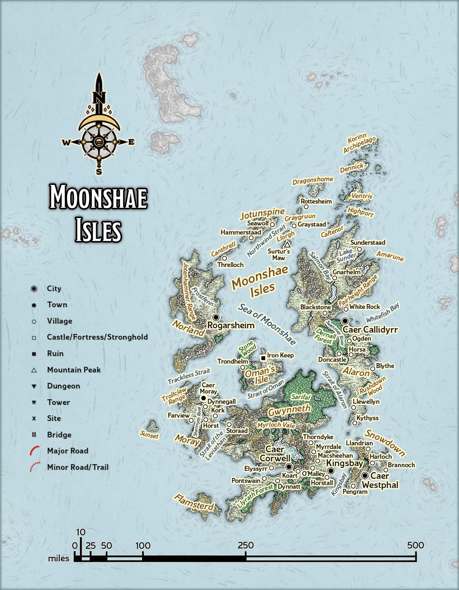
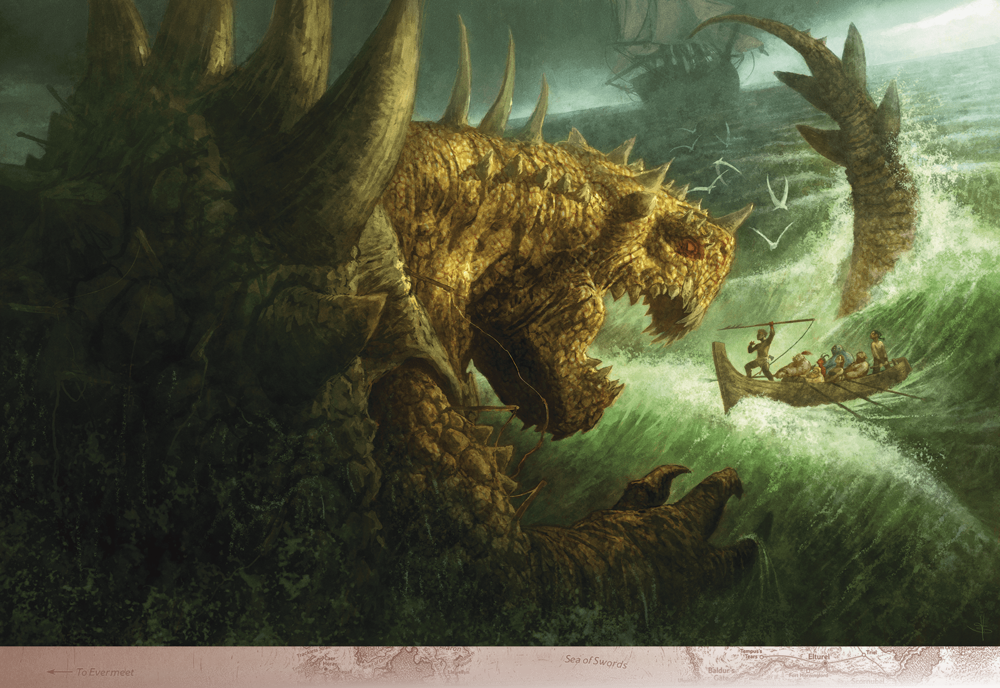

# Moonshae Isles

> **At a Glance:** Each island realm is its own small, self-contained pocket of culture, from the ancient traditions of the Moonshaes to innovative Lantan.
> **Region:** Trackless Sea
> **Languages:** Lantanese, Illuskan, Chondathan

The Moonshae Isles are a mystical archipelago located in the Trackless Sea, west of the Sword Coast. Known for their rich fey magic and diverse cultures, the islands are home to the Norlanders and the Ffolk. The Norlanders are seafaring people with a Viking-like culture, while the Ffolk are known for their agrarian lifestyle and deep connection to the land. The islands are ruled by the Kendrick dynasty, which has unified these once-warring cultures under a single banner. The Ffolk worship the Earthmother, a deity representing the natural world of the Moonshaes, with moonwells serving as sacred sites of natural magic. However, a sinister curse known as the Rusting threatens the islands, corrupting moonwells and transforming life into rusted iron. The druids and rangers of the isles work tirelessly to combat this curse and protect their homeland.

## Notable Locations

### Rusting and the Rusted

A century ago, the island of Snowdown was invaded by Amn, led by the vampire Erliza Darissen. The invaders exploited the island's resources, leading to environmental devastation. Although the Amnians were eventually driven out, Erliza's dying curse gave rise to the Rusting. This curse affects both flora and fauna, turning them into twisted iron that eventually crumbles to dust. Moonwells become pools of black oil, and prolonged exposure transforms people into Rusted constructs. These constructs, devoid of life, now haunt the coasts in warships of rusted iron, posing a threat to the Moonshaes.

### Alaron

Alaron is the largest of the Moonshae Isles and the political center of the archipelago. It is predominantly inhabited by the Ffolk, with Caer Calidyrr serving as the seat of power for High King Derid Kendrick. The island is divided between the Ffolk in the south and the Norlanders in the north, who engage in pastoral activities and mining in the Farheight Range. Alaron's strategic location and its fertile lands make it a vital part of the Kendrick dynasty's rule.

### Gwynneth

Gwynneth is renowned for its magical aura and is considered the heart of the Earthmother's power. The island remains untouched by the Rusting, preserving its natural beauty and magical essence. Key landmarks include the rebuilt Caer Corwell and Myrloch Vale, a lush valley inhabited by fey creatures. The northern part of Gwynneth is home to the fey kingdom of Sarifal, ruled by High Lady Ordalf, who maintains a delicate balance between the mortal and fey realms.

### Moray

Moray is a rugged island known for its wild landscapes and dangerous inhabitants. It is plagued by the Red Shadow, a group of werewolves who worship the beast-god Kazgaroth. These werewolves conduct violent rituals and sacrifices, casting a shadow of fear over the island. Despite the dangers, Moray's untamed wilderness attracts adventurers seeking to challenge its perils.

### Norland

Norland is the cultural heart of the Norlanders, who first settled the Moonshaes on this cold, northern island. Jarl Olfsvenn governs Norland, remaining loyal to High King Kendrick despite personal turmoil. His sister, Queen Forfallen, has succumbed to the Rusting, complicating his rule. The island's economy is threatened by overfishing, which has exacerbated the spread of the Rusting in Rogarsheim, affecting the local populace.

### Oman’s Isle

Oman's Isle is dominated by giants and their goliath kin, who live among ancient Ostorian ruins. The island is a place of both danger and opportunity for adventurers. The town of Trondheim serves as a relatively safe haven for visitors, managed by goliaths who act as intermediaries between the giants and outsiders. The isle's rugged terrain and ancient history make it a place of intrigue and peril.

### Snowdown

Once a prosperous island, Snowdown now suffers under the blight of the Rusting. The curse first appeared at the island's sole moonwell, and efforts to reverse the environmental damage caused by Amn's occupation have been largely unsuccessful. The population dwindles as the land becomes increasingly inhospitable, serving as a grim reminder of the consequences of unchecked exploitation.

### Korinn Archipelago

The Korinn Archipelago is a cluster of smaller islands located northeast of Alaron. Known for their treacherous waters and pirate activity, these islands are a haven for those seeking to avoid the law. The archipelago's hidden coves and secretive communities make it a challenging area to navigate, both politically and geographically.

### Flamsterd's Isle

Flamsterd's Isle is named after the legendary wizard Flamsterd, who once resided there. The island is shrouded in mystery, with rumors of magical experiments and hidden treasures attracting adventurers. Despite its small size, the isle's enigmatic nature and potential for discovery make it a point of interest for those exploring the Moonshaes.
