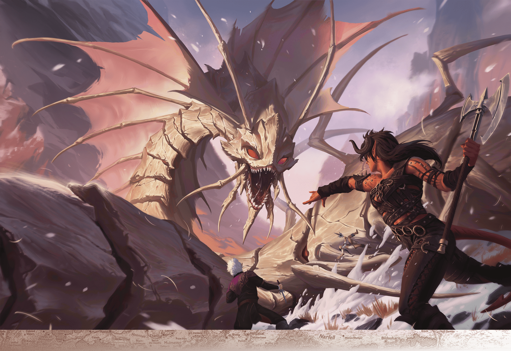

# The Vast

> **At a Glance:** Booming trade cities dot rugged wilds in a diverse region that bursts with untapped wealth: gemstone-studded mountains, powerful primal magic, and relics of buried kingdoms.
> **Region:** Forgotten Lands
> **Languages:** Damaran

The Vast isn’t a unified realm, but a common term for the great swath of land bound by the Dragon Reach to the west, the Moonsea to the north, Impiltur to the east, and the Sea of Fallen Stars to the south. The region’s name comes from Vastar, the orc kingdom that once ruled this place and warred with the surrounding dwarven and elven communities. The Vast of today is primarily peaceful farmland ringed by prosperous coastal cities. Countless treasures lie buried just beneath the land’s surface, either in dwarven ruins, orc crypts, or forgotten battlegrounds.

The political landscape of the Vast is a tapestry of city-states and independent towns, each governed by its own council or lord. Despite the lack of a central government, these cities often cooperate on matters of trade and defense. The Earthspur Mountains to the east are rich in precious gems and metals, attracting miners and adventurers. However, the mountains also hide dangers, as many tunnels lead to the Underdark, home to drow and other hostile creatures. The culture of the Vast is a blend of Damaran and local traditions, with a strong emphasis on trade, craftsmanship, and exploration.

## Notable Locations

### Procampur

One of the oldest extant settlements along the Sea of Fallen Stars, Procampur was built atop an underground dwarven town called Proeskampalar. Procampur is known for its walled city districts, with slate-roofed buildings. More than its handsome architecture, though, Procampur is reputedly the single richest independent city along the northern Inner Sea. Hundreds of gem cutters and goldsmiths call the place home, and it would be a popular target for pirates if not for its incomparable fortifications and vigilant local government. The city's leadership is known for its diplomatic skill, maintaining strong trade relations with neighboring regions.

### Tsurlagol

Tsurlagol is a bustling port city located on the northern shore of the Sea of Fallen Stars. It serves as a major hub for maritime trade, with ships arriving from all over Faerun. The city's economy thrives on the export of local goods, including grains, fish, and crafted items. Tsurlagol is also known for its vibrant marketplaces, where merchants from distant lands sell exotic wares. The city is governed by a council of merchants, ensuring that trade remains the lifeblood of the community.

### Calaunt

Calaunt, situated on the southern bank of the River Vesper, is a city known for its strategic location and defensive prowess. The city is encircled by formidable walls and watchtowers, making it a bastion against potential invasions. Calaunt's economy is heavily reliant on river trade, with goods transported to and from the Moonsea region. The city is ruled by a powerful merchant prince, whose influence extends throughout the Vast.

### Tantras

Tantras is a city renowned for its religious significance and architectural beauty. It is home to several grand temples dedicated to various deities, making it a pilgrimage site for the faithful. The city is also known for its skilled artisans, who produce exquisite religious artifacts and artworks. Tantras is governed by a council of clerics, who ensure that the city's spiritual and civic needs are met.

### The Earthspur Mountains

The Earthspur Mountains are a rugged range that forms the eastern boundary of the Vast. Rich in mineral wealth, these mountains are dotted with mining settlements and dwarven holds. The mountains are also home to numerous dangers, including monsters and hostile Underdark denizens. Adventurers often venture into the Earthspurs seeking treasure, but few return unscathed.

### The Dragon Reach

The Dragon Reach is a large bay that forms the western border of the Vast. It is a vital waterway for trade, connecting the region to the Sea of Fallen Stars. The bay is named for the dragons that once roamed its skies, though sightings are rare in the present day. Coastal cities along the Dragon Reach thrive on fishing and shipping industries.

## FRHoF Source Text

#### The Vast

The Vast isn’t a unified realm, but a common term for the great swath of land bound by the Dragon Reach to the west, the Moonsea to the north, Impiltur to the east, and the Sea of Fallen Stars to the south. The region’s name comes from Vastar, the orc kingdom that once ruled this place and warred with the surrounding dwarven and elven communities. The Vast of today is primarily peaceful farmland ringed by prosperous coastal cities. Countless treasures lie buried just beneath the land’s surface, either in dwarven ruins, orc crypts, or forgotten battlegrounds.

As in other lands that touch the Earthspur Mountains, the gem trade is strong in the Vast, and many miners and adventurers alike come to the foothills seeking their fortune. The wisest are wary, for many of the tunnels that ribbon the Earthspurs connect to the Underdark, whose communities are far less welcoming of outsiders.

*** Procampur. *** One of the oldest extant settlements along the Sea of Fallen Stars, Procampur was built atop an underground dwarven town called Proeskampalar. Procampur is known for its walled city districts, with slate-roofed buildings. More than its handsome architecture, though, Procampur is reputedly the single richest independent city along the northern Inner Sea. Hundreds of gem cutters and goldsmiths call the place home, and it would be a popular target for pirates if not for its incomparable fortifications and vigilant local government.

The White Worm takes Karlach, Astarion, and Shadowheart by surprise.
Audy Ravindra
