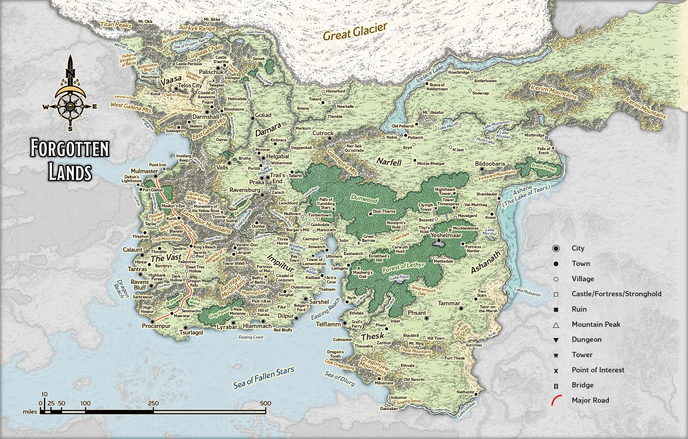

# Thesk

> **At a Glance:** Booming trade cities dot rugged wilds in a diverse region that bursts with untapped wealth: gemstone-studded mountains, powerful primal magic, and relics of buried kingdoms.
> **Region:** Forgotten Lands
> **Languages:** Damaran

Thesk is known to many as the Gateway to the East because it is the western terminus of the Golden Way, an ancient trade road that connected Faerun to lands beyond the Sunrise Mountains. Although much of the Golden Way now lies in ruins, remnants of the old road still appear in the well-traveled hills between Thesk’s largest cities, Telflamm, Phsant, and Tammar. Thesk’s glory days as a trade metropolis are over, and Theskian wealth is now concentrated in the uppermost echelons of society, whose oligarchs exploit the working class via all manner of harebrained investment schemes.

The region is characterized by its rugged terrain, with the Dragonjaw Mountains to the north and the Forest of Lethyr to the south. Thesk is a land of diverse cultures, where humans, dwarves, and half-orcs live in relative harmony. The influence of the East is evident in the architecture and customs found throughout the region, a testament to the centuries of trade and cultural exchange. Despite its decline, Thesk remains a place of opportunity for adventurers and traders alike, who seek to uncover its hidden riches and ancient secrets.

## Notable Locations

### Golden Way

Despite its history as the most famous trade route between Faerun and lands to the east, the Golden Way is now a shadow of its former self. In Faerun, the Golden Way begins at the western edge of Thesk, where well-maintained roads connect the cities of Telflamm, Phent, Phsant, and Tammar. Beyond Thesk’s borders, the Golden Way becomes a path through the plains of Ashanath, connects to Rashemen via various ferries, and dissolves into little more than piles of stones, way markers, as it wraps around the Sunrise Mountains and continues eastward through the Hordelands and beyond. Interspersed here and there along the road are encampments and travel stations that provide shelter for those daring to make the months-long intercontinental journey.

### Telflamm

The largest city in Thesk isn’t controlled by that realm, but by the Shadowmasters, a religious thieves’ guild that owns the city’s inns and gambling halls and exercises considerable influence over Thesk’s government. The Shadowmasters operate out of the House of the Master’s Shadow, the largest temple to Mask in Faerun. Telflamm's strategic location at the mouth of the River Flam enables it to control much of the trade entering and leaving Thesk, making it a vital hub despite the decline of the Golden Way.

### Phsant

Phsant is the heart of Thesk, serving as a cultural and economic center. Known for its vibrant markets and diverse population, the city thrives on the trade of goods from across Faerun and beyond. The annual Phsant Festival attracts visitors from all over, celebrating the region's rich history and cultural diversity. The city's leadership is a coalition of merchants and local leaders who strive to maintain its prosperity.

### Tammar

Tammar is a smaller city compared to Telflamm and Phsant but plays a crucial role as a trading post and agricultural center. Surrounded by fertile lands, Tammar supplies much of Thesk's food and raw materials. The city is also known for its skilled craftsmen, particularly in leatherworking and pottery. Tammar's council is composed of influential farmers and artisans who ensure the city's interests are represented in regional affairs.

### Nyth

Nyth is a small village nestled at the edge of the Forest of Lethyr. Known for its serene beauty and proximity to the forest, Nyth is a popular destination for those seeking respite from the bustling trade cities. The village is also a starting point for adventurers exploring the forest's depths, where ancient ruins and magical creatures are rumored to dwell.

### The Dragonjaw Mountains

The Dragonjaw Mountains form the northern border of Thesk, providing a natural barrier and a source of mineral wealth. The mountains are rich in gemstones and precious metals, attracting miners and prospectors. However, the mountains are also home to dangerous creatures and ancient secrets, making them a perilous but potentially rewarding destination for adventurers.

### The Forest of Lethyr

The Forest of Lethyr is a vast, ancient woodland that covers much of southern Thesk. It is home to a variety of wildlife and is considered sacred by the druids who protect its secrets. The forest is rumored to contain ancient elven ruins and powerful magical sites, drawing scholars and treasure hunters alike.

### Phent

Phent is a fortified town located near the eastern border of Thesk. It serves as a military outpost and a gateway for trade with the neighboring region of Rashemen. The town's defenses are maintained by a garrison of soldiers who protect Thesk from potential threats from the east. Phent is also known for its skilled blacksmiths and weapon makers, who supply arms to Thesk's defenders.

### Two Stars

Two Stars is a small settlement located near the center of Thesk. It is named for the two prominent stars visible in the night sky above the town. Two Stars is a peaceful community known for its hospitality and serves as a resting point for travelers journeying along the Golden Way. The town is governed by a council of elders who ensure the safety and well-being of its residents.
