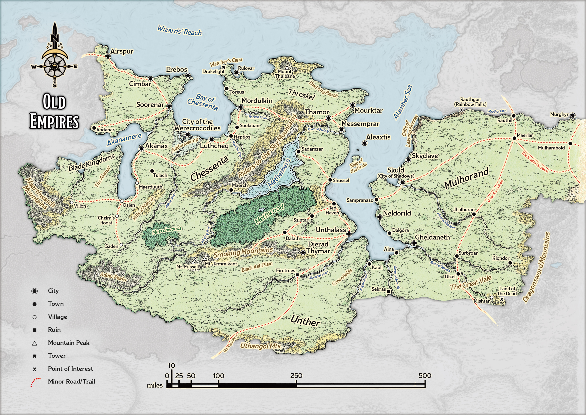
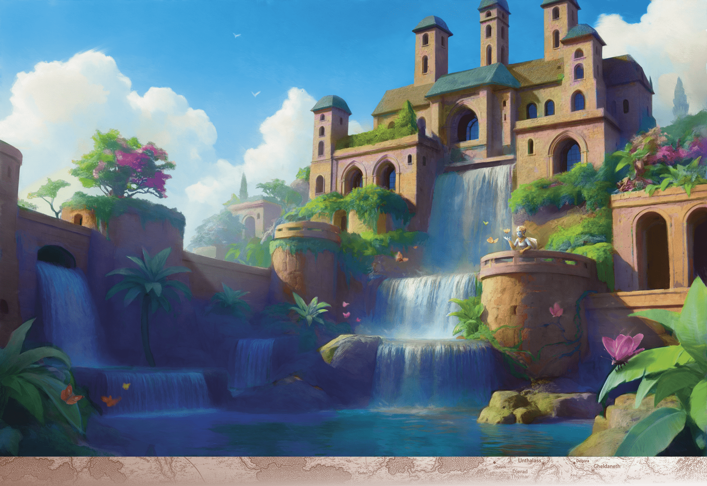

# Unther

> **At a Glance:** Living deities walk among mortals, leading their followers into cycles of terrible wars followed by golden ages.
> **Region:** Old Empires
> **Languages:** Chessentan, Mulhorandi, Untheric

Unther, a land of stark contrasts, is a realm shaped by its tumultuous history and the iron-fisted rule of its god-king, Gilgeam. Situated in the region known as the Old Empires, Unther shares its origins with the neighboring land of Mulhorand. However, while Mulhorand is often seen as a land of prosperity and divine favor, Unther is characterized by its oppressive regime and war-torn landscape. The government of Unther is an absolute theocracy under Gilgeam, who demands unwavering loyalty and forbids the worship of any other deity. His reign is marked by a series of brutal campaigns and internal purges, leaving the land scarred and its people living in fear.

Geographically, Unther is a land of extremes, with fertile river valleys juxtaposed against barren wastelands like the Black Ash Plain. The culture of Unther is heavily influenced by its history of conquest and divine intervention. The people are resilient, having endured centuries of tyranny and warfare. Despite the harsh conditions, Unther has a rich cultural heritage, with ancient ruins and historical sites that speak to its storied past. The region's history is one of rise and fall, with periods of relative peace punctuated by violent upheavals.

## Notable Locations

### Black Ash Plain

This wasteland of infertile soil takes its name from the embers and ash that perpetually rain down from the volcanoes of the nearby Smoking Mountains. From the blighted earth jut brutalist ruins, vestiges of Ancient Mulhorand and even earlier empires. The ruins magically shift across the desert of their own accord. Those who brave the ruins’ subterranean depths find themselves in an ever-transforming maze of basalt corridors and granite columns engraved with eerie glyphs that resemble no known language. This area is avoided by most due to its unpredictable nature and the dangerous creatures that call it home.

### Djerad Thymar

The fortress-city called Djerad Thymar was the capital of Tymanchebar, an empire of dragonborn that was transported from its home world of Abeir to Toril during the Spellplague and fused with Unther to form the new realm of Tymanther. With Unther’s return in the Second Sundering, the armies of Unther have shattered the power of Tymanther, but Djerad Thymar still stands. With its awe-inspiring stone architecture (the city is carved into the face of a mountain) and its vast arts districts, Djerad Thymar is a bastion for draconic culture and a mark of great pride for dragonborn. The city remains a symbol of resistance and hope for its people, who continue to preserve their unique traditions despite the ongoing conflict.

### Messemprar

The large city of Messemprar is by far the finest and most hospitable settlement in Unther. Not coincidentally, it is also the only city not presently under the thumb of Gilgeam. Instead, a coalition of anti-Gilgeam mages called the North Wizards controls the settlement. The North Wizards foster a brand of democracy otherwise unknown in the Old Empires. A prime port, Messemprar is beset on all sides by would-be conquerors: war ships from Chessenta, the armies of Mulhorand, and freebooting Inner Sea pirates from lands abroad. Sturdy adventurers are in constant demand to protect the city’s independence. The city is a hub of trade and culture, known for its terraced gardens and vibrant markets.

### Unthalass

Supposedly, Unthalass was once the greatest city in the Realms: a paradise of flowering gardens, alabaster statues, and palatial limestone manors. Anyone who visits the city as it is now would scarcely believe such legends. Everything here has been sacrificed in the name of the god-king Gilgeam’s hunger for conquest. The mud-brick streets overflow with filth and even blood, for Gilgeam brooks no dissent within his capital. The tyrant himself rules all of Unther from an imposing granite fortress in Unthalass called the Citadel of Black Ash. The city is a stark reminder of the cost of tyranny, with its people living under constant surveillance and fear.

### The Smoking Mountains

The Smoking Mountains form a natural barrier along Unther's western border. These volcanic peaks are a source of both danger and opportunity. The mountains are rich in minerals and precious metals, attracting miners and adventurers alike. However, the frequent volcanic activity and the presence of dangerous creatures make it a perilous place to explore. The mountains are also home to various tribes and factions that resist Gilgeam's rule, using the rugged terrain to their advantage.

### The River Alamber

The River Alamber is a vital artery for trade and travel in Unther. It flows through the heart of the realm, providing water and fertile soil to the surrounding lands. However, the river is also a strategic military asset, with many battles fought along its banks. Control of the river is crucial for maintaining power in the region, and it is heavily guarded by Gilgeam's forces. Despite the conflict, the river remains a lifeline for the people of Unther, sustaining agriculture and commerce.

## Organizations

### The Children of Gilgeam

The Children of Gilgeam are the elite warriors and enforcers of the god-king's will. Comprising hoplites, holy warriors, and warlocks, they are fiercely loyal to Gilgeam and play a crucial role in maintaining his rule. They are known for their brutality and unwavering dedication, often leading campaigns against any who oppose the god-king. Their presence is felt throughout Unther, and they are both feared and respected by the populace.

### The North Wizards

The North Wizards are a coalition of mages who oppose Gilgeam's tyranny. Based in Messemprar, they advocate for a more democratic form of governance and work to undermine the god-king's power. They are instrumental in maintaining the city's independence and are known for their cunning and resourcefulness. The North Wizards are constantly seeking allies and resources to bolster their cause, making them a key player in the region's politics.
