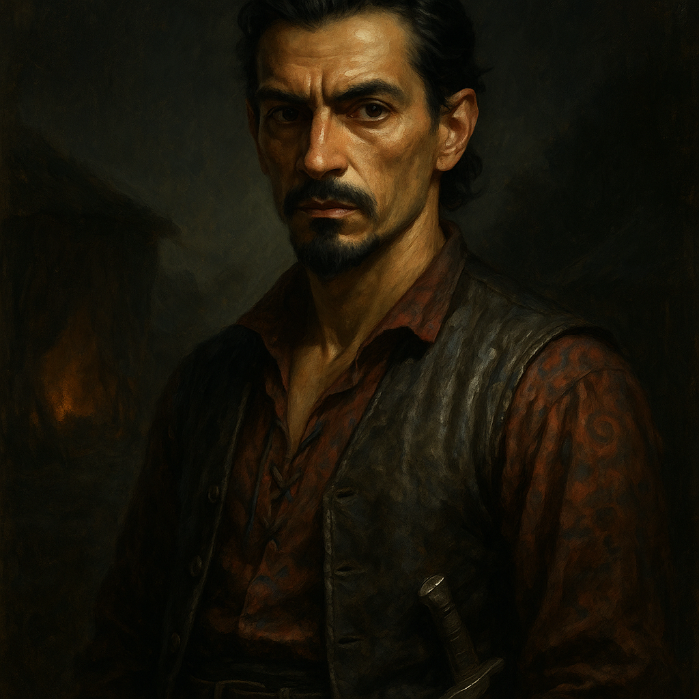

# Arrigal Vanduva — Vistani Spy

<table><tr>
<td width="300" valign="top" style="padding-right: 16px;">

</td>
<td valign="top">

*Medium Humanoid (Human), Neutral Evil*

---

**Armor Class** 15 (studded leather)
**Hit Points** 52 (8d8 + 16)
**Speed** 30 ft.

---

| STR | DEX | CON | INT | WIS | CHA |
|:---:|:---:|:---:|:---:|:---:|:---:|
| 12 (+1) | 18 (+4) | 14 (+2) | 14 (+2) | 14 (+2) | 16 (+3) |

---

**Saving Throws** Dex +7, Int +5
**Skills** Deception +6, Stealth +7, Perception +5, Insight +5, Sleight of Hand +7, Acrobatics +7
**Senses** Passive Perception 15
**Languages** Common, Vistani Cant
**Challenge** 4 (1,100 XP) **Proficiency Bonus** +3

</td>
</tr></table>

---

</td>
</tr></table>

---

## Traits

**Cunning Action.** On each of his turns, Arrigal can use a bonus action to take the Dash, Disengage, or Hide action.

**Sneak Attack (1/Turn).** Arrigal deals an extra 14 (4d6) damage when he hits a target with a weapon attack and has advantage on the attack roll, or when the target is within 5 feet of an ally of Arrigal's that isn't incapacitated and Arrigal doesn't have disadvantage on the attack roll.

**Evasion.** When subjected to an effect that allows a Dexterity saving throw for half damage, Arrigal takes no damage on a success and half damage on a failure.

**Double Agent.** Arrigal secretly reports to Strahd. He will fight convincingly alongside allies but may withhold effort or "miss" key strikes at critical moments at the DM's discretion.

## Actions

**Multiattack.** Arrigal makes two scimitar attacks.

**Scimitar.** *Melee Weapon Attack:* +7 to hit, reach 5 ft., one target. *Hit:* 7 (1d6 + 4) slashing damage.

**Dagger.** *Melee or Ranged Weapon Attack:* +7 to hit, reach 5 ft. or range 20/60 ft., one target. *Hit:* 6 (1d4 + 4) piercing damage.

## Reactions

**Uncanny Dodge.** When an attacker Arrigal can see hits him with an attack, he can halve the attack's damage against him.

---

## DM Notes

- Arrigal traded his loyalty to Strahd for his life years ago. He is one of Strahd's most trusted spies among the Vistani.
- His spy role is unknown to his brother Luvash, who trusts him completely.
- He delivered the false letter from the Burgomaster that lured the adventurers to Barovia.
- He will fight alongside the allies during this battle, but he is reporting everything to Strahd.
- He wants facts, timelines, who saw what. He fears misreading the next move.
- His alignment tag is "enemy" but he presents as a trusted ally. Play him as helpful, competent, and always watching.
