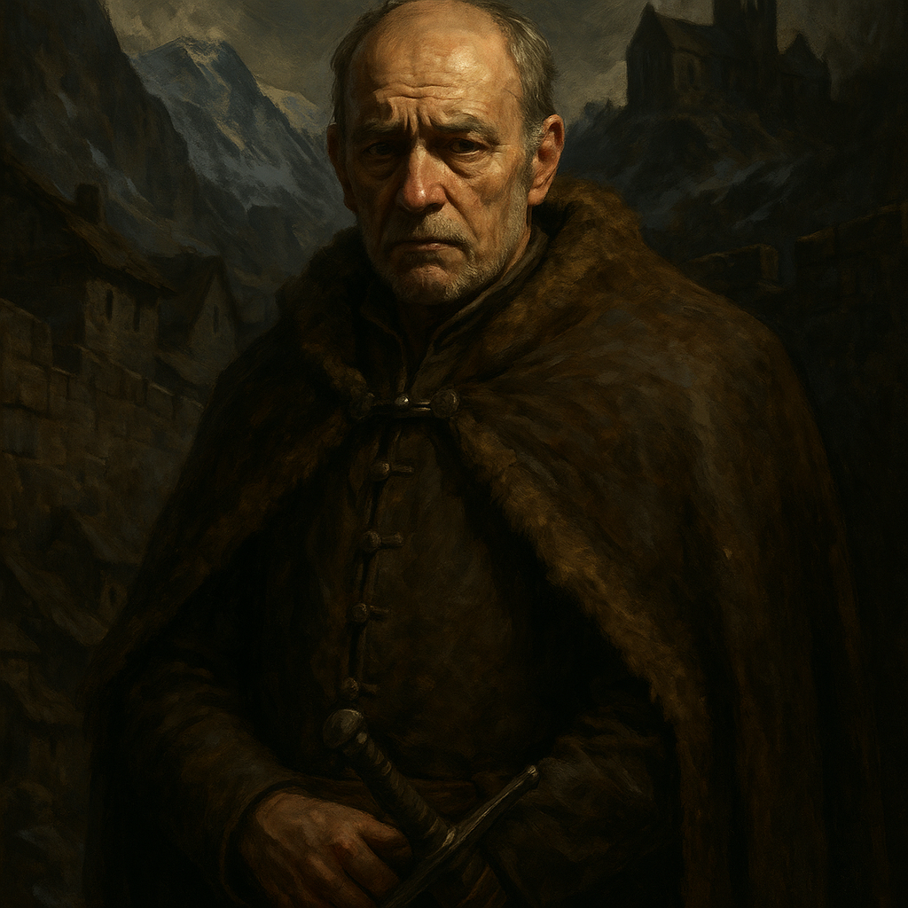

# Baron Dmitri Krezkov — Noble Warrior

<table><tr>
<td width="300" valign="top" style="padding-right: 16px;">

</td>
<td valign="top">

*Medium Humanoid (Human), Lawful Good*

---

**Armor Class** 16 (chain mail)
**Hit Points** 52 (8d8 + 16)
**Speed** 30 ft.

---

| STR | DEX | CON | INT | WIS | CHA |
|:---:|:---:|:---:|:---:|:---:|:---:|
| 15 (+2) | 11 (+0) | 14 (+2) | 13 (+1) | 14 (+2) | 14 (+2) |

---

**Saving Throws** Str +4, Con +4
**Skills** Athletics +4, Insight +4, Intimidation +4, Perception +4
**Senses** Passive Perception 14
**Languages** Common
**Challenge** 3 (700 XP) **Proficiency Bonus** +2

</td>
</tr></table>

---

</td>
</tr></table>

---

## Traits

**Guardian of Krezk.** Dmitri has advantage on attack rolls against creatures that have damaged one of his allies within the last round.

**Stern Resolve.** Dmitri has advantage on saving throws against being charmed or frightened.

## Actions

**Multiattack.** Dmitri makes two warhammer attacks.

**Warhammer.** *Melee Weapon Attack:* +4 to hit, reach 5 ft., one target. *Hit:* 6 (1d8 + 2) bludgeoning damage, or 7 (1d10 + 2) bludgeoning damage if used with two hands.

**Shield Bash.** *Melee Weapon Attack:* +4 to hit, reach 5 ft., one target. *Hit:* 4 (1d4 + 2) bludgeoning damage. The target must succeed on a DC 12 Strength saving throw or be knocked prone.

## Reactions

**Protective Strike.** When a creature within 5 feet of Dmitri hits an ally with a melee attack, Dmitri can make one warhammer attack against that creature.

---

## DM Notes

- Dmitri is the burgomaster of Krezk, a cautious and protective leader.
- His wife Anna is a sorceress and his steady anchor.
- His daughter Ilya was used by the Abbot to create Vasilka. Dmitri does not know this.
- If Dmitri ever sees Vasilka, he would recognize his daughter's face. This could be a pivotal story moment during this battle.
- He is close friends with Baron Vallakovich and the late Kolyan Indirovich.
