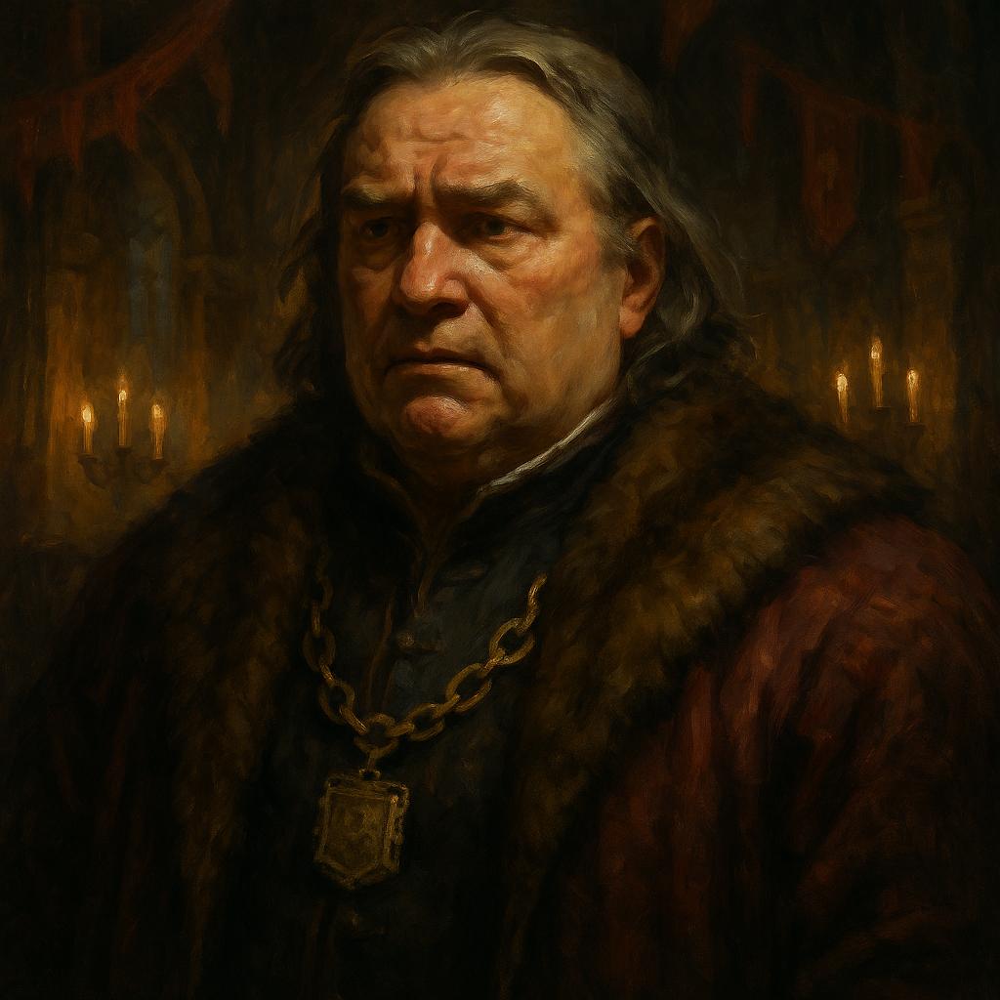

# Baron Vargas Vallakovich — Noble Commander

<table><tr>
<td width="300" valign="top" style="padding-right: 16px;">

</td>
<td valign="top">

*Medium Humanoid (Human), Lawful Neutral*

---

**Armor Class** 15 (breastplate)
**Hit Points** 39 (6d8 + 12)
**Speed** 30 ft.

---

| STR | DEX | CON | INT | WIS | CHA |
|:---:|:---:|:---:|:---:|:---:|:---:|
| 12 (+1) | 12 (+1) | 14 (+2) | 14 (+2) | 13 (+1) | 16 (+3) |

---

**Saving Throws** Wis +3, Cha +5
**Skills** Insight +3, Persuasion +5, History +4, Intimidation +5
**Senses** Passive Perception 11
**Languages** Common
**Challenge** 2 (450 XP) **Proficiency Bonus** +2

</td>
</tr></table>

---

</td>
</tr></table>

---

## Traits

**All Will Be Well.** Once per short rest, Baron Vallakovich can inspire his allies. Up to 3 creatures within 30 feet that can hear him gain advantage on their next saving throw within 1 minute.

**Political Authority.** The Baron has advantage on Charisma (Persuasion) and Charisma (Intimidation) checks when dealing with Barovian citizens.

## Actions

**Longsword.** *Melee Weapon Attack:* +3 to hit, reach 5 ft., one target. *Hit:* 5 (1d8 + 1) slashing damage.

**Command (1/Day).** The Baron issues a single-word command to a creature within 60 feet that can hear and understand him. The target must succeed on a DC 13 Wisdom saving throw or follow the command on its next turn.

---

## DM Notes

- Baron Vallakovich is the burgomaster of Vallaki. He genuinely wants the best for his people.
- He is not a strong combatant but provides morale and political authority.
- He is close friends with Baron Krezkov and the other burgomasters.
- His trusted protector is Izek Strazni, who handles the fighting.
- "All will be well!" is his motto. He clings to hope even in Barovia's darkness.
