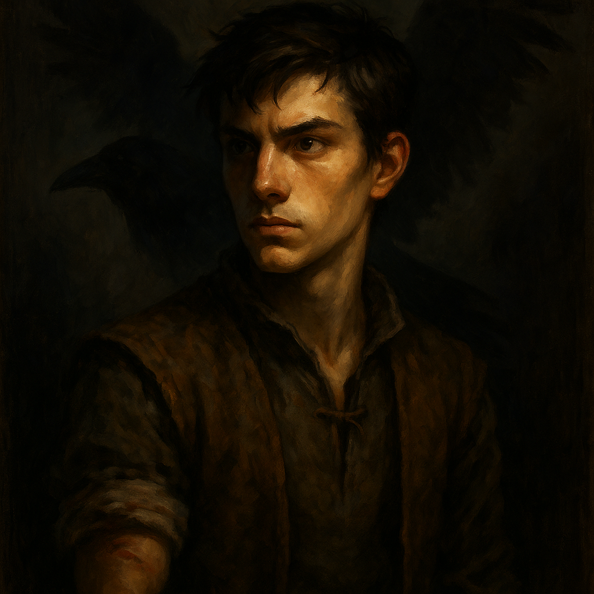

# Brom Martikov — Wereraven Scout

<table><tr>
<td width="300" valign="top" style="padding-right: 16px;">

</td>
<td valign="top">

*Medium Humanoid (Human, Shapechanger), Chaotic Good*

---

**Armor Class** 13 (leather armor)
**Hit Points** 27 (5d8 + 5)
**Speed** 30 ft. (fly 50 ft. in raven or hybrid form)

---

| STR | DEX | CON | INT | WIS | CHA |
|:---:|:---:|:---:|:---:|:---:|:---:|
| 10 (+0) | 15 (+2) | 12 (+1) | 11 (+0) | 13 (+1) | 12 (+1) |

---

**Skills** Perception +3, Stealth +4
**Damage Immunities** Bludgeoning, Piercing, and Slashing from nonmagical attacks not made with silvered weapons
**Senses** Passive Perception 13
**Languages** Common (can mimic sounds in raven form)
**Challenge** 2 (450 XP) **Proficiency Bonus** +2

</td>
</tr></table>

---

</td>
</tr></table>

---

## Traits

**Shapechanger.** Brom can use his action to polymorph into a raven-humanoid hybrid or into a raven, or back into his human form. His statistics are the same in each form. Any equipment he is wearing or carrying isn't transformed. He reverts to human form if he dies.

**Keen Sight.** Brom has advantage on Wisdom (Perception) checks that rely on sight.

**Mimicry (Raven/Hybrid Only).** Brom can mimic simple sounds he has heard. A creature that hears the sound can tell it is an imitation with a DC 10 Wisdom (Insight) check.

## Actions

**Multiattack (Human/Hybrid Only).** Brom makes two attacks: one with his shortsword and one with his shortbow, or two shortsword attacks.

**Shortsword (Human/Hybrid Only).** *Melee Weapon Attack:* +4 to hit, reach 5 ft., one target. *Hit:* 5 (1d6 + 2) piercing damage.

**Shortbow (Human/Hybrid Only).** *Ranged Weapon Attack:* +4 to hit, range 80/320 ft., one target. *Hit:* 5 (1d6 + 2) piercing damage.

**Beak (Raven/Hybrid Only).** *Melee Weapon Attack:* +4 to hit, reach 5 ft., one target. *Hit:* 1 piercing damage in raven form, or 4 (1d4 + 2) piercing damage in hybrid form.

---

## DM Notes

- Brom is 17 years old, brave and eager. He was wounded at the Festival of Light trying to save Stella and Karl Wachter.
- As a wereraven, he is part of the Keepers of the Feather.
- Arabelle Vanduva has feelings for him.
- In this battle, Brom will fly in raven form to warn Gregor telepathically of approaching creatures from the North, then shift to hybrid form and use his bow to support whichever group is most in need.
