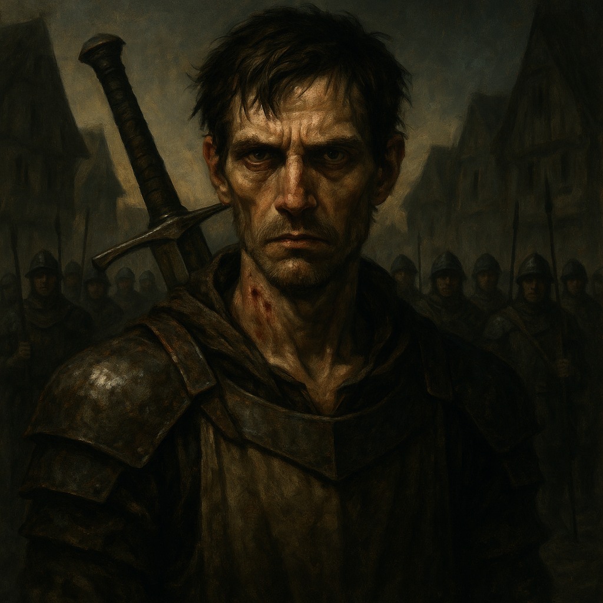

# Doru — Militia Commander

<table><tr>
<td width="300" valign="top" style="padding-right: 16px;">

</td>
<td valign="top">

*Medium Humanoid (Human), Lawful Good*

---

**Armor Class** 16 (chain mail)
**Hit Points** 58 (9d8 + 18)
**Speed** 30 ft.

---

| STR | DEX | CON | INT | WIS | CHA |
|:---:|:---:|:---:|:---:|:---:|:---:|
| 16 (+3) | 13 (+1) | 14 (+2) | 10 (+0) | 12 (+1) | 14 (+2) |

---

**Saving Throws** Str +6, Con +5
**Skills** Athletics +6, Intimidation +5, Perception +4
**Senses** Darkvision 30 ft., Passive Perception 14
**Languages** Common
**Challenge** 4 (1,100 XP) **Proficiency Bonus** +3

</td>
</tr></table>

---

</td>
</tr></table>

---

## Traits

**Survivor of the Undercroft.** Doru spent months as a vampire spawn chained in a church undercroft. He has advantage on saving throws against being frightened and against effects from undead creatures.

**Militia Commander.** Doru can use a bonus action to direct one allied militia member within 30 feet to make a weapon attack as a reaction.

**Lingering Darkness.** Doru retains darkvision from his time as a vampire spawn.

## Actions

**Multiattack.** Doru makes two longsword attacks.

**Longsword.** *Melee Weapon Attack:* +6 to hit, reach 5 ft., one target. *Hit:* 7 (1d8 + 3) slashing damage, or 8 (1d10 + 3) slashing damage if used with two hands.

**Javelin.** *Melee or Ranged Weapon Attack:* +6 to hit, reach 5 ft. or range 30/120 ft., one target. *Hit:* 6 (1d6 + 3) piercing damage.

**Rally (Recharge 5-6).** Doru shouts a rallying cry. Each allied creature within 30 feet that can hear him gains 8 (1d8 + 4) temporary hit points.

---

## DM Notes

- Doru was a vampire spawn, cured when the party killed Seraphine Stormraven at the Battle of Tser Pool.
- He reformed the Village Militia alongside his old friend Ismark.
- He and Father Donavich serve as the militia's command structure: Doru as commander, Donavich as healer.
- He arrives with the Barovian Forces during the End Phase with Ismark, Donavich, and 25 militia members.
