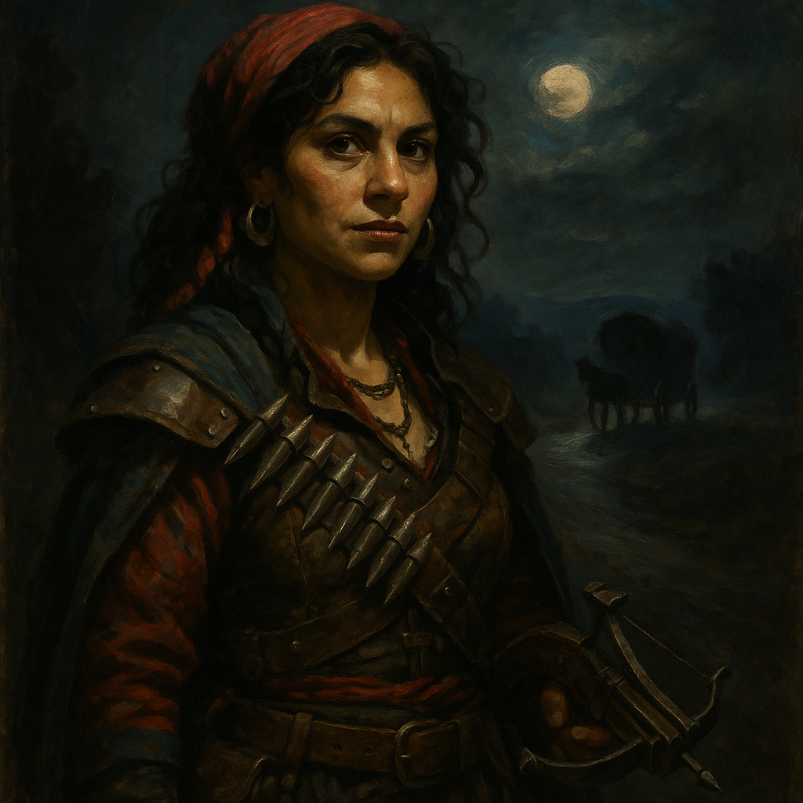

# Ezmerelda d'Avenir — Monster Hunter

<table><tr>
<td width="300" valign="top" style="padding-right: 16px;">

</td>
<td valign="top">

*Medium Humanoid (Human), Chaotic Good*

---

**Armor Class** 17 (studded leather, shield)
**Hit Points** 65 (10d8 + 20)
**Speed** 30 ft.

---

| STR | DEX | CON | INT | WIS | CHA |
|:---:|:---:|:---:|:---:|:---:|:---:|
| 14 (+2) | 18 (+4) | 14 (+2) | 14 (+2) | 14 (+2) | 16 (+3) |

---

**Saving Throws** Dex +7, Wis +5
**Skills** Acrobatics +7, Athletics +5, Investigation +5, Perception +5, Stealth +7, Survival +5
**Senses** Passive Perception 15
**Languages** Common, Vistani Cant, Elvish
**Challenge** 5 (1,800 XP) **Proficiency Bonus** +3

</td>
</tr></table>

---

## Traits

**Monster Slayer.** Ezmerelda deals an extra 1d6 damage when she hits a creature with a weapon attack if that creature is an aberration, fiend, or undead (included in attacks vs those types).

**Vistani Heritage.** Ezmerelda has advantage on saving throws against being cursed. She can read the Tarokka and knows the Vistani roads.

**Prosthetic Leg.** Ezmerelda lost her right leg below the knee to a werewolf and wears a well-crafted prosthetic. She has disadvantage on ability checks and saving throws to avoid being knocked prone. If her prosthetic is removed or destroyed, her speed is halved.

**Fearless.** Ezmerelda has advantage on saving throws against being frightened.

## Spellcasting (Innate)

Ezmerelda's monster-hunting training includes limited spellcasting. Her spellcasting ability is Wisdom (spell save DC 13, +5 to hit with spell attacks).

**3/day each:**
- *Cure Wounds* (1st level) — Touch. Restore 1d8 + 2 hit points.
- *Protection from Evil and Good* — Touch one creature. For 10 min (concentration), aberrations, celestials, elementals, fey, fiends, and undead have disadvantage on attacks against the target. Target can't be charmed, frightened, or possessed by them.

**1/day each:**
- *Magic Weapon* — Touch a nonmagical weapon. It becomes +1 for 1 hour. Concentration.
- *Lesser Restoration* — Touch. End one disease or one condition: blinded, deafened, paralyzed, or poisoned.

## Actions

**Multiattack.** Ezmerelda makes two rapier attacks or two hand crossbow attacks.

**Rapier.** *Melee Weapon Attack:* +7 to hit, reach 5 ft., one target. *Hit:* 8 (1d8 + 4) piercing damage.

**Hand Crossbow (Silvered Bolts).** *Ranged Weapon Attack:* +7 to hit, range 30/120 ft., one target. *Hit:* 7 (1d6 + 4) piercing damage. Silvered.

**Holy Water (2 Vials).** *Ranged Weapon Attack:* +7 to hit, range 20 ft., one target. *Hit:* 7 (2d6) radiant damage to fiends and undead.

## Reactions

**Uncanny Dodge.** When an attacker Ezmerelda can see hits her with an attack, she can halve the attack's damage.

---

## DM Notes

- Ezmerelda is Van Richten's former student. They parted ways due to a disagreement but she came to Barovia searching for him.
- She is resourceful, fearless, and carries an arsenal of monster-hunting equipment.
- Her Vistani heritage gives her unique insight into both the supernatural threats and the political landscape of Barovia.
- Per Session 27 wrap-up, she is tending to Mordenkainen in the back of a wagon after Van Richten restored him. They are heading back to town.
- She lost her leg to a werewolf. She does not let it slow her down.
