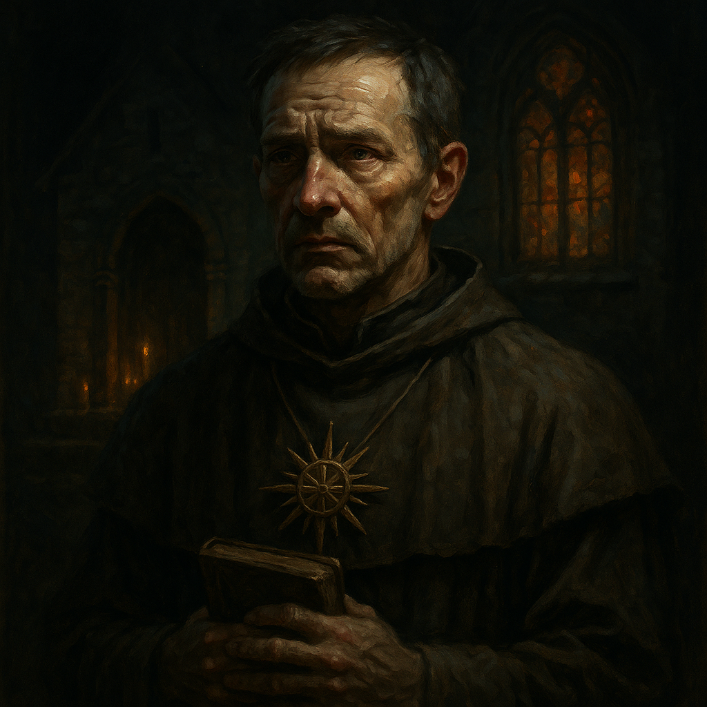

# Father Donavich — Militia Healer

<table><tr>
<td width="300" valign="top" style="padding-right: 16px;">

</td>
<td valign="top">

*Medium Humanoid (Human), Lawful Good*

---

**Armor Class** 14 (chain shirt)
**Hit Points** 38 (7d8 + 7)
**Speed** 30 ft.

---

| STR | DEX | CON | INT | WIS | CHA |
|:---:|:---:|:---:|:---:|:---:|:---:|
| 10 (+0) | 10 (+0) | 12 (+1) | 13 (+1) | 17 (+3) | 14 (+2) |

---

**Saving Throws** Wis +6, Cha +5
**Skills** Medicine +6, Religion +4, Insight +6
**Senses** Passive Perception 13
**Languages** Common
**Challenge** 3 (700 XP) **Proficiency Bonus** +3

</td>
</tr></table>

---

</td>
</tr></table>

---

## Traits

**Renewed Faith.** Donavich's faith was shattered and restored. He has advantage on saving throws against being charmed or frightened by undead.

## Spellcasting

Donavich is a 5th-level cleric. His spellcasting ability is Wisdom (spell save DC 14, +6 to hit with spell attacks).

**Cantrips (at will):**
- *Sacred Flame* — 60 ft. DEX save or 2d8 radiant damage. Ignores cover. No attack roll.
- *Spare the Dying* — Touch a creature at 0 HP. It becomes stable.
- *Guidance* — Touch. Target adds 1d4 to one ability check within 1 minute. Concentration.

**1st Level (4 slots):**
- *Cure Wounds* — Touch. Restore 1d8 + 3 hit points.
- *Healing Word* — Bonus action, 60 ft. Restore 1d4 + 3 hit points. Can attack and heal same turn.
- *Bless* — 30 ft. Up to 3 creatures add 1d4 to attack rolls and saving throws. Concentration, 1 min.
- *Shield of Faith* — 60 ft. +2 AC to one creature. Concentration, 10 min.

**2nd Level (3 slots):**
- *Aid* — 30 ft. Up to 3 creatures gain +5 to max HP and current HP. Lasts 8 hours. No concentration.
- *Prayer of Healing* (out of combat) — Up to 6 creatures within 30 ft. each regain 2d8 + 3 HP. 10 minute casting time.
- *Spiritual Weapon* — Bonus action, 60 ft. Summon spectral weapon. Bonus action each turn to attack: +6 to hit, 1d8 + 3 force. Lasts 1 min. No concentration.

**3rd Level (2 slots):**
- *Mass Healing Word* — Bonus action, 60 ft. Up to 6 creatures each regain 1d4 + 3 HP.
- *Spirit Guardians* — 15 ft. radius around Donavich. Hostile creatures entering or starting turn: WIS save, 3d8 radiant on fail, half on success. Speed halved in area. Concentration, 10 min.

## Actions

**Mace.** *Melee Weapon Attack:* +3 to hit, reach 5 ft., one target. *Hit:* 3 (1d6) bludgeoning damage.

---

## DM Notes

- Donavich's faith was shattered when his son Doru was turned into a vampire spawn, then restored when the party killed Seraphine.
- He serves as second in command and healer of the reformed Village Militia.
- He blessed the militia before marching and serves as their spiritual backbone.
- He arrives with the Barovian Forces during the End Phase.
- His priority is keeping the militia alive with healing. He will not be on the front line.
