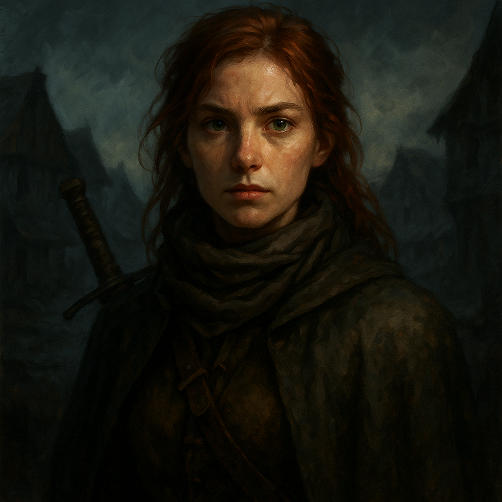

# Ireena Kolyana — Noble Fighter

<table><tr>
<td width="300" valign="top" style="padding-right: 16px;">

</td>
<td valign="top">

*Medium Humanoid (Human), Lawful Good*

---

**Armor Class** 16 (chain mail)
**Hit Points** 52 (8d8 + 16)
**Speed** 30 ft.

---

| STR | DEX | CON | INT | WIS | CHA |
|:---:|:---:|:---:|:---:|:---:|:---:|
| 14 (+2) | 14 (+2) | 14 (+2) | 12 (+1) | 13 (+1) | 16 (+3) |

---

**Saving Throws** Dex +4, Cha +5
**Skills** Athletics +4, Insight +3, Persuasion +5, Perception +3
**Senses** Passive Perception 13
**Languages** Common
**Challenge** 3 (700 XP) **Proficiency Bonus** +2

</td>
</tr></table>

---

</td>
</tr></table>

---

## Traits

**Reincarnation of Tatyana.** Ireena is the latest reincarnation of Tatyana. She has advantage on saving throws against charm effects from Strahd or his servants.

**Defiant Spirit.** When Ireena is reduced to half her hit points or fewer, she gains advantage on attack rolls until the end of her next turn.

## Actions

**Multiattack.** Ireena makes two rapier attacks.

**Rapier.** *Melee Weapon Attack:* +4 to hit, reach 5 ft., one target. *Hit:* 6 (1d8 + 2) piercing damage.

**Light Crossbow.** *Ranged Weapon Attack:* +4 to hit, range 80/320 ft., one target. *Hit:* 6 (1d8 + 2) piercing damage.

## Reactions

**Parry.** Ireena adds 2 to her AC against one melee attack that would hit her. She must see the attacker and be wielding a melee weapon.

---

## DM Notes

- Ireena is the adopted daughter of the late Burgomaster Kolyan Indirovich and sister of Ismark.
- She is the reincarnation of Tatyana. Strahd has bitten her twice. She keeps the marks covered with a scarf.
- She is skilled with a sword and refuses to be a helpless victim.
- Izek Strazni is her biological brother, though neither knows the truth.
- She is brave, compassionate, and determined.
