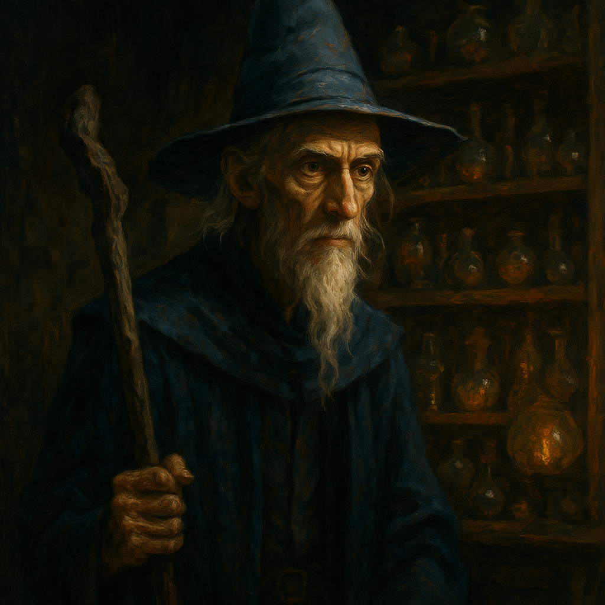

# Iskander — Skander Duplicate Wizard

<table><tr>
<td width="300" valign="top" style="padding-right: 16px;">

</td>
<td valign="top">

*Medium Humanoid (Human), Neutral Good*

---

**Armor Class** 14 (mage armor)
**Hit Points** 45 (8d8 + 8)
**Speed** 30 ft.

---

| STR | DEX | CON | INT | WIS | CHA |
|:---:|:---:|:---:|:---:|:---:|:---:|
| 9 (-1) | 14 (+2) | 12 (+1) | 18 (+4) | 12 (+1) | 10 (+0) |

---

**Saving Throws** Int +7, Wis +4
**Skills** Arcana +7, Investigation +7
**Senses** Passive Perception 11
**Languages** Common, Elvish, Draconic
**Challenge** 4 (1,100 XP) **Proficiency Bonus** +3

</td>
</tr></table>

---

</td>
</tr></table>

---

## Traits

**Skander Coordination.** When Iskander can see another Skander duplicate or the Prime within 30 feet, he has advantage on initiative rolls and can't be surprised.

## Spellcasting

Iskander is a 6th-level wizard. His spellcasting ability is Intelligence (spell save DC 15, +7 to hit with spell attacks).

**Cantrips (at will):**
- *Ray of Frost* — Ranged spell attack, 60 ft., 2d8 cold damage. Target's speed reduced by 10 ft. until start of next turn.
- *Mage Hand* — Spectral hand appears, can manipulate objects up to 30 ft. away.
- *Light* — Touch an object. It sheds bright light in 20 ft. radius, dim light 20 ft. beyond. Lasts 1 hour.
- *Message* — Whisper a message to a creature within 120 ft. Target can whisper back. Others can't hear it.

**1st Level (4 slots):**
- *Mage Armor* (pre-cast) — AC becomes 13 + DEX. Lasts 8 hours. No concentration.
- *Shield* — Reaction. +5 AC until start of next turn, including against triggering attack. Blocks Magic Missile.
- *Magic Missile* — 3 darts, each deals 1d4+1 force damage. Auto-hit. No attack roll.
- *Detect Magic* — Sense magic within 30 ft. for 10 min. Concentration. Can see aura and determine school.

**2nd Level (3 slots):**
- *Shatter* — 60 ft. range, 10 ft. radius. 3d8 thunder damage. CON save for half. Disadvantage for inorganic creatures.
- *Web* — 60 ft. range, 20 ft. cube. Area becomes difficult terrain. Creatures starting turn in web or entering: DEX save or restrained. Concentration, 1 hour. Flammable.
- *Misty Step* — Bonus action. Teleport up to 30 ft. to a space you can see.

**3rd Level (3 slots):**
- *Counterspell* — Reaction, 60 ft. Automatically counter a spell of 3rd level or lower. For higher: INT check DC 10 + spell level.
- *Lightning Bolt* — 100 ft. line, 5 ft. wide. 8d6 lightning damage. DEX save for half. Ignites flammable objects.
- *Slow* — 120 ft. range, up to 6 creatures in 40 ft. cube. WIS save. On fail: halved speed, -2 AC, -2 DEX saves, no reactions, only 1 attack per turn, spells take 2 turns. Concentration, 1 min.

## Actions

**Quarterstaff.** *Melee Weapon Attack:* +2 to hit, reach 5 ft., one target. *Hit:* 3 (1d6 - 1) bludgeoning damage.

---

## DM Notes

- Iskander is one of five duplicates of Yuri Skander, created by the accidental triggering of an amulet of wishing.
- He retains all of Yuri's original memories and abilities but has diverged into his own person.
- The Skanders hate Strahd after Rahadin murdered their brother Oskander.
- He arrives via Dimensional Door during the End Phase with the Skander reinforcements.
