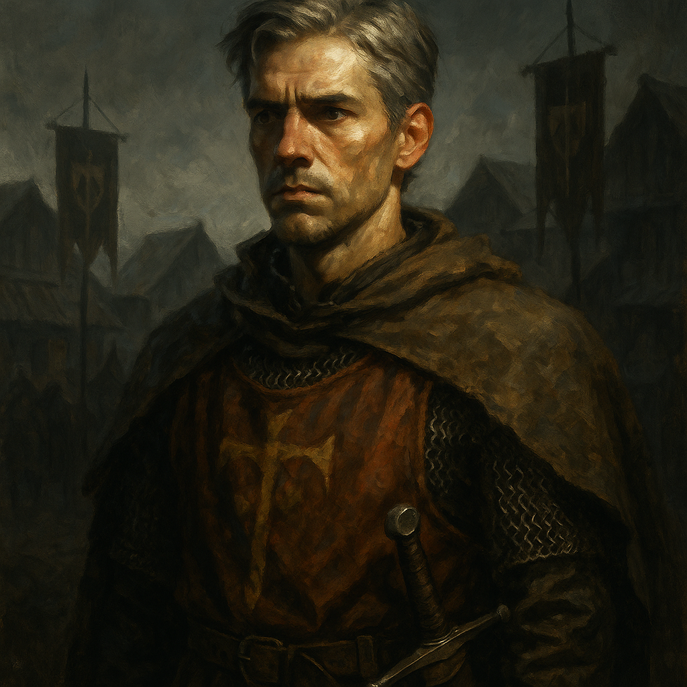

# Ismark Kolyanovich — Militia Leader

<table><tr>
<td width="300" valign="top" style="padding-right: 16px;">

</td>
<td valign="top">

*Medium Humanoid (Human), Lawful Good*

---

**Armor Class** 17 (half plate, shield)
**Hit Points** 75 (10d8 + 30)
**Speed** 30 ft.

---

| STR | DEX | CON | INT | WIS | CHA |
|:---:|:---:|:---:|:---:|:---:|:---:|
| 17 (+3) | 12 (+1) | 16 (+3) | 12 (+1) | 14 (+2) | 15 (+2) |

---

**Saving Throws** Str +6, Con +6
**Skills** Athletics +6, Perception +5, Persuasion +5, History +4
**Senses** Passive Perception 15
**Languages** Common
**Challenge** 5 (1,800 XP) **Proficiency Bonus** +3

</td>
</tr></table>

---

</td>
</tr></table>

---

## Traits

**Survivor of Castle Ravenloft.** Ismark survived the assault on Castle Ravenloft. He has advantage on saving throws against being frightened.

**Inspiring Leader.** At the start of combat, Ismark can give a brief rallying speech. Up to 6 allies who can hear him within 30 feet gain 8 temporary hit points. This can be used once per short rest.

**Protector.** When a creature Ismark can see attacks a target within 5 feet of him, he can use his reaction to impose disadvantage on the attack roll. He must be wielding a shield.

## Actions

**Multiattack.** Ismark makes two longsword attacks.

**Longsword.** *Melee Weapon Attack:* +6 to hit, reach 5 ft., one target. *Hit:* 7 (1d8 + 3) slashing damage, or 8 (1d10 + 3) slashing damage if used with two hands.

**Handaxe.** *Melee or Ranged Weapon Attack:* +6 to hit, reach 5 ft. or range 20/60 ft., one target. *Hit:* 6 (1d6 + 3) slashing damage.

## Reactions

**Parry.** Ismark adds 2 to his AC against one melee attack that would hit him. He must see the attacker and be wielding a melee weapon.

---

## DM Notes

- Ismark was once called "Ismark the Lesser," but has proven himself a capable leader.
- He leads the reformed Village Militia, the Barovian contingent, alongside Doru. Nearly 75 men under arms.
- He arrives riding hard with the Barovian Forces during the End Phase, with Donavich, Doru, and 25 militia members.
- He is Ireena's brother (adopted). He is fiercely protective of her.
- A veteran of the failed assault on Castle Ravenloft alongside Mordenkainen.
