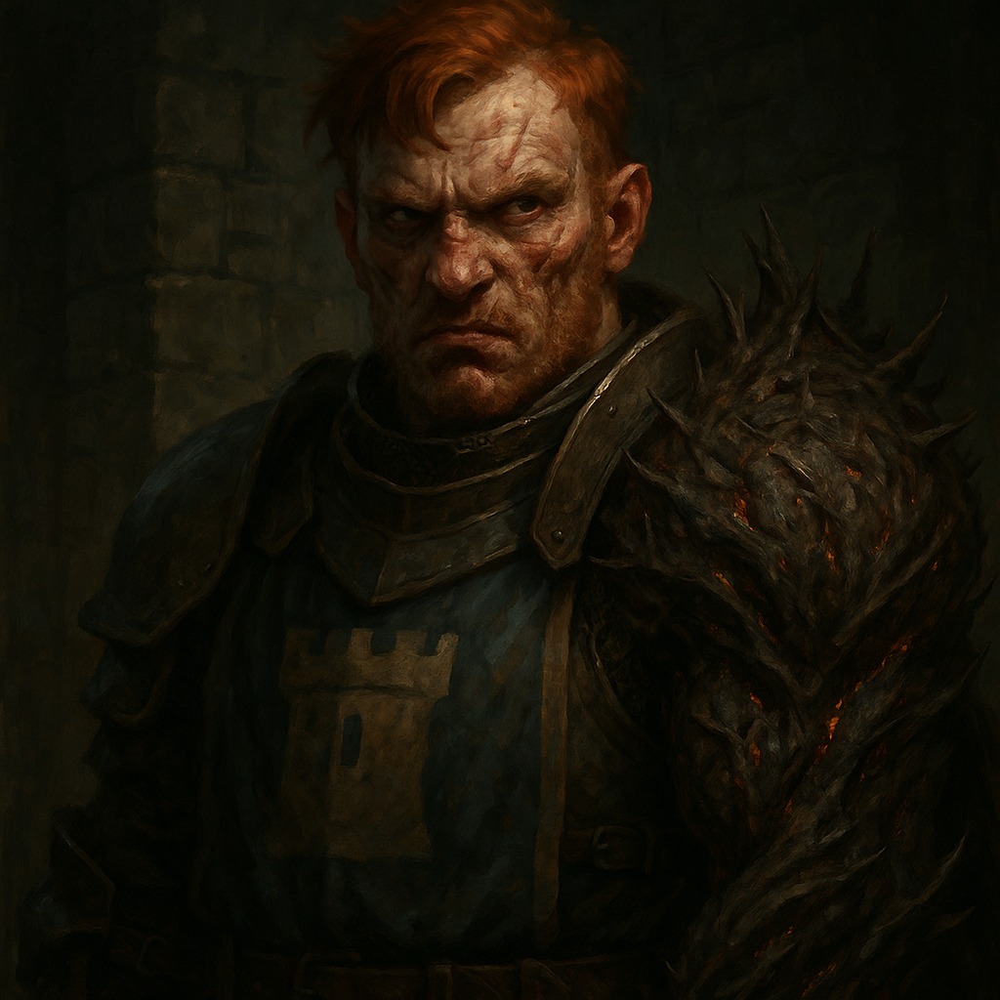

# Izek Strazni — Captain of the Guard

<table><tr>
<td width="300" valign="top" style="padding-right: 16px;">

</td>
<td valign="top">

*Medium Humanoid (Human, Mutated), Neutral*

---

**Armor Class** 16 (chain mail)
**Hit Points** 85 (10d8 + 40)
**Speed** 30 ft.

---

| STR | DEX | CON | INT | WIS | CHA |
|:---:|:---:|:---:|:---:|:---:|:---:|
| 18 (+4) | 12 (+1) | 18 (+4) | 10 (+0) | 10 (+0) | 8 (-1) |

---

**Saving Throws** Str +7, Con +7
**Skills** Athletics +7, Intimidation +2, Perception +3
**Damage Resistances** Fire
**Senses** Passive Perception 13
**Languages** Common
**Challenge** 5 (1,800 XP) **Proficiency Bonus** +3

</td>
</tr></table>

---

</td>
</tr></table>

---

## Traits

**Fiendish Arm.** Izek's monstrous, oversized arm is wreathed in barbs and can conjure fire. He has resistance to fire damage and his melee attacks with the arm deal extra fire damage.

**Brute.** A melee weapon deals one extra die of its damage when Izek hits with it (included in attacks).

**Fearsome Presence.** Creatures that can see Izek's monstrous arm have disadvantage on Charisma (Persuasion) checks against him.

## Actions

**Multiattack.** Izek makes two attacks: one with his battleaxe and one with his fiendish arm, or he uses Hurl Flame twice.

**Battleaxe.** *Melee Weapon Attack:* +7 to hit, reach 5 ft., one target. *Hit:* 13 (2d8 + 4) slashing damage, or 15 (2d10 + 4) slashing damage if used with two hands.

**Fiendish Arm.** *Melee Weapon Attack:* +7 to hit, reach 5 ft., one target. *Hit:* 11 (2d6 + 4) bludgeoning damage plus 3 (1d6) fire damage. On a hit, Izek can grapple the target (escape DC 15).

**Hurl Flame.** *Ranged Spell Attack:* +7 to hit (uses STR), range 60 ft., one target. *Hit:* 10 (3d6) fire damage. If the target is a flammable object not being worn or carried, it also catches fire.

---

## DM Notes

- Izek is Ireena's biological brother, separated in childhood during a dire wolf attack. Neither knows the truth.
- His monstrous arm grew back through unknown means, possibly a dark gift or fiendish pact.
- He is obsessed with Ireena's face, which he sees in dreams. He commissions Blinsky to make dolls in her likeness.
- Fiercely loyal to Baron Vallakovich. He protects the Baron and handles the fighting.
- Volatile temper. Can be dangerously unpredictable when provoked.
