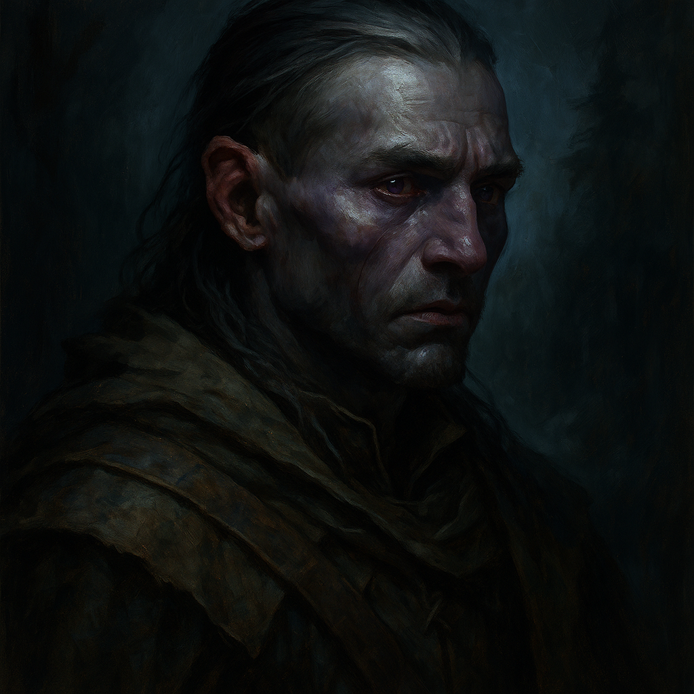

# Kasimir Velikov — Dusk Elf Ranger

<table><tr>
<td width="300" valign="top" style="padding-right: 16px;">

</td>
<td valign="top">

*Medium Humanoid (Elf), Neutral*

---

**Armor Class** 15 (studded leather)
**Hit Points** 58 (9d8 + 18)
**Speed** 30 ft.

---

| STR | DEX | CON | INT | WIS | CHA |
|:---:|:---:|:---:|:---:|:---:|:---:|
| 12 (+1) | 16 (+3) | 14 (+2) | 14 (+2) | 16 (+3) | 10 (+0) |

---

**Saving Throws** Dex +6, Wis +6
**Skills** Perception +6, Stealth +6, Survival +6, Nature +5
**Senses** Darkvision 60 ft., Passive Perception 16
**Languages** Common, Elvish
**Challenge** 4 (1,100 XP) **Proficiency Bonus** +3

</td>
</tr></table>

---

</td>
</tr></table>

---

## Traits

**Fey Ancestry.** Kasimir has advantage on saving throws against being charmed, and magic can't put him to sleep.

**Night Watch Leader.** Kasimir leads the Night Watch that patrols the Tser Hill camp perimeter. He has advantage on Wisdom (Perception) checks at night and can't be surprised while conscious.

**Favored Enemy.** Kasimir has advantage on Wisdom (Survival) checks to track undead and lycanthropes, and on Intelligence checks to recall information about them.

## Spellcasting

Kasimir is a 5th-level ranger spellcaster. His spellcasting ability is Wisdom (spell save DC 14, +6 to hit with spell attacks).

**1st Level (4 slots):**
- *Hunter's Mark* — Bonus action, 90 ft. Mark a creature. Deal extra 1d6 damage to it on each hit. If target drops to 0 HP, can move mark to new target as bonus action. Concentration, 1 hour.
- *Cure Wounds* — Touch. Restore 1d8 + 3 hit points.
- *Ensnaring Strike* — Bonus action, self. Next hit: target makes STR save or is restrained by vines. Restrained target takes 1d6 piercing at start of each turn. Concentration.
- *Absorb Elements* — Reaction when taking acid, cold, fire, lightning, or thunder damage. Resistance to that damage until start of next turn. Next melee attack deals extra 1d6 of that damage type.

**2nd Level (2 slots):**
- *Pass Without Trace* — Self, 30 ft. radius. Each creature you choose gains +10 to Stealth checks. Can't be tracked except by magical means. Concentration, 1 hour.
- *Spike Growth* — 150 ft. range, 20 ft. radius. Area becomes difficult terrain. Each 5 ft. of movement through area deals 2d4 piercing damage. Camouflaged (Perception check vs DC 14 to notice). Concentration, 10 min.

## Actions

**Multiattack.** Kasimir makes two longbow attacks or two shortsword attacks.

**Longbow.** *Ranged Weapon Attack:* +6 to hit, range 150/600 ft., one target. *Hit:* 7 (1d8 + 3) piercing damage.

**Shortsword.** *Melee Weapon Attack:* +6 to hit, reach 5 ft., one target. *Hit:* 6 (1d6 + 3) piercing damage.

---

## DM Notes

- Kasimir is the leader of the dusk elves at Tser Hill. His ears were cut off by Rahadin on Strahd's orders.
- He is haunted by visions from his dead sister Patrina, who was stoned to death by her own people when she agreed to become Strahd's bride.
- He seeks the Amber Temple to resurrect Patrina, unaware her spirit has been corrupted by dark powers.
- He leads the Night Watch that patrols the Tser Hill camp perimeter.
- He knows of the power located in the ancient ruins beneath the Amber Temple.
