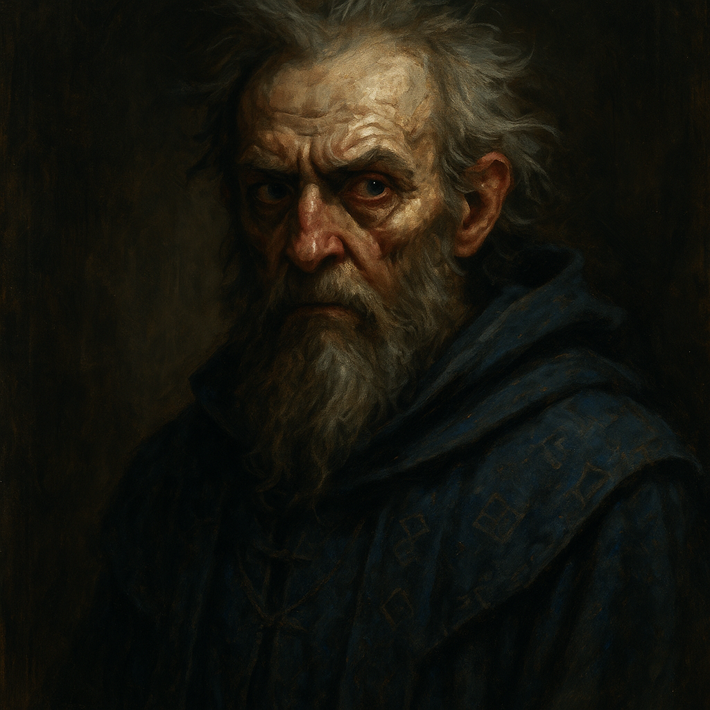

# Mordenkainen — Archmage of Oerth

<table><tr>
<td width="300" valign="top" style="padding-right: 16px;">

</td>
<td valign="top">

*Medium Humanoid (Human), Lawful Neutral*

---

**Armor Class** 17 (mage armor, staff of power)
**Hit Points** 99 (18d8 + 18)
**Speed** 30 ft.

---

| STR | DEX | CON | INT | WIS | CHA |
|:---:|:---:|:---:|:---:|:---:|:---:|
| 10 (+0) | 14 (+2) | 12 (+1) | 20 (+5) | 16 (+3) | 16 (+3) |

---

**Saving Throws** Int +10, Wis +8
**Skills** Arcana +10, History +10, Insight +8, Perception +8
**Damage Resistances** damage from spells (staff of power)
**Senses** Passive Perception 18
**Languages** Common, Elvish, Draconic, Celestial, Abyssal, Infernal
**Challenge** 12 (8,400 XP) **Proficiency Bonus** +5 (reduced, see Weakened State)

</td>
</tr></table>

---

## Traits

**Weakened State.** Mordenkainen lost his spellbook and magical focus when he was thrown from Castle Ravenloft. He spent ten months wandering the woods near Mount Baratok, feral and mad, before Van Richten restored him. Without his spellbook, he cannot prepare new spells or recover expended slots through study. His 8th and 9th level slots are unavailable. His current spell list is what he can recall from memory. The DM may restore full power when his spellbook is recovered or at a major story milestone.

**Staff of Power.** Mordenkainen wields a staff of power (+2 to AC included, +2 to spell attack rolls and save DCs included). The staff has 20 charges and regains 2d8+4 charges daily at dawn.

**Magic Resistance.** Mordenkainen has advantage on saving throws against spells and other magical effects.

**Arcane Recovery (1/Day).** Mordenkainen can recover up to 5 levels worth of spell slots during a short rest.

## Spellcasting

Mordenkainen is an 18th-level wizard. His spellcasting ability is Intelligence (spell save DC 19, +12 to hit with spell attacks, includes staff bonus).

**Cantrips (at will):**
- *Fire Bolt* — Ranged spell attack, 120 ft., 4d10 fire damage.
- *Mage Hand* — Spectral hand appears, can manipulate objects up to 30 ft. away.
- *Prestidigitation* — Minor magical trick. Lasts 1 hour.
- *Shield* (via Staff of Power, no slot) — Reaction. +5 AC until start of next turn.
- *Ray of Frost* — Ranged spell attack, 60 ft., 4d8 cold damage. Target speed reduced by 10 ft.

**1st Level (4 slots):**
- *Magic Missile* — 3 darts, each 1d4+1 force damage. Auto-hit.
- *Mage Armor* (pre-cast) — AC becomes 13 + DEX. Lasts 8 hours. No concentration.
- *Detect Magic* — Sense magic within 30 ft. for 10 min. Concentration.

**2nd Level (3 slots):**
- *Mirror Image* — 3 duplicates appear. AC 10 + DEX. Each absorbs one attack, then vanishes. No concentration.
- *Misty Step* — Bonus action. Teleport up to 30 ft.
- *Detect Thoughts* — 30 ft. Read surface thoughts. WIS save to probe deeper. Concentration, 1 min.

**3rd Level (3 slots):**
- *Counterspell* — Reaction, 60 ft. Auto-counter 3rd level or lower. Higher: INT check DC 10 + spell level.
- *Lightning Bolt* — 100 ft. line, 5 ft. wide. 8d6 lightning damage. DEX save for half.
- *Dispel Magic* — 120 ft. End one spell of 3rd level or lower. Higher: INT check DC 10 + spell level.

**4th Level (3 slots):**
- *Banishment* — 60 ft. CHA save or banished to harmless demiplane for 1 min. Concentration.
- *Greater Invisibility* — Touch. Target is invisible for 1 min. Can attack and cast while invisible. Concentration.
- *Polymorph* — 60 ft. WIS save. Target transforms into a beast of CR equal to or less than target's level/CR. Concentration, 1 hour.

**5th Level (2 slots):**
- *Wall of Force* — 120 ft. Create an invisible wall up to ten 10 ft. panels. Nothing can physically pass. Immune to damage. Lasts 10 min. Concentration.
- *Telekinesis* — 60 ft. Move a creature or object up to 1,000 lbs. STR check contested. Concentration, 10 min.

**6th Level (1 slot — Weakened):**
- *Chain Lightning* — 150 ft. One target takes 10d8 lightning damage (DEX save half). Bolt arcs to up to 3 additional targets within 30 ft. of the first, each taking 10d8 (DEX save half).

**7th Level (1 slot — Weakened):**
- *Mordenkainen's Magnificent Mansion* — Create a 50-room extradimensional dwelling. Lasts 24 hours. Full amenities and unseen servants.

*Note: Mordenkainen's 8th and 9th level slots are unavailable due to his weakened state. The DM may restore them as the campaign progresses.*

## Actions

**Staff of Power.** *Melee Weapon Attack:* +7 to hit (+2 from staff), reach 5 ft., one target. *Hit:* 5 (1d6 + 2) bludgeoning damage, or 6 (1d8 + 2) if wielded two-handed.

**Staff Spell (Charges).** Mordenkainen can expend charges from the Staff of Power to cast spells without using spell slots:
- *Cone of Cold* (5 charges) — 60 ft. cone. 8d8 cold damage. CON save for half.
- *Fireball* (5 charges) — 150 ft., 20 ft. radius. 8d6 fire damage. DEX save for half.
- *Wall of Force* (5 charges) — As above.
- *Hold Monster* (5 charges) — 90 ft. WIS save or paralyzed. Repeat save at end of each turn. Concentration.

## Reactions

**Counterspell (3rd-Level Slot).** When a creature within 60 feet casts a spell, Mordenkainen attempts to interrupt it. Auto-counter 3rd level or lower. Higher: INT check DC 10 + spell level.

**Shield (Staff Charge).** +5 AC until start of next turn, including against triggering attack. Blocks Magic Missile.

---

## DM Notes

- Mordenkainen arrived in Barovia roughly one year before the players, about six months ahead of Van Richten. Van Richten called him in to help destroy Strahd and the Stormraven Sisters for Ezmerelda, whose family was killed by them.
- Mordenkainen is fond of Ezmerelda, treating her like a niece. She calls him "Uncle Mordy." It did not take much convincing to bring him to Barovia.
- While building alliances, Klara Vorovich (a spy at the Blood of the Vine Inn) reported his activities through Vistani loyalist channels to Strahd. With his plans exposed, Mordenkainen had no choice but to act before he was ready.
- He rallied Doru, Ireena, Ismark, and about fifty villagers for a desperate assault on Castle Ravenloft. On the ramparts, Strahd saw Ireena and faltered for one heartbeat. Mordenkainen struck, gravely wounding Strahd. But Strahd struck him down and pushed him over the castle walls into the valley below.
- He survived the fall but lost his spellbook and magical focus. The attack and fall shattered his mind. He could not remember who he was. For ten months he wandered the northern woods around Mount Baratok, feral and dangerous, attacking anything that came close. Strahd believes him dead.
- Van Richten and Ezmerelda tracked him down and restored him with Greater Restoration (Session 27 wrap-up). He is confused about what happened but "appears to be his same stubborn self." They are heading back to town.
- **Spellbook recovery** is a potential quest hook. His spellbook may be in the valley below Castle Ravenloft, in the possession of one of Strahd's servants, or in the ruins near Mount Baratok. Recovering it would restore his 8th and 9th level slots.
- Even weakened, Mordenkainen is the most powerful spellcaster the party has access to. His Staff of Power (which survived the fall) gives him enormous flexibility. Use him as a powerful but not fight-ending ally.
- He is stubborn, brilliant, and does not suffer fools. He will want to know everything the party has learned before committing to any plan.
