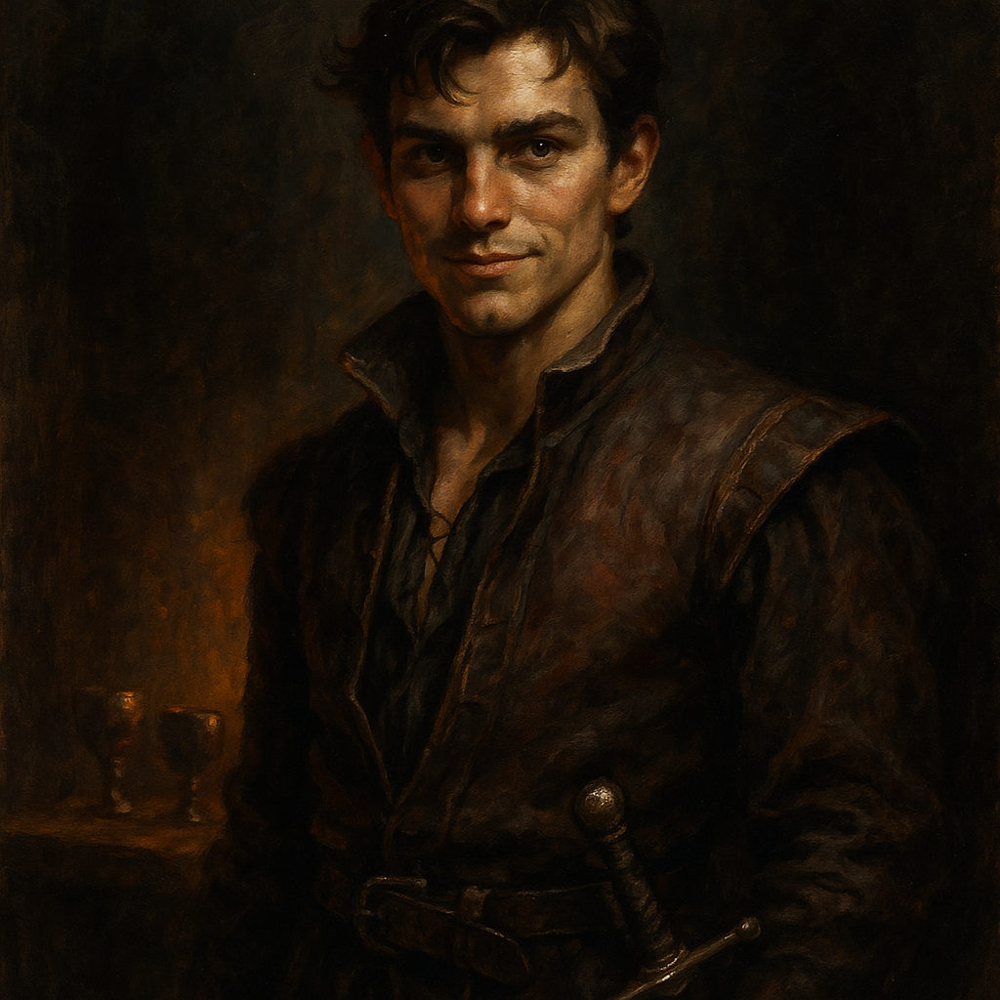

# Nikolai Wachter Jr. — Noble Fighter

<table><tr>
<td width="300" valign="top" style="padding-right: 16px;">

</td>
<td valign="top">

*Medium Humanoid (Human), Neutral Good*

---

**Armor Class** 16 (chain mail)
**Hit Points** 52 (8d8 + 16)
**Speed** 30 ft.

---

| STR | DEX | CON | INT | WIS | CHA |
|:---:|:---:|:---:|:---:|:---:|:---:|
| 16 (+3) | 12 (+1) | 14 (+2) | 11 (+0) | 10 (+0) | 14 (+2) |

---

**Saving Throws** Str +5, Con +4
**Skills** Athletics +5, Persuasion +4, Intimidation +4
**Senses** Passive Perception 10
**Languages** Common
**Challenge** 3 (700 XP) **Proficiency Bonus** +2

</td>
</tr></table>

---

</td>
</tr></table>

---

## Traits

**Brave.** Nikolai has advantage on saving throws against being frightened.

**Wine-Fueled Resilience.** Nikolai has advantage on Constitution saving throws against poison.

## Actions

**Multiattack.** Nikolai makes two longsword attacks.

**Longsword.** *Melee Weapon Attack:* +5 to hit, reach 5 ft., one target. *Hit:* 7 (1d8 + 3) slashing damage, or 8 (1d10 + 3) slashing damage if used with two hands.

**Shield Bash.** *Melee Weapon Attack:* +5 to hit, reach 5 ft., one target. *Hit:* 5 (1d4 + 3) bludgeoning damage. If the target is Medium or smaller, it must succeed on a DC 13 Strength saving throw or be knocked prone.

## Reactions

**Parry.** Nikolai adds 2 to his AC against one melee attack that would hit him. He must see the attacker and be wielding a melee weapon.

---

## DM Notes

- Nikolai Jr. is Lady Fiona Wachter's eldest son and heir to Wachterhaus.
- He is fond of wine and trouble but is a capable fighter when it counts.
- He commands the Wachter militia forces.
- At the Festival of Light, he protected Elvir Martikov (Urwin's youngest daughter). The two have feelings for each other.
- He arrives with the End Phase reinforcements.
