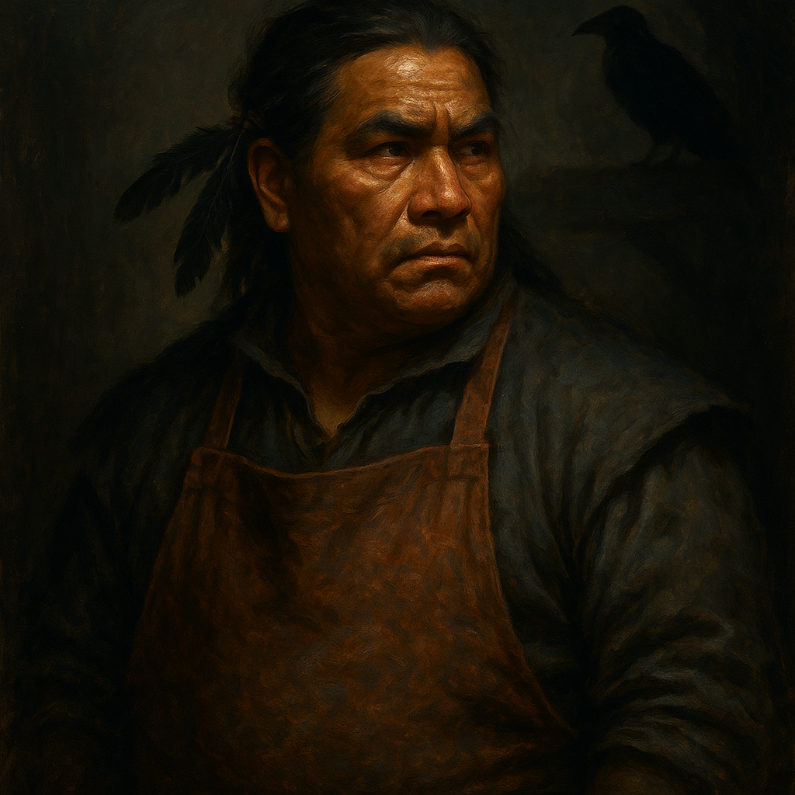

# Urwin Martikov — Wereraven Innkeeper

<table><tr>
<td width="300" valign="top" style="padding-right: 16px;">

</td>
<td valign="top">

*Medium Humanoid (Human, Shapechanger), Lawful Good*

---

**Armor Class** 13 (leather armor)
**Hit Points** 44 (8d8 + 8)
**Speed** 30 ft. (fly 50 ft. in raven or hybrid form)

---

| STR | DEX | CON | INT | WIS | CHA |
|:---:|:---:|:---:|:---:|:---:|:---:|
| 12 (+1) | 15 (+2) | 12 (+1) | 13 (+1) | 15 (+2) | 14 (+2) |

---

**Skills** Perception +4, Stealth +4, Insight +4, Nature +3
**Damage Immunities** Bludgeoning, Piercing, and Slashing from nonmagical attacks not made with silvered weapons
**Senses** Passive Perception 14
**Languages** Common (can mimic sounds in raven form)
**Challenge** 3 (700 XP) **Proficiency Bonus** +2

</td>
</tr></table>

---

</td>
</tr></table>

---

## Traits

**Shapechanger.** Urwin can use his action to polymorph into a raven-humanoid hybrid or into a raven, or back into his human form. His statistics are the same in each form. Any equipment he is wearing or carrying isn't transformed. He reverts to human form if he dies.

**Keen Sight.** Urwin has advantage on Wisdom (Perception) checks that rely on sight.

**Keeper of the Feather.** Urwin is a senior member of the Keepers of the Feather spy network. He has advantage on Wisdom (Insight) checks and Intelligence (Investigation) checks when gathering information.

## Spellcasting (Innate)

Urwin has limited innate spellcasting from his wereraven lineage. His spellcasting ability is Wisdom (spell save DC 12, +4 to hit).

**At will:**
- *Message* — Whisper a message to a creature within 120 ft. Target can whisper back. Others can't hear it.

**2/day each:**
- *Faerie Fire* — 60 ft. range, 20 ft. cube. DEX save or outlined in light. Attacks against outlined creatures have advantage. Invisible creatures become visible. Concentration, 1 min.
- *Cure Wounds* (1st level) — Touch. Restore 1d8 + 2 hit points.

## Actions

**Multiattack (Human/Hybrid Only).** Urwin makes two attacks: one with his shortsword and one with his hand crossbow, or two shortsword attacks.

**Shortsword (Human/Hybrid Only).** *Melee Weapon Attack:* +4 to hit, reach 5 ft., one target. *Hit:* 5 (1d6 + 2) piercing damage.

**Hand Crossbow (Human/Hybrid Only).** *Ranged Weapon Attack:* +4 to hit, range 30/120 ft., one target. *Hit:* 5 (1d6 + 2) piercing damage.

**Beak (Raven/Hybrid Only).** *Melee Weapon Attack:* +4 to hit, reach 5 ft., one target. *Hit:* 1 piercing damage in raven form, or 4 (1d4 + 2) piercing damage in hybrid form.

---

## DM Notes

- Urwin runs the Blue Water Inn in Vallaki with his wife Danika. Both are wereravens.
- He is Davian Martikov's son and a senior member of the Keepers of the Feather.
- The Blue Water Inn is the intelligence hub for the wereraven spy network.
- His children are Elvir, Brom (17), and Bray (14), all wereravens.
- The entire Martikov family are vowed enemies of Strahd.
