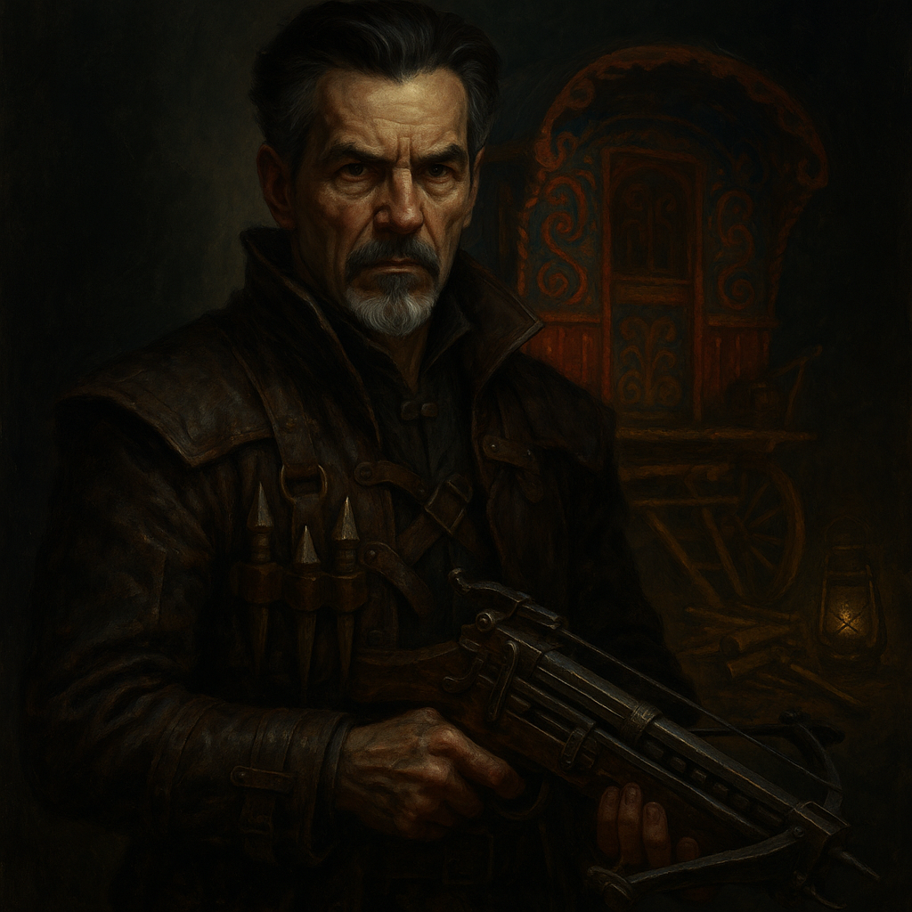

# Rudolph Van Richten — Legendary Monster Hunter

<table><tr>
<td width="300" valign="top" style="padding-right: 16px;">

</td>
<td valign="top">

*Medium Humanoid (Human), Lawful Good*

---

**Armor Class** 16 (studded leather +1)
**Hit Points** 77 (14d8 + 14)
**Speed** 30 ft.

---

| STR | DEX | CON | INT | WIS | CHA |
|:---:|:---:|:---:|:---:|:---:|:---:|
| 12 (+1) | 16 (+3) | 12 (+1) | 16 (+3) | 16 (+3) | 14 (+2) |

---

**Saving Throws** Dex +6, Wis +6, Int +6
**Skills** Arcana +6, Investigation +6, Medicine +6, Perception +6, Stealth +6, Survival +6
**Senses** Passive Perception 16
**Languages** Common, Elvish, Celestial, Abyssal
**Challenge** 6 (2,300 XP) **Proficiency Bonus** +3

</td>
</tr></table>

---

## Traits

**Monster Hunter.** Van Richten has advantage on Wisdom (Survival) checks to track undead, fiends, and lycanthropes, and on Intelligence checks to recall information about them.

**Undead Slayer.** Van Richten deals an extra 1d8 radiant damage when he hits an undead creature with a weapon attack (included in attacks vs undead).

**Prepared for Everything.** Van Richten carries an assortment of monster-hunting equipment: holy water (3 vials), silvered weapons, garlic, a mirror, wooden stakes, and manacles.

**Disguise Master.** Van Richten has advantage on Charisma (Deception) checks to maintain his Rictavio persona.

## Spellcasting (Innate)

Van Richten has studied enough arcane lore to cast a limited number of spells. His spellcasting ability is Intelligence (spell save DC 14, +6 to hit with spell attacks).

**At will:**
- *Detect Evil and Good* — Concentration, 10 min. Know if an aberration, celestial, elemental, fey, fiend, or undead is within 30 ft. and its type.

**3/day each:**
- *Protection from Evil and Good* — Touch one creature. For 10 min (concentration), aberrations, celestials, elementals, fey, fiends, and undead have disadvantage on attacks against the target. Target can't be charmed, frightened, or possessed by them.
- *Cure Wounds* (2nd level) — Touch. Restore 2d8 + 3 hit points.

**1/day each:**
- *Greater Restoration* — Touch. End one of: reduce ability score, reduce max HP, charm/petrify, curse, or any one effect reducing ability scores or HP max.
- *Magic Circle* — Draw a 10 ft. radius, 20 ft. tall cylinder on the ground. For 1 hour, chosen creature types can't willingly enter, have disadvantage on attacks against those inside, and can't charm/frighten/possess those inside.

## Actions

**Multiattack.** Van Richten makes two rapier attacks or two hand crossbow attacks.

**Rapier +1.** *Melee Weapon Attack:* +7 to hit, reach 5 ft., one target. *Hit:* 8 (1d8 + 4) piercing damage.

**Hand Crossbow (Silvered Bolts).** *Ranged Weapon Attack:* +6 to hit, range 30/120 ft., one target. *Hit:* 6 (1d6 + 3) piercing damage. Silvered. He carries bolts dipped in holy water that deal an extra 2d6 radiant damage to undead or fiends (6 bolts remaining).

**Holy Water (3 Vials).** *Ranged Weapon Attack:* +6 to hit, range 20 ft., one target. *Hit:* 7 (2d6) radiant damage to fiends and undead.

## Reactions

**Parry.** Van Richten adds 3 to his AC against one melee attack that would hit him. He must see the attacker and be wielding a melee weapon.

---

## DM Notes

- Van Richten operates in Barovia disguised as Rictavio, a flamboyant carnival ringmaster. The party met him at the Wizard Tower in Session 20 under the name Rudolph d'Avernir.
- He knows Mordenkainen from previous adventures and considers him one of his oldest and closest friends.
- He thinks of Ezmerelda as a daughter and vowed to destroy Strahd and the Stormraven Sisters to avenge her family.
- He carries deep guilt over the Vistani curse placed on him after a tragic incident involving his son, Erasmus.
- Per Session 27 wrap-up, he and Ezmerelda managed to find "that crazy old fool" (Mordenkainen) and restored him with Greater Restoration. They are heading back to town, arriving in two days.
