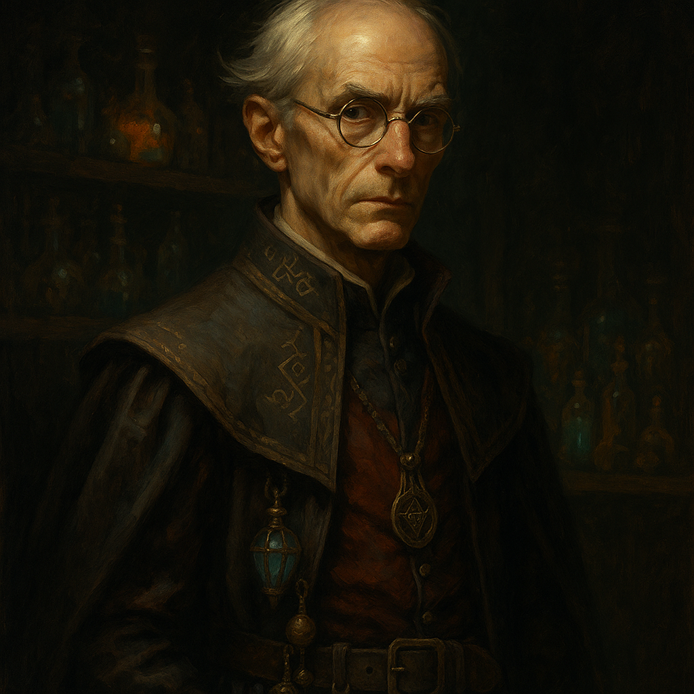

# Yuri Skander — The Prime Skander

<table><tr>
<td width="300" valign="top" style="padding-right: 16px;">

</td>
<td valign="top">

*Medium Humanoid (Human), Neutral Good*

---

**Armor Class** 14 (mage armor)
**Hit Points** 55 (10d8 + 10)
**Speed** 30 ft.

---

| STR | DEX | CON | INT | WIS | CHA |
|:---:|:---:|:---:|:---:|:---:|:---:|
| 9 (-1) | 14 (+2) | 12 (+1) | 18 (+4) | 13 (+1) | 11 (+0) |

---

**Saving Throws** Int +7, Wis +4
**Skills** Arcana +7, History +7, Investigation +7
**Senses** Passive Perception 11
**Languages** Common, Elvish, Draconic
**Challenge** 5 (1,800 XP) **Proficiency Bonus** +3

</td>
</tr></table>

---

</td>
</tr></table>

---

## Traits

**Skander Duplicates.** Yuri is the Prime Skander. He and his duplicates (Iskander, etc.) share memories from before the duplication but have since diverged. They coordinate well in combat and can anticipate each other's tactics.

## Spellcasting

Yuri is a 7th-level wizard. His spellcasting ability is Intelligence (spell save DC 15, +7 to hit with spell attacks).

**Cantrips (at will):**
- *Fire Bolt* — Ranged spell attack, 120 ft., 2d10 fire damage.
- *Mage Hand* — Spectral hand appears, can manipulate objects up to 30 ft. away.
- *Prestidigitation* — Minor magical trick (light, clean, flavor, small illusion). Lasts 1 hour.
- *Minor Illusion* — Create a sound or image of an object within 30 ft. Lasts 1 minute. Investigation check vs DC 15 to see through.

**1st Level (4 slots):**
- *Mage Armor* (pre-cast) — AC becomes 13 + DEX. Lasts 8 hours. No concentration.
- *Magic Missile* — 3 darts, each deals 1d4+1 force damage. Auto-hit. No attack roll.
- *Shield* — Reaction. +5 AC until start of next turn, including against triggering attack. Blocks Magic Missile.
- *Thunderwave* — 15 ft. cube originating from caster. 2d8 thunder damage, CON save for half. Failed save pushed 10 ft.

**2nd Level (3 slots):**
- *Misty Step* — Bonus action. Teleport up to 30 ft. to a space you can see.
- *Scorching Ray* — 3 rays, ranged spell attack each. 2d6 fire damage per ray. Can target same or different creatures.
- *Hold Person* — 60 ft. Target humanoid must make WIS save or be paralyzed. Repeat save at end of each turn. Concentration.

**3rd Level (3 slots):**
- *Counterspell* — Reaction, 60 ft. Automatically counter a spell of 3rd level or lower. For higher: INT check DC 10 + spell level.
- *Fireball* — 150 ft. range, 20 ft. radius. 8d6 fire damage. DEX save for half.
- *Dispel Magic* — 120 ft. End one spell of 3rd level or lower on a target. Higher: INT check DC 10 + spell level.

**4th Level (1 slot):**
- *Dimension Door* — Teleport self + one willing creature to any spot within 500 ft. No line of sight needed.

## Actions

**Dagger.** *Melee or Ranged Weapon Attack:* +5 to hit, reach 5 ft. or range 20/60 ft., one target. *Hit:* 4 (1d4 + 2) piercing damage.

---

## DM Notes

- Yuri is the original Skander, from whom five duplicates were created by a magical accident involving an amulet of wishing.
- He runs Skanders Imporium of Magic in Vallaki.
- The Skanders hate Strahd after Rahadin murdered their brother Oskander.
- Yuri arrives via Dimensional Door during the End Phase, as part of the Skander reinforcements.
