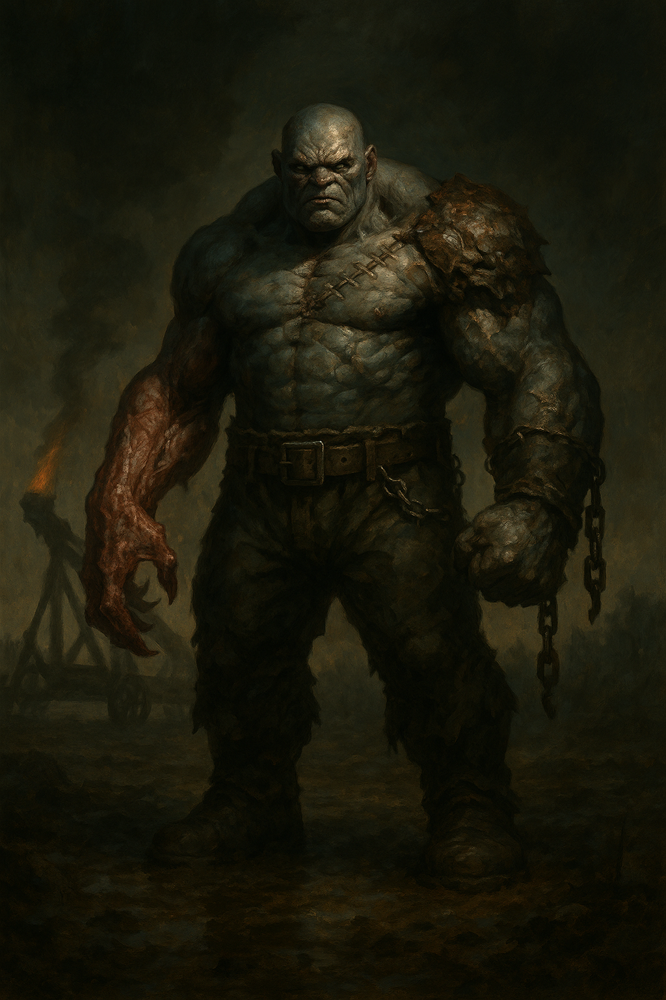

# Flesh Golem Catapult Crew — Stat Blocks

## Flesh Golem, Huge

<table><tr>
<td width="300" valign="top" style="padding-right: 16px;">

</td>
<td valign="top">

*Huge Construct, Unaligned*

A massive, lumbering thing stitched together from dozens of corpses. Bigger than a standard flesh golem by half again, built for brute labor. It pulls the catapult into position and operates the mechanism with mechanical precision.

---

**Armor Class** 12 (natural armor)
**Hit Points** 175 (14d12 + 84)
**Speed** 30 ft.

---

| STR | DEX | CON | INT | WIS | CHA |
|:---:|:---:|:---:|:---:|:---:|:---:|
| 24 (+7) | 8 (-1) | 22 (+6) | 4 (-3) | 8 (-1) | 3 (-4) |

---

**Damage Immunities** Lightning, Poison; Bludgeoning, Piercing, and Slashing from nonmagical attacks
**Condition Immunities** Charmed, Exhaustion, Frightened, Paralyzed, Petrified, Poisoned
**Senses** Darkvision 60 ft., Passive Perception 9
**Languages** understands commands from the Abbot's creations but can't speak
**Challenge** 8 (3,900 XP) **Proficiency Bonus** +3

</td>
</tr></table>

---

### Traits

**Immutable Form.** The golem is immune to any spell or effect that would alter its form.

**Lightning Absorption.** Whenever the golem is subjected to lightning damage, it takes no damage and instead regains hit points equal to the lightning damage dealt.

**Magic Resistance.** The golem has advantage on saving throws against spells and other magical effects.

**Siege Monster.** The golem deals double damage to objects and structures.

**Catapult Operator.** The golem can operate the catapult alone, performing all steps of the reload cycle without assistance.

### Actions

**Multiattack.** The golem makes two Slam attacks.

**Slam.** *Melee Weapon Attack:* +10 to hit, reach 10 ft., one target. *Hit:* 20 (3d8 + 7) bludgeoning damage.

**Hurl (Recharge 5-6).** The golem grabs a creature or object within reach and hurls it up to 30 feet. If the target is a creature, it must succeed on a DC 18 Strength saving throw or be thrown, taking 14 (2d6 + 7) bludgeoning damage and landing prone. If thrown into another creature, that creature must succeed on a DC 15 Dexterity saving throw or take 10 (2d6 + 3) bludgeoning damage and be knocked prone.

### Reactions

**Berserk Fury (1/Day).** When the golem drops below 60 hit points, it enters a berserk fury at the start of its next turn. While berserk, the golem has advantage on all melee attack rolls but attack rolls against it also have advantage. It attacks the nearest creature each turn. The fury lasts until the golem is destroyed or has no creatures within reach.

---
---

## Catapult (Siege Weapon)

*Huge Object*

A crude but effective siege weapon pulled into position by the Huge Flesh Golem. It launches large leather bags stuffed with pitch-soaked rags that are set ablaze before firing.

---

**Armor Class** 15 (reinforced wood and iron)
**Hit Points** 100
**Damage Immunities** Poison, Psychic
**Speed** 0 ft. (must be pulled by the Flesh Golem; 30 ft. while being pulled)

---

### Operation

The catapult requires a **3-turn reload cycle** to fire. The Flesh Golem performs all steps.

| Turn | Action | Description |
|:----:|:------:|:------------|
| 1 | **Lock Down** | The golem cranks the arm into firing position and locks the mechanism. |
| 2 | **Load and Light** | The golem loads a leather bag of pitch-soaked materials and sets it ablaze. |
| 3 | **Fire** | The catapult launches the flaming payload. |

**Ammunition:** 4 shots total.

### Attack

**Flaming Payload.** *Ranged Weapon Attack:* automatic (targets an area, no attack roll), range 150/600 ft. The payload hits a point the operator can see and explodes on impact.

Each creature within a **10-foot radius** (20-foot diameter) of the impact point must make a **DC 15 Dexterity saving throw**, taking **8d6 + 8 fire damage** on a failure, or **half damage** on a success.

The area of impact is lightly obscured by smoke and burning debris until the end of the golem's next turn. A creature that starts its turn in the area takes 3 (1d6) fire damage.

### Destroying the Catapult

- The catapult can be attacked directly (AC 15, 100 HP).
- It is immune to poison and psychic damage.
- If the catapult is destroyed while loaded and lit (Turn 2 of the cycle), it explodes. Each creature within 15 feet must make a DC 13 Dexterity saving throw, taking 4d6 fire damage on a failure, or half on a success.
- If the Flesh Golem is killed or driven off, the catapult is inoperable.

---

## DM Notes

- The catapult arrives with the **Reinforcements** wave. Players should hear it before they see it: the creaking of wood, the thud of the golem's footsteps, and then a flaming payload arcing through the sky.
- First shot targets the densest cluster of defenders on the hilltop. Give them a round to see it being loaded and lit before it fires.
- The werewolves led by Emil Toranescu will specifically target the catapult during the Wolf Pack Arrives phase. They will suffer casualties taking it out. This gives the players a window to see allied forces making a real sacrifice.
- If players try to destroy it themselves, reward creative approaches. Lightning spells heal the golem but do nothing to the catapult. Fire won't help against a weapon that is already on fire.
- 4 shots across the battle is 12 turns of operation (3 turns per shot). The werewolves should arrive and attack it after 1-2 shots have been fired.