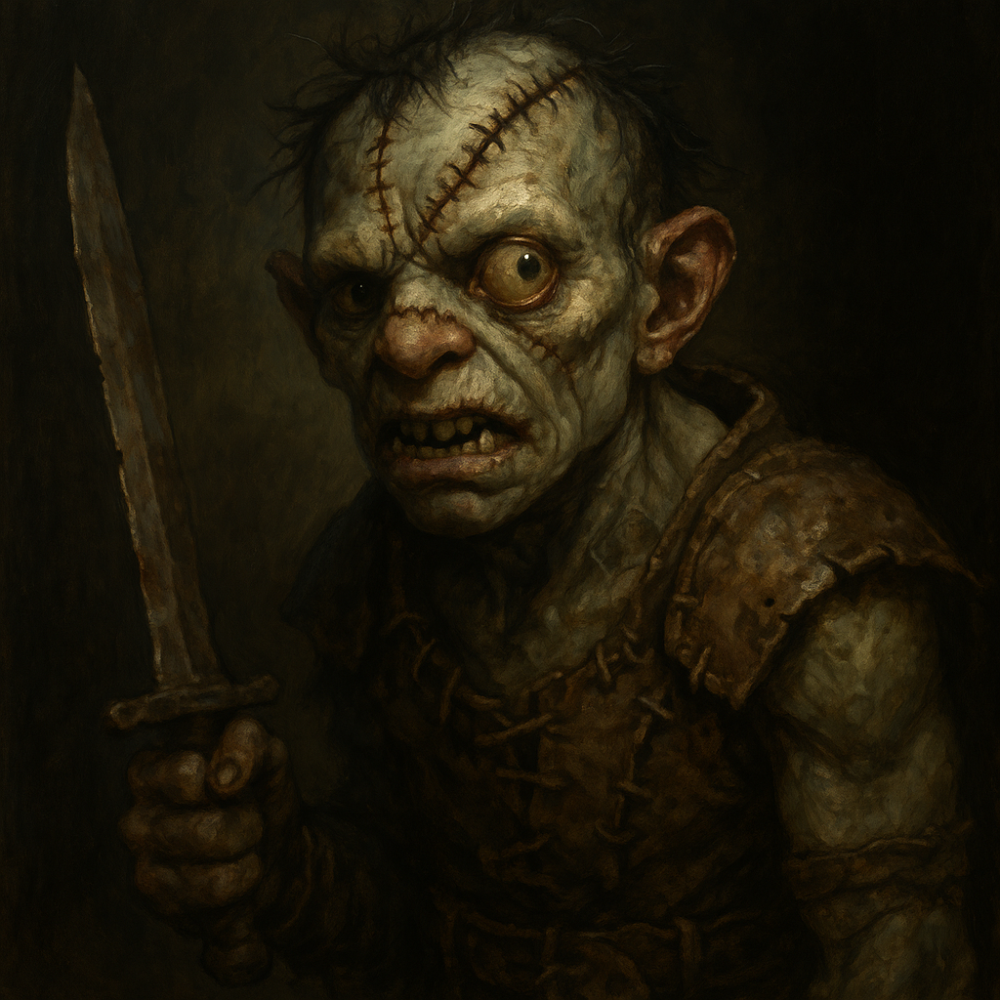
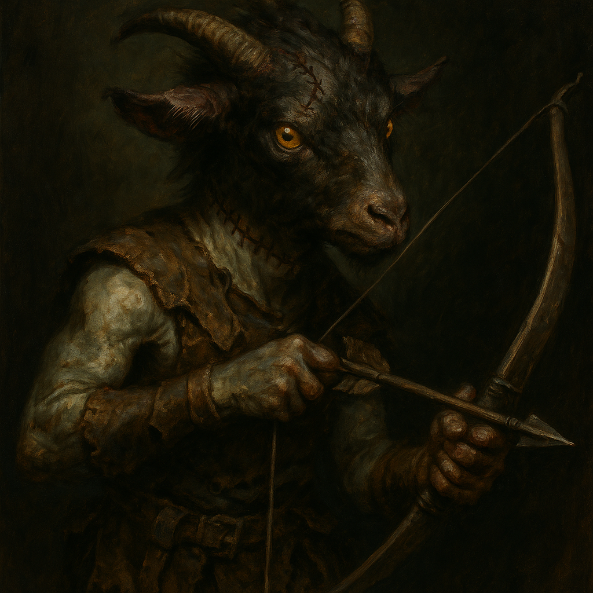
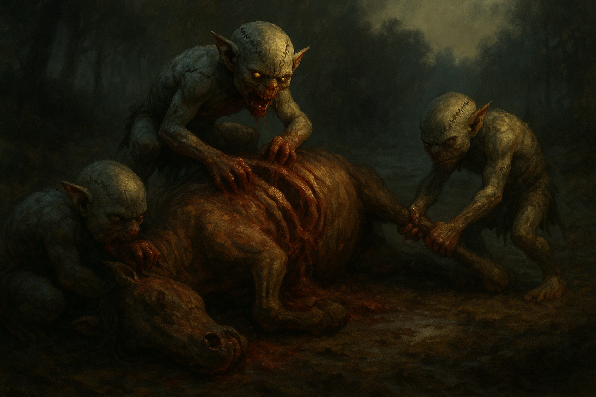

# The Abbot's Stitches — Monster Stat Blocks

## Mongrelfolk (Melee)

<table><tr>
<td width="300" valign="top" style="padding-right: 16px;">

</td>
<td valign="top">

*Small Monstrosity, Chaotic Neutral*

---

**Armor Class** 11 (scraps of leather and stitched hide)
**Hit Points** 22 (5d6 + 5)
**Speed** 25 ft.

---

| STR | DEX | CON | INT | WIS | CHA |
|:---:|:---:|:---:|:---:|:---:|:---:|
| 12 (+1) | 12 (+1) | 12 (+1) | 8 (-1) | 10 (+0) | 6 (-2) |

---

**Skills** Stealth +3
**Senses** Darkvision 30 ft., Passive Perception 10
**Languages** understands Common but can barely speak it
**Challenge** 1/4 (50 XP) **Proficiency Bonus** +2

</td>
</tr></table>

---

### Traits

**Pack Mentality.** The mongrelfolk has advantage on attack rolls against a creature if at least one of its allies is within 5 feet of the target and the ally isn't incapacitated.

**Stitched Together.** The mongrelfolk has advantage on saving throws against being frightened. It fights until destroyed, never making morale checks.

### Actions

**Shortsword.** *Melee Weapon Attack:* +3 to hit, reach 5 ft., one target. *Hit:* 4 (1d6 + 1) slashing damage.

**Bite.** *Melee Weapon Attack:* +3 to hit, reach 5 ft., one target. *Hit:* 3 (1d4 + 1) piercing damage.

---
---

## Mongrelfolk (Ranged)

<table><tr>
<td width="300" valign="top" style="padding-right: 16px;">

</td>
<td valign="top">

*Small Monstrosity, Chaotic Neutral*

---

**Armor Class** 12 (patchwork leather)
**Hit Points** 18 (4d6 + 4)
**Speed** 25 ft.

---

| STR | DEX | CON | INT | WIS | CHA |
|:---:|:---:|:---:|:---:|:---:|:---:|
| 10 (+0) | 14 (+2) | 12 (+1) | 8 (-1) | 10 (+0) | 6 (-2) |

---

**Skills** Stealth +4
**Senses** Darkvision 30 ft., Passive Perception 10
**Languages** understands Common but can barely speak it
**Challenge** 1/4 (50 XP) **Proficiency Bonus** +2

</td>
</tr></table>

---

### Traits

**Pack Mentality.** The mongrelfolk has advantage on attack rolls against a creature if at least one of its allies is within 5 feet of the target and the ally isn't incapacitated.

**Stitched Together.** The mongrelfolk has advantage on saving throws against being frightened. It fights until destroyed, never making morale checks.

### Actions

**Shortbow.** *Ranged Weapon Attack:* +4 to hit, range 80/320 ft., one target. *Hit:* 5 (1d6 + 2) piercing damage.

**Dagger.** *Melee Weapon Attack:* +4 to hit, reach 5 ft., one target. *Hit:* 4 (1d4 + 2) piercing damage.

---
---

## Patchwork Goblin Swarm

<table><tr>
<td width="300" valign="top" style="padding-right: 16px;">

</td>
<td valign="top">

*Large Swarm of Small Monstrosities, Chaotic Evil*

A writhing mass of small, stitched-together goblins that move as one. They claw, bite, and drag targets to the ground under sheer weight of numbers.

---

**Armor Class** 12 (natural armor, overlapping bodies)
**Hit Points** 65 (10d10 + 10)
**Speed** 30 ft., climb 15 ft.

---

| STR | DEX | CON | INT | WIS | CHA |
|:---:|:---:|:---:|:---:|:---:|:---:|
| 16 (+3) | 14 (+2) | 12 (+1) | 5 (-3) | 8 (-1) | 3 (-4) |

---

**Damage Resistances** Bludgeoning, Piercing, Slashing
**Condition Immunities** Charmed, Frightened, Grappled, Paralyzed, Petrified, Prone, Restrained, Stunned
**Senses** Darkvision 30 ft., Passive Perception 9
**Languages** none
**Challenge** 4 (1,100 XP) **Proficiency Bonus** +2

</td>
</tr></table>

---

### Traits

**Swarm.** The swarm can occupy another creature's space and vice versa. The swarm can move through any opening large enough for a Small creature. The swarm can't regain hit points or gain temporary hit points.

**Overwhelming Numbers.** The swarm has advantage on attack rolls against any creature that is prone.

### Actions (Custom Swarm Rules)

The swarm makes **one attack per turn**, scaling with the number of goblins currently in the swarm.

**Rend (Daggers, Teeth, and Claws).** *Melee Weapon Attack:* **+2 per goblin** to hit, reach 0 ft., one target in the swarm's space. *Hit:* **1d6+1 per goblin** slashing damage.

**Drag Down.** The swarm attempts to drag a creature in its space to the ground. The target must succeed on a Strength saving throw or be knocked prone and restrained until the start of the swarm's next turn. **DC = 10 + (2 x number of goblins).** A restrained creature can use its action to make a Strength (Athletics) check against the same DC to free itself.

### Scaling Quick Reference

| Goblins | Attack Bonus | Damage | Drag Down DC |
|:-------:|:------------:|:------:|:------------:|
| 2 | +4 | 2d6+2 | DC 12 |
| 3 | +6 | 3d6+3 | DC 13 |
| 4 | +8 | 4d6+4 | DC 14 |
| 5 | +10 | 5d6+5 | DC 15 |
| 6 | +12 | 6d6+6 | DC 16 |
| 7 | +14 | 7d6+7 | DC 17 |
| 8 | +16 | 8d6+8 | DC 18 |

### Reactions

**Pile On.** When a creature in the swarm's space is knocked prone by any source, the swarm can immediately make one Rend attack against that creature.

---

## Swarm Tactics — DM Reference

- **One attack per swarm per turn.** The whole pile acts as a single unit.
- **+2 to attack per goblin.** Five goblins = +10 to hit.
- **1d6+1 damage per goblin.** Five goblins = 5d6+5 damage.
- **Drag Down DC = 10 + (1/goblins).** Five goblins = DC 15 STR save.
- **Prone = advantage.** Once a target is prone, the swarm has advantage on Rend. Prone + restrained is catastrophic.
- **Commandable:** Vasilka can use Command Stitches (bonus action) to direct swarms to move half speed or make one attack.
- **Healable:** Vasilka's Necrotic Surge lair action restores 5 HP to each swarm in range.
- **Max Goblins** the max number of Goblins per medium creature is 6.. +/- 2 for each size category. 

### How to Run Swarms

1. Move the swarm into the target's space.
2. Rend to deal damage. Track goblin count as they take losses.
3. Use Drag Down to pin melee fighters. Once prone + restrained, other swarms pile on.
4. Multiple swarms on one target is intentional. Let players feel the weight of being swarmed.
5. Players should realize quickly: "being swarmed is VERY bad."
