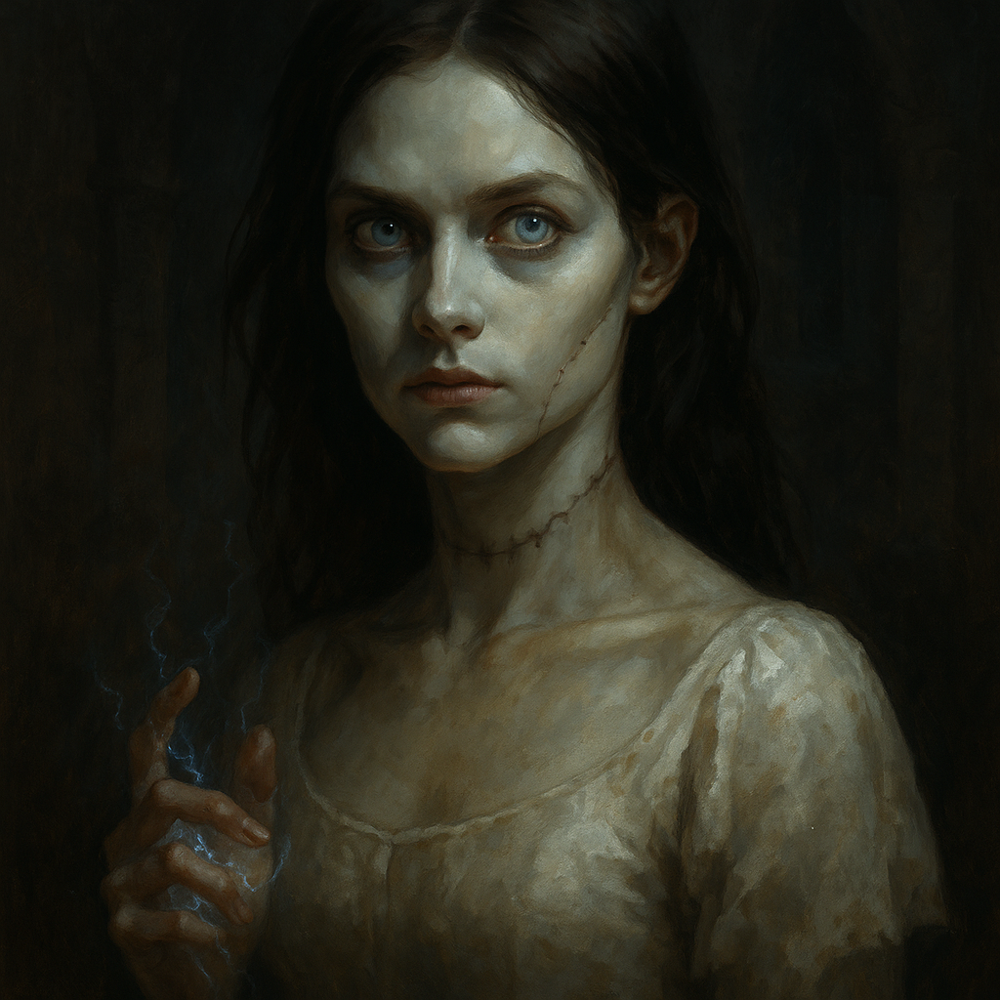

# Vasilka — The Resurrected Ilya Krezkov

<table><tr>
<td width="300" valign="top" style="padding-right: 16px;">

</td>
<td valign="top">

*Medium Undead/Construct (Flesh Golem), Neutral Evil*

---

**Armor Class** 16 (natural armor, enhanced by sorcery)
**Hit Points** 136 (16d8 + 64)
**Speed** 30 ft.

---

| STR | DEX | CON | INT | WIS | CHA |
|:---:|:---:|:---:|:---:|:---:|:---:|
| 18 (+4) | 12 (+1) | 18 (+4) | 12 (+1) | 14 (+2) | 20 (+5) |

---

**Saving Throws** Con +8, Cha +9, Wis +6
**Skills** Arcana +5, Intimidation +9, Perception +6
**Damage Resistances** Cold, Fire, Lightning
**Damage Immunities** Poison
**Condition Immunities** Charmed, Exhaustion, Frightened, Paralyzed, Poisoned
**Senses** Darkvision 60 ft., Passive Perception 16
**Languages** Common, Abyssal
**Challenge** 10 (5,900 XP) **Proficiency Bonus** +4

</td>
</tr></table>

---

</td>
</tr></table>

---

## Traits

**Flesh Golem Resilience.** Vasilka has advantage on saving throws against spells and other magical effects. If she is subjected to an effect that allows a Constitution saving throw to take half damage, she takes no damage on a success and half damage on a failure.

**Innate Sorcery (Recharge on Short/Long Rest).** As a bonus action, Vasilka can tap into the divine spark left by the Abbot's creation. For 1 minute, her spell save DC increases by 1 (to DC 18) and she gains advantage on attack rolls for sorcerer spells she casts.

**Immutable Form.** Vasilka is immune to any spell or effect that would alter her form.

**Sorcerous Recovery (1/Day).** When Vasilka has no sorcery points remaining, she regains 4 sorcery points at the start of her next turn.

---

## Spellcasting

Vasilka is an 8th-level spellcaster. Her spellcasting ability is Charisma (spell save DC 17, +9 to hit with spell attacks). She has the following sorcerer spells prepared:

**Sorcery Points:** 8
**Metamagic:** Twinned Spell, Subtle Spell, Quickened Spell

**Cantrips (at will):**
- *Chill Touch* — Ranged spell attack, 120 ft., 2d8 necrotic damage. Target can't regain HP until start of Vasilka's next turn. Advantage if target is undead.
- *Mind Sliver* — 60 ft. INT save or 2d6 psychic damage and subtract 1d4 from target's next saving throw before end of Vasilka's next turn.
- *Mage Hand* — Spectral hand appears, can manipulate objects up to 30 ft. away.
- *Minor Illusion* — Create a sound or image within 30 ft. Lasts 1 minute. Investigation check vs DC 17 to see through.
- *Prestidigitation* — Minor magical trick (light, clean, flavor, small illusion). Lasts 1 hour.

**1st Level (4 slots):**
- *Shield* — Reaction. +5 AC until start of next turn, including against triggering attack. Blocks Magic Missile.
- *Mage Armor* (pre-cast) — AC becomes 13 + DEX. Lasts 8 hours. No concentration.
- *Ray of Sickness* — Ranged spell attack, 60 ft. 2d8 poison damage. On hit, target makes CON save or is poisoned until end of its next turn.

**2nd Level (3 slots):**
- *Hold Person* — 60 ft. Target humanoid makes WIS save or is paralyzed. Repeat save at end of each turn. Melee attacks within 5 ft. auto-crit. Concentration.
- *Misty Step* — Bonus action. Teleport up to 30 ft. to a space you can see.
- *Shatter* — 60 ft. range, 10 ft. radius. 3d8 thunder damage. CON save for half. Disadvantage for inorganic creatures.

**3rd Level (3 slots):**
- *Counterspell* — Reaction, 60 ft. Automatically counter a spell of 3rd level or lower. For higher: CHA check DC 10 + spell level.
- *Fireball* — 150 ft. range, 20 ft. radius. 8d6 fire damage. DEX save for half. Ignites flammable objects.
- *Dispel Magic* — 120 ft. End one spell of 3rd level or lower on a target. Higher: CHA check DC 10 + spell level.

**4th Level (2 slots):**
- *Banishment* — 60 ft. CHA save or target is banished to a harmless demiplane for up to 1 minute. Concentration. If target is native to the current plane, it returns when the spell ends.
- *Vitriolic Sphere* — 150 ft. range, 20 ft. radius. 10d4 acid damage, DEX save for half. On failed save, target also takes 5d4 acid at end of its next turn.

---

## Unique Abilities

**Spell Redirect (Recharge 5-6).** When Vasilka sees a creature within 60 feet of her cast a spell that targets an area or makes a ranged spell attack, she can use her reaction to seize control of the spell's energy. She makes a Charisma check contested by the caster's spellcasting ability check. On a success, she redirects the spell to a new target or area of her choice within the spell's range (measured from her position). The spell uses the original caster's spell save DC and attack bonus.

> *DM Note: This is how she took control of Thorian's water spell and hurled it back over the hilltop defenders. Use this sparingly for dramatic moments.*

**Command Stitches (Bonus Action).** Vasilka directs up to two Goblin Stitch Swarms within 60 feet. Each directed swarm can immediately move up to half its speed or make one attack. This does not use the swarm's reaction.

---

## Actions

**Multiattack.** Vasilka makes two Necrotic Slam attacks, or she makes one Necrotic Slam attack and casts a cantrip.

**Necrotic Slam.** *Melee Weapon Attack:* +8 to hit, reach 5 ft., one target. *Hit:* 11 (2d6 + 4) bludgeoning damage plus 9 (2d8) necrotic damage.

**Quickened Spell (3 Sorcery Points).** As a bonus action, Vasilka casts a spell that normally has a casting time of 1 action.

---

## Reactions

**Shield (1st-Level Slot).** When hit by an attack or targeted by *magic missile*, Vasilka gains +5 AC until the start of her next turn, including against the triggering attack.

**Counterspell (3rd-Level Slot).** When a creature within 60 feet casts a spell, Vasilka attempts to interrupt it. The spell fails if it is 3rd level or lower. For higher level spells, she makes a Charisma ability check (DC 10 + spell level).

---

## Lair Actions (Spell-Enhanced)

When fighting within 120 feet of her Goblin Stitch forces, Vasilka can use one of the following lair actions on initiative count 20 (losing ties). She cannot use the same lair action two rounds in a row.

**Necrotic Surge.** Dark energy pulses outward from Vasilka in a 30-foot radius. Each creature of her choice in the area must make a DC 17 Constitution saving throw, taking 14 (4d6) necrotic damage on a failure, or half on a success. Goblin Stitches in the area regain 5 hit points each.

**Stitch Frenzy.** Up to three Goblin Stitch Swarms within 60 feet of Vasilka are driven into a frenzy until initiative count 20 of the next round. Frenzied swarms have advantage on attack rolls and their attacks deal an extra 3 (1d6) damage, but attacks against them also have advantage.

**Unnatural Fog.** Vasilka summons a 20-foot-radius sphere of thick, dark fog centered on a point within 90 feet. The area is heavily obscured. The fog lasts until initiative count 20 of the next round or until dispersed by a strong wind. Vasilka and her stitches can see through this fog.

**Grasp of the Dead.** Spectral hands erupt from the ground in a 15-foot square within 60 feet. Each creature in the area must succeed on a DC 17 Strength saving throw or be restrained until initiative count 20 of the next round. A restrained creature can use its action to make a DC 17 Strength (Athletics) check to free itself.

---

## Tactics

**Opening Round.** Vasilka stays at range (60-120 ft. from the hilltop) and opens with Fireball or Vitriolic Sphere targeting clustered defenders. She uses Subtle Spell to prevent Counterspell.

**Mid-Battle.** She uses Command Stitches to direct swarms toward isolated or prone targets. She saves Spell Redirect for high-impact spells from the party's casters. She uses Quickened Spell to cast Fireball or Hold Person as a bonus action while making Necrotic Slam attacks if anyone closes distance.

**When Pressed.** If forced into melee, she uses Misty Step to reposition and Shield to deflect attacks. She reserves Banishment for the party's strongest melee fighter.

**Lair Actions.** She uses Necrotic Surge to heal her swarms and damage clustered defenders. Stitch Frenzy when swarms are engaged with the party. Unnatural Fog to cover flanking movements or block line of sight to her. Grasp of the Dead to pin down melee fighters trying to reach her.

**Retreat.** When Vasilka drops below 40 HP, the Abbot arrives to extract her. She uses Misty Step and Counterspell defensively to survive until he reaches her, then she teleports to safety (as noted in Session 27).

---

## DM Notes

- Vasilka is not a standard flesh golem. The Abbot used divine power and the Holy Symbol of Ravenkind to restore her, granting her sorcerous abilities far beyond what a construct should have.
- She was created using the body and essence of Ilya Krezkov. Baron Dmitri Krezkov does not know this. If he ever sees Vasilka, he would recognize his daughter's face.
- She can potentially be recruited as an ally if the players kill the Abbot without harming her or the mongrelfolk. She would want freedom for herself and her kind in exchange for their aid.
- The Abbot will arrive in person when she starts taking serious damage. He is a deva and far more dangerous than Vasilka herself.
- Her Spell Redirect is the signature "oh no" ability. When Thorian cast his water spell, she seized it and turned it against the defenders. Save this for a dramatic moment each encounter.
